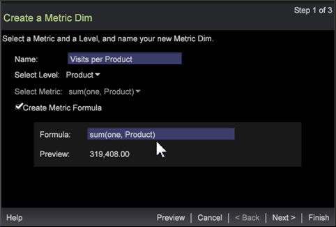

# 지표 치수 마법사{#metric-dim-wizard}

단계별 마법사를 사용하여 지표 속성(지표 차원)으로 정의된 Dimension을 만듭니다. 그런 다음 새 지표 딤을 테스트하고 미리 보고 Dimension 목록에 저장합니다.

지표 딤은 지표를 새 차원으로 변환합니다. 예를 들어 페이지 보기 횟수 지표 및 방문자 수준을 기반으로 한 지표 딤은 각 방문자에 대한 총 페이지 보기 횟수를 기준으로 차원 요소를 표시합니다. 차원 요소를 기반으로 현재 정의된 지표를 확장하여 새 차원으로 만들고 저장할 수 있습니다.

## Step 1: Select Dimension and Metric {#section-58b6ea7bbba5487ba1a3c264aa3dcb95}

1. 지표 치수 마법사를 엽니다.

   작업 영역에서 마우스 오른쪽 버튼을 클릭하고 **[!UICONTROL Tools]** > 를 선택합니다 **[!UICONTROL Create Metric Dim]**.

1. 지표 치수 이름을 지정합니다.

   기본적으로 이름 필드는 레벨 및 지표 선택에 따라 자동으로 채워집니다.

1. Dimension 수준을 선택합니다.

   차원 레벨은 입력을 필터링하고 차원 유형을 정의하는 모든 구성 요소 값을 포함하는 상위 차원입니다.

   Dimension 수준에는 다음이 포함됩니다.

   * 클릭스루
   * 히트
   * 제품
   * 방문
   * 방문자

1. 지표를 선택합니다.

   미리 작성된 지표를 선택하여 확장하고 지표 dim으로 저장합니다.

   

1. (선택 사항) 지표 공식을 만듭니다.

   상자를 클릭하여 사용자 지정 지표 공식을 입력합니다. 계산된 미리 보기 값이 식의 유효성을 검사하는 것처럼 표시됩니다.

   

   고유한 [지표 표현식을](https://docs.adobe.com/content/help/en/data-workbench/using/client/qry-lang-syntx/c-syntx-mtrc-exp.html) 추가하거나 다른 지표 편집기 또는 시각화에서 잘라내어 붙여넣을 수 있습니다. 구문 오류, 수식 오류, 정의되지 않은 필터 및 기타 오류가 마법사에 보고됩니다.

1. 클릭 **[!UICONTROL Next]**.

## 2단계:버킷 형식 지정 및 설정 {#section-5bddf3cd306545d7806a501637f80f77}

1. 새 지표 흐리게 하기 위한 형식을 선택합니다.

   

   형식은 시각화에서 지표를 열 때 지표가 표시되는 방식을 정의합니다. 이러한 형식은 아래에 정의된 [printf 표준을](http://www.cplusplus.com/reference/cstdio/printf/)선택합니다.

   ```
   %[flags][width][.precision][length][specifier]
   % 0.2lf = % _ [flags] 0 [width] .2 [.precision] l [length] f[ specifier]
   ```

   필드에서 **[!UICONTROL Preview]** 선택한 지표 및 형식을 기반으로 값이 표시됩니다.

1. 버킷 수 표현식 추가를 참조하십시오.

   다양한 범위 또는 버킷으로 지표 흐림 효과를 정의할 수 있습니다. 크기(예: [0-4], [5-10],..)를 기반으로 요소의 하위 세트를 반환합니다. Dimension 수준의 요소는 범위에 지표 값이 포함된 요소와 관련됩니다. Dimension 표현식에 대한 구문에서 [버킷 표현식 설명을 참조하십시오](https://docs.adobe.com/content/help/en/data-workbench/using/client/qry-lang-syntx/c-syntx-dim-exp.html).

1. 저장하기 **[!UICONTROL Preview]** 전에 지표 치수 값 테이블을 열려면 을 클릭합니다.

   

   지표당 테이블 세부 정보 지표 값은 어둡게 표시됩니다.

1. 새로 만든 차원 **[!UICONTROL Show in Dimension Menu]** 을 클릭하여 **파인더** 의 Dimension 탭에 **추가합니다**.

1. 클릭 **[!UICONTROL Next]**.

## 3단계:마침 및 저장 {#section-d9043235b18a425f9de0db668d4b1683}

1. 저장 후 지표 흐림 편집기, 그래프 시각화 또는 표를 시작하려면 선택합니다.

   | 필드 | 설명 |
   |---|---|
   | **[!UICONTROL Launch Metric Dim Editor]** | 지표 치수 편집기를 엽니다. |
   | **[!UICONTROL Launch Graph]** | 표의 PNG 그래픽을 실행합니다. |
   | **[!UICONTROL Launch Table]** | 선택한 지표의 값과 새 지표 dim의 값을 나열하는 열의 값이 있는 작업 영역에서 테이블을 시작합니다. |

1. 을 클릭하고 **[!UICONTROL Finish]** 저장합니다.

   파일을 저장할 수 있는 저장 대화 상자가 열립니다. 값을 보기 위해 선택한 옵션이 작업 공간에 열립니다.

