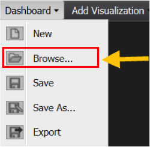

# 대시보드 브라우저{#dashboard-browser}

대시보드 브라우저는 사용자와 조직의 다른 구성원이 만들고 저장한 대시보드를 쉽게 탐색, 검색 및 열 수 있도록 합니다.

볼 수 있는 권한이 있는 모든 대시보드를 찾아서 액세스할 수 있습니다(액세스 컨트롤에 대한 자세한 내용은 액세스 제어 섹션을 참조하십시오). 대시보드 브라우저는 대시보드를 찾아야 할 때 잘 작동하지만 필요한 대시보드나 대시보드 위치를 잘 알 수 없습니다. 대시보드 브라우저는 지정된 대시보드에서 추가 세부 사항을 가져오고 특수 기능을 수행하는 데에도 유용합니다.

## 대시보드 브라우저 {#section-10e158d738684219ab997ef050b675d7} 열기

Data Workbench 대시보드에 로그인하면 기본적으로 대시보드 브라우저가 표시됩니다. 도구 모음에서 대시보드 메뉴를 클릭하고 **[!UICONTROL Browse…]**&#x200B;을 선택하여 언제든지 대시보드 브라우저에 액세스할 수도 있습니다.

