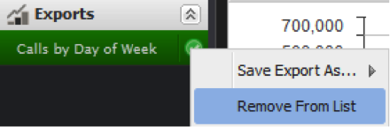

# 데이터 내보내기{#exporting-data}

{{eol}}

데이터를 내보내는 3가지 방법과 내보내기를 검색하는 방법을 보여 줍니다.

데이터는 대시보드에서 세 가지 방법으로 내보낼 수 있습니다.

먼저 개별 시각화에서 데이터를 내보낼 수 있습니다. 두 번째, 수행한 구성 및 선택 사항을 포함하여 현재 작업 대시보드를 내보낼 수 있습니다. 세 번째, 저장된 대시보드를 열지 않고 내보낼 수 있습니다.

내보내기는 2단계 프로세스를 사용하여 수행됩니다. 먼저 내보내기는 위의 세 가지 방법 중 하나를 사용하여 서버에서 큐에 올라갑니다. 내보내기의 상태가 **[!UICONTROL Exports]** 내보내기 준비 중인 메뉴입니다. 다음으로 내보내기가 준비되면 CSV 또는 Excel 형식으로 데이터를 다운로드할 수 있습니다.

내보내기는 몇 분 정도 걸릴 수 있지만 내보내기 중에 응용 프로그램을 계속 사용할 수 있습니다.

## 시각화 내보내기 {#section-46b74b46c2eb44129c8b85a9eabd2304}

시각화에서 데이터를 내보내려면 **[!UICONTROL Save]** 시각화의 도구 메뉴에서 을 클릭합니다.

서버에서 내보내기가 시작되고 내보내기 표시기가 내보내기 메뉴에 추가됩니다.

## 대시보드 내보내기 {#section-27329f2a5fed44b49deb26dc5164531f}

작업 대시보드에서 데이터 내보내기를 시작하려면 다음을 선택합니다 **[!UICONTROL Export]** 에서 **[!UICONTROL Dashboard]** 메뉴 아래의 제품에서 사용할 수 있습니다.

서버에서 내보내기가 시작되고 내보내기 표시기가 내보내기 메뉴에 추가됩니다.

## 저장된 대시보드 내보내기 {#section-e989f7b16e25479ab77454f2c34471ba}

저장된 대시보드에서 데이터 내보내기를 시작하려면 대시보드 브라우저를 사용합니다. 대시보드 브라우저 내에서 원하는 대시보드로 이동하여 대시보드의 세부 사항이 나타나도록 선택합니다. 오른쪽 세부 사항 패널의 **[!UICONTROL Operations]** 섹션, **[!UICONTROL Export Data]**.

서버에서 내보내기가 시작되고 내보내기 표시기가 **[!UICONTROL Exports]** 메뉴 아래의 제품에서 사용할 수 있습니다.

## 내보내기 검색 {#section-0f03c5321c804867b7c72cf92f6f67d0}

내보내기가 완료되면 팝업 알림이 나타나서 내보내기가 준비되었음을 알립니다.

내보내기를 검색하려면 **[!UICONTROL Exports]** 메뉴 아래의 제품에서 사용할 수 있습니다. 원하는 내보내기 항목 오른쪽에 있는 녹색 확인 표시를 클릭하면 드롭다운 메뉴가 표시됩니다. 이 메뉴 내에서 **[!UICONTROL Save Export As…]** 하위 메뉴에서 해당 메뉴 옵션을 선택하여 CSV 또는 Excel 형식으로 내보내기를 다운로드합니다.

이제 브라우저의 파일 다운로드 프로세스가 시작됩니다.

내보내기는 자동으로 제거되지 않으므로 각 형식으로 내보내기를 쉽게 다운로드할 수 있습니다. 에서 내보내기를 제거할 수 있습니다 **[!UICONTROL Exports]** 메뉴 아래의 왼쪽 탐색 패널 그렇지 않으면 로그아웃할 때 자동으로 제거됩니다.

에서 내보내기를 제거하려면 **[!UICONTROL Export List]**&#x200B;를 클릭하고 내보내기 제목 오른쪽에 있는 확인 표시를 클릭한 다음 을 선택합니다 **[!UICONTROL Remove From List]**.

