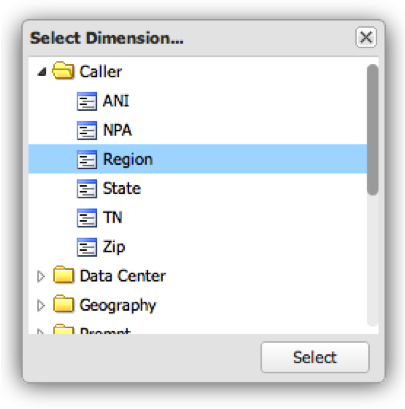

# 시각화 구성{#configuring-visualizations}

제목, 프로필, 차원, 지표, 필터, 표시 상단, 정렬 기준 및 기간을 구성하는 방법을 보여줍니다.

대시보드 캔버스의 각 시각화에는 자체 구성이 있습니다. 시각화를 대시보드 캔버스에 처음 추가하면 해당 구성 창이 자동으로 나타납니다. 구성되면 시각화 창의 오른쪽 상단에 있는 톱니바퀴 아이콘을 클릭하여 시각화를 언제든지 수정할 수 있습니다.

>[!NOTE]
>
>구성 옵션은 표시되는 시각화 유형에 따라 약간 다릅니다.

## 시각화 제목 {#section-0414844283d745ae912e85f8ea14a51d}

이 필드를 사용하면 시각화 상단에 표시되는 제목을 사용자 지정할 수 있습니다. 기본적으로 제목은 로 설정되어 **[!UICONTROL Automatic Title]**&#x200B;있으므로 시각화 창의 제목을 자동으로 생성합니다. 이 **[!UICONTROL Automatic Title]** 단추를 지우면 이 필드에 제목을 배치할 수 있습니다. (이 필드는 모든 시각화에 적용됩니다.)

## 프로필 {#section-16eb0def0a2d4eb289f5bb9200d14754}

이 필드를 사용하면 데이터를 시각화할 프로필을 선택할 수 있습니다. 드롭다운 메뉴를 클릭하면 액세스 권한이 있는 프로필 목록이 표시됩니다. 이 필드는 리치 텍스트 시각화에는 적용되지 않습니다.

프로필은 데이터를 수반하는 차원, 지표 및 필터와 함께 특정 도메인에 대한 데이터를 포함하는 데이터 워크벤치 내에 정의된 데이터 세트입니다. 프로필은 특정 목적(예: 마케팅 또는 웹 사이트 트래픽)을 충족하도록 설계된 경우가 많습니다.

>[!NOTE]
>
>액세스 권한이 부여된 프로필만 볼 수 있습니다. 자세한 내용은 액세스 제어를 참조하십시오.

## 차원 {#section-4ebb8c4308a146c3a35c7ac7ab6b579f}

시각화할 차원을 선택할 수 있습니다. 프로파일 필드에서 선택한 프로파일에서 사용할 수 있는 차원 목록에서 목록이 채워집니다. 원하는 차원을 클릭한 다음 선택 단추를 클릭합니다. (이 필드는 지표 범례 및 리치 텍스트 시각화에는 적용되지 않습니다.)

차원은 비슷한 데이터 유형의 카테고리입니다. 예를 들어 요일 차원은 다음 데이터 요소로 구성됩니다.일요일, 월요일, 화요일, 수요일, 목요일, 금요일, 그리고 토요일에. 차원은 측정되는 내용을 표시합니다.

## Metric(s) {#section-7d46f2f1b9fe4e539b5eb0a0dc6e5ad3}

시각화할 지표를 선택할 수 있습니다. 지표는 정량적 개체이며 정량화할 수 있는 일부 표현식으로 정의됩니다. 예를 들어 세션당 페이지 보기는 페이지 보기 횟수의 표현식에서 세션 수로 나눈 값입니다. 지표는 &quot;몇 개?&quot;라는 질문에 답합니다.

단일 지표 시각화에는 단일 지표 선택 창이 있습니다.

다중 지표 시각화에는 다중 지표 선택 창이 있습니다.

이 목록은 프로필 필드에서 선택한 프로필에서 사용할 수 있는 지표 목록에서 채워집니다.

원하는 지표를 클릭한 다음 을 **[!UICONTROL Select]**&#x200B;클릭합니다. 이 필드는 리치 텍스트 시각화에는 적용되지 않습니다.

## 필터 {#section-f8619ae2f8e54735a2c1b0fbb8bb1281}

시각화에 적용할 필터를 선택합니다. 필터 선택 창을 사용하면 필터 목록에서 여러 필터를 선택할 수 있습니다. 프로파일 필드에서 선택한 프로파일에서 사용할 수 있는 필터 목록에서 목록이 채워집니다. 원하는 필터를 클릭한 다음 을 **[!UICONTROL Select]**&#x200B;클릭합니다.

>[!NOTE]
>
>여기에 적용된 필터는 전체 대시보드가 아니라 해당 시각화에만 적용됩니다. 이 기능은 서로 다른 두 시각화의 결과를 서로 다른 필터가 적용된 것과 비교하는 데 유용합니다.

## 디스플레이 탑 {#section-7ce71cb0fa6446998b710b427e68b133}

대시보드의 시각화는 전체 데이터를 표시하도록 디자인되지 않았습니다. 대신 시각화에 표시할 차원 레코드 수를 지정할 수 있습니다. 아래에 지정된 정렬 기준 값에 따라 최상위 차원 수가 표시됩니다. (이 필드는 테이블, 지표 범례 및 리치 텍스트 시각화에는 적용되지 않습니다.)

## Sort By {#section-f686249e20444359bff87c00cc2ba29f}

이렇게 하면 시각화 내에서 데이터가 표시될 때 데이터가 정렬되는 방법을 지정할 수 있습니다. (이 필드는 테이블, 지표 범례 및 리치 텍스트 시각화에는 적용되지 않습니다.) 다음과 같은 여러 정렬 옵션이 있습니다.

* **[!UICONTROL Default]** - 데이터 워크벤치에 저장된 정렬 순서에 따라 정렬되지 않은 데이터를 반환합니다. 시간, 일, 주 또는 월과 같은 시간 기반 데이터에 사용할 수 있는 옵션입니다.
* **[!UICONTROL Dimension]** -영숫자 차원 값을 기반으로 데이터를 정렬합니다.
* **[!UICONTROL Metric]** - 지표 값을 기반으로 데이터를 정렬하고 최상위 차원을 빠르게 시각화하는 데 유용합니다.
* **[!UICONTROL Descending]** - 데이터를 내림차순으로 정렬합니다.
* **[!UICONTROL Ascending]** - 데이터를 오름차순으로 정렬합니다.

## 기간 {#section-6220368e9e524b46ac735add6ab9edb0}

이 시각화를 사용하면 시각화 내에 표시할 데이터의 원하는 시작 및/또는 종료 날짜를 지정할 수 있습니다.

**[!UICONTROL All Dates]**를 선택하면 프로필에 사용할 수 있는 전체 날짜 범위가 표시됩니다.

선택을 **[!UICONTROL Range]** 선택하면 지정된 범위 내에 있는 데이터만 표시됩니다. 날짜 범위를 입력하려면 시작 및/또는 종료 날짜를 입력하거나 달력 아이콘을 선택하여 달력 입력을 사용할 수 있습니다.

이 필드는 리치 텍스트 시각화에는 적용되지 않습니다.

>[!NOTE]
>
>여기에 적용된 날짜 범위는 전체 대시보드가 아니라 해당 시각화에만 적용됩니다. 이 기능은 서로 다른 날짜 범위가 적용된 두 가지 시각화의 결과를 비교하는 데 유용합니다.

