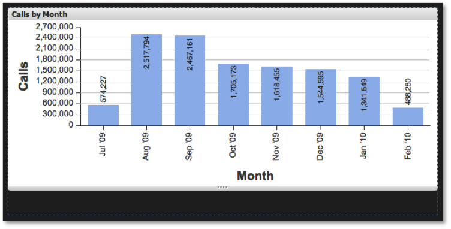

# 시각화 크기 조정{#sizing-visualizations}

시각화를 확장 및 축소하는 것 외에도 크기를 조정할 수 있습니다.

시각화 창 아래쪽에 있는 크기 조정 핸들을 사용하면 됩니다. 시각화 창의 아래쪽 가장자리 위로 마우스를 가져가면 클릭-드래그하여 대시보드 캔버스에서 윈도우를 높이거나 짧게 만들 수 있습니다. 대시보드 내의 다른 시각화는 크기가 조정된 시각화의 새 크기에 맞게 자동으로 배치됩니다. 시각화의 폭은 브라우저 너비를 기준으로 수정되며 조작할 수 없습니다.

