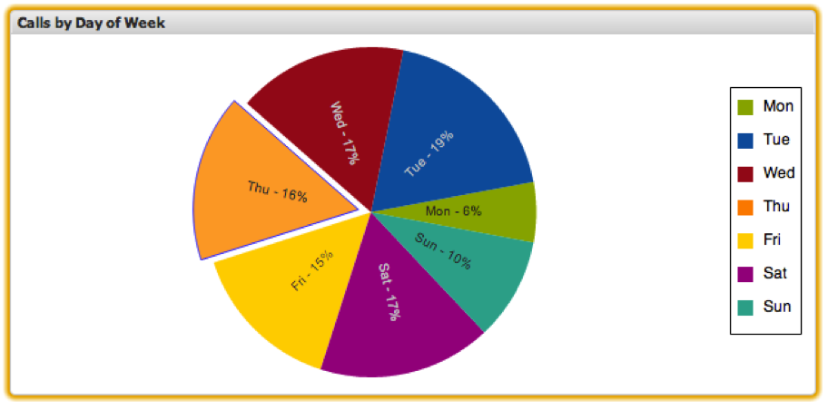

# 파이 차트{#pie-chart}

{{eol}}

파이 차트 시각화 기능을 사용하면 제한된 수의 차원에 대한 지표 값의 상대적 백분율을 표시할 수 있습니다. 파이 차트를 사용하면 한 번에 최대 20개의 고유한 데이터 요소를 차트에 표시할 수 있습니다. 파이의 각 웨지는 해당 백분율과 함께 데이터 집합에 있는 차원을 나타냅니다. 각 백분율은 파이 차트에 표시되는 다른 차원의 지표 값에 대해 계산되며, 전체 데이터 세트일 필요는 없습니다.

특정 웨지를 눌러 파이 차트에서 선택할 수 있습니다.

