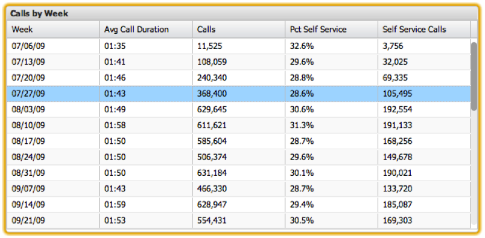

# 표{#tables}

표는 대시보드 애플리케이션에서 사용할 수 있는 가장 세부적인 시각화입니다. 테이블을 사용하면 테이블의 행으로 표시된 각 데이터 요소를 사용하여 지표 및 차원 데이터를 시각화할 수 있습니다. 한 열에는 차원 값이 포함되지만 다른 열에는 해당 지표 값이 포함됩니다. 여러 지표를 표시할 수 있으며 테이블에 표시할 수 있는 차원 값의 수에는 제한이 없습니다. Data Workbench 데이터에 있는 선택한 차원의 모든 값이 테이블에 표시됩니다.

열 머리글 영역의 다른 위치로 열 헤더를 클릭하여 드래그하여 열 순서를 재배열할 수 있습니다. 적절한 열 헤더를 클릭하여 언제든지 정렬을 수행할 수 있습니다. 열 헤더를 다시 클릭하면 정렬 순서가 거꾸로 됩니다.

특정 행을 클릭하여 테이블에서 선택할 수 있습니다. 누르기 및 **[!UICONTROL Control]** 추가 항목을 클릭하면 키가 선택 항목을 유지합니다. 누르기 및 **[!UICONTROL Control]** 를 클릭하면 선택 영역의 값도 전환합니다. 이 기능은 이미 선택한 항목 그룹에서 선택 항목을 한 개만 제거하는 데 유용합니다. 먼저 행을 클릭하여 선택한 다음 키를 눌러 다양한 행을 선택할 수 있습니다 **[!UICONTROL Shift]** 키를 누른 채 마지막 행을 클릭합니다.

