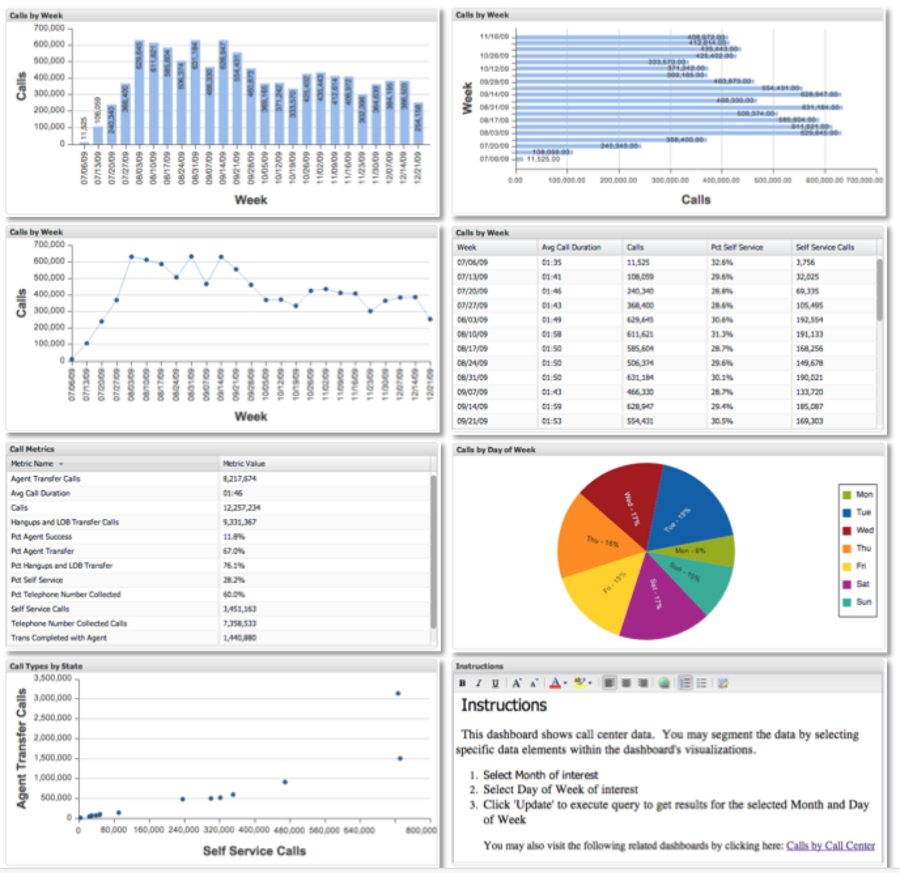

# 시각화 유형{#visualization-types}

8가지 서로 다른 시각화 유형을 소개합니다.

시각화를 선택할 때 시각화하고 있는 차원과 지표를 신중하게 고려하고 데이터를 가장 효과적으로 시각화하는 방법을 고려해야 합니다. 예를 들어, 일부 시각화는 한 번에 표시할 수 있는 데이터 수량의 제한을 갖습니다.

데이터를 시각화하고 분석하는 데 사용할 수 있는 8가지 시각화 유형이 있습니다.막대 차트, 열 차트, 라인 차트, 파이 차트, 표, 지표 범례, 산포 플롯 및 리치 텍스트.

