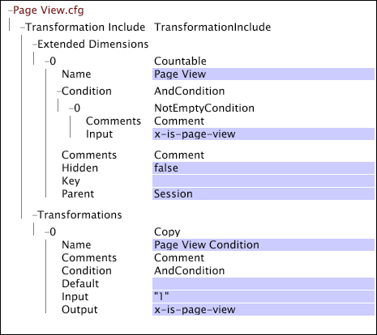

# 변환을 위한 웹 전용 설정{#web-specific-settings-for-transformation}

변형 데이터 세트에 정의된 웹 전용 설정에 대한 정보 사이트용 Adobe 프로파일과 함께 제공되는 파일을 포함합니다.

이러한 설정에 의해 정의된 조건, 차원 및 매개 변수는 데이터 세트 구성의 변환 단계 동안 생성됩니다.

* [페이지 보기 조건](../../../home/c-dataset-const-proc/c-config-web-data/c-web-spec-transf.md#section-cc2807a12a88492f8b64a43234a1f835)
* [URI 차원](../../../home/c-dataset-const-proc/c-config-web-data/c-web-spec-transf.md#section-348f7e9099d049d197a7cdcbc8a6c234)
* [레퍼러 차원](../../../home/c-dataset-const-proc/c-config-web-data/c-web-spec-transf.md#section-8a97ec34d18b4814b5f95495ac4f8638)
* [세션 매개 변수](../../../home/c-dataset-const-proc/c-config-web-data/c-web-spec-transf.md#section-0a209b0c504041a5801f7f71a963c8b1)

## 페이지 보기 조건 {#section-cc2807a12a88492f8b64a43234a1f835}

이 [!DNL Page View Condition] 작업은 방문자의 페이지 보기 내역에 대해 수집된 데이터에 특정 로그 항목(즉, 페이지 요청)을 포함해야 하는지 여부를 결정하는 조건 작업입니다. 로그 항목이 이 항목을 [!DNL Page View Condition]충족하면 페이지 보기 계산 가능한 차원의 요소가 됩니다. 로그 항목이 이 항목을 충족하지 않을 [!DNL Page View Condition]경우 다른 차원에서 해당 데이터 필드에 계속 액세스할 수 있습니다. 페이지 보기 차원 외에 다음 차원은 [!DNL Page View Condition]다음과 같은 결과의 영향을 받을 수 있습니다.

* **[!DNL URI]및[!DNL Page]**이러한 차원은 JavaScript의 영향을 받습니다[!DNL Page View Condition]. 지정된 페이지가 전달되지 않으면 URI 또는 페이지 차원에 포함되지[!DNL Page View Condition,]않습니다.

* **[!DNL Visitor Page Views]및[!DNL Session Page Views]**방문자 페이지 보기 횟수 및 세션 페이지 보기 횟수 차원은 방문자가 해당 세션 간 또는 해당 세션에서 본 페이지 수의 카운트입니다. 에 의해 필터링된 페이지는 이 카운트의 일부가[!DNL Page View Condition]아닙니다.

* **세션 번호:** 세션 [!DNL Page View Condition] 번호 차원에 간접 효과가 있습니다. 세션 번호 차원은 [!DNL Page View Condition];따라서 페이지와 [!DNL Session Number] 관련하여 고려할 [!DNL Page Views]때 페이지 보기가 없는 세션을 가질 수 있습니다.

의 기본 구현에는 페이지 보기 계산 가능한 차원과 관련 차원이 [!DNL Site] [!DNL Transformation Dataset Include] [!DNL Page View Condition] 정의된 파일이 포함되어 있습니다.

계산 가능한 차원에 대한 자세한 내용은 확장 [차원을 참조하십시오](../../../home/c-dataset-const-proc/c-ex-dim/c-abt-ex-dim.md).

**페이지 보기 조건에 대한 구성 설정을 편집하려면**

1. 데이터 집합 프로필 [!DNL Profile Manager] 내에서 파일을 열고 [!DNL Dataset\Transformation\Traffic\Page View.cfg] 파일을 엽니다.

   >[!NOTE]
   >
   >구현을 사용자 정의한 [!DNL Site]경우 이러한 구성 설정이 있는 파일이 설명된 위치와 다를 수 있습니다.

1. 필요에 따라 매개 변수의 값을 검토하거나 [!DNL Page View Condition] 편집합니다. 다음 예를 안내서로 사용합니다. 이 파일에서 는 변환으로 [!DNL Page View Condition] 정의됩니다 [!DNL Copy] . 이 파일에는 페이지 보기 계산 가능한 차원의 정의도 포함되어 있습니다.

   

   >[!NOTE]
   >
   >계산 가능한 차원에 대한 자세한 내용은 확장 [차원을 참조하십시오](../../../home/c-dataset-const-proc/c-ex-dim/c-abt-ex-dim.md). 변환에 대한 자세한 내용은 [!DNL Copy] 데이터 [변형을 참조하십시오](../../../home/c-dataset-const-proc/c-data-trans/c-abt-transf.md).

1. 창 **[!UICONTROL (modified)]** 맨 위에서 마우스 오른쪽 단추를 클릭하여 파일을 저장한 다음 **[!UICONTROL Save]**&#x200B;을 클릭합니다.

1. 로컬에서 변경한 내용을 적용하려면 열에서 파일에 대한 확인 표시를 마우스 오른쪽 단추로 클릭한 다음 [!DNL Profile Manager]> [!DNL User] &lt; **[!UICONTROL Save to]** > ***[!UICONTROL profile name]***&#x200B;을 클릭합니다. 여기서 프로필 이름은 데이터 세트 프로필의 이름이거나 데이터 세트에 포함된 파일이 속하는 상속된 프로필입니다.

   >[!NOTE]
   >
   >이러한 프로필에 대한 업데이트를 설치할 때 변경 사항을 덮어쓰게 되므로 수정된 구성 파일을 Adobe가 제공한 내부 프로필에 저장하지 마십시오.

## URI 차원 {#section-348f7e9099d049d197a7cdcbc8a6c234}

작업 중인 [!DNL Site]경우, 본 웹 사이트 페이지의 URI 스템인 요소를 포함하는 URI 차원을 정의해야 합니다. 기본 구현에는 URI 단순 차원이 정의된 [!DNL Transformation Dataset Include] 파일이 포함되어 있습니다.

단순 차원에 대한 자세한 내용은 확장 [차원을 참조하십시오](../../../home/c-dataset-const-proc/c-ex-dim/c-abt-ex-dim.md).

**URI 차원에 대한 구성 설정을 편집하려면**

1. 데이터 집합 프로필 [!DNL Profile Manager] 내에서 파일을 열고 [!DNL Dataset\Transformation\Traffic\URI.cfg] 파일을 엽니다.

   >[!NOTE]
   >
   >구현을 사용자 정의한 [!DNL Site]경우 이러한 구성 설정이 있는 파일이 설명된 위치와 다를 수 있습니다.

1. 원하는 대로 파일의 매개 변수 값을 검토하거나 편집합니다. 다음 예제와 정보를 안내선으로 사용합니다.

URI 차원에 대한 구성 설정은 다음 두 개의 매개 변수를 포함합니다.

* **대/소문자 구분:** 참 또는 거짓 true인 경우, 고유 페이지를 식별하는 데 대소문자(위/아래)가 고려됩니다. 기본값은 true입니다.
* **최대 요소:** URI 차원에 대한 최대 요소 수(즉, URI). 기본값은 32768입니다.

   >[!NOTE]
   >
   >이 값을 변경하면 심각한 성능 문제가 발생할 수 있습니다. Adobe에 문의하지 않고 이 값을 변경하지 마십시오.

* 창 맨 위에서 마우스 오른쪽 단추를 클릭하여 [!DNL URI.cfg] 파일을 저장한 **[!UICONTROL (modified)]** 다음 을 **[!UICONTROL Save]**&#x200B;클릭합니다.

* 로컬에서 변경한 내용을 적용하려면 열에서 파일에 대한 확인 표시를 마우스 오른쪽 단추로 클릭한 다음 [!DNL Profile Manager]> [!DNL User] &lt; **[!UICONTROL Save to]** > ***[!UICONTROL profile name]***&#x200B;을 클릭합니다. 여기서 프로필 이름은 데이터 세트 프로필의 이름이거나 데이터 세트에 포함된 파일이 속하는 상속된 프로필입니다.

   >[!NOTE]
   >
   >이러한 프로필에 대한 업데이트를 설치할 때 변경 사항을 덮어쓰게 되므로 수정된 구성 파일을 Adobe가 제공한 내부 프로필에 저장하지 마십시오.

## 레퍼러 차원 {#section-8a97ec34d18b4814b5f95495ac4f8638}

작업 중인 [!DNL Site]경우 모든 세션에서 첫 번째 로그 항목의 레퍼러의 두 번째 수준 도메인으로 구성된 레퍼러 차원을 정의해야 합니다. 기본 구현에는 레퍼러 단순 차원이 정의된 [!DNL Transformation Dataset Include] 파일이 포함되어 있습니다.

단순 차원에 대한 자세한 내용은 확장 [차원을 참조하십시오](../../../home/c-dataset-const-proc/c-ex-dim/c-abt-ex-dim.md).

**레퍼러 차원에 대한 구성 설정을 편집하려면**

1. 데이터 집합 프로필 [!DNL Profile Manager] 내에서 파일을 열고 [!DNL Dataset\Transformation\Traffic\Referrer.cfg] 파일을 엽니다.

   >[!NOTE]
   >
   >구현을 사용자 정의한 [!DNL Site]경우 이러한 구성 설정이 있는 파일이 설명된 위치와 다를 수 있습니다.

1. 원하는 대로 파일의 매개 변수 값을 검토하거나 편집합니다. 다음 예제와 정보를 안내선으로 사용합니다.

   

   레퍼러 차원에 대한 구성 설정에는 레퍼러 차원에 대한 최대 요소 수(즉, 레퍼러)를 지정하는 최대 요소 매개 변수가 포함됩니다. 기본값은 32768입니다.

   >[!NOTE]
   >
   >위의 예에서 매개 변수는 0으로 [!DNL Maximum Elements] 설정됩니다. 이 매개 변수를 0으로 설정하면 데이터 워크벤치 서버는 내부 기본값 32768을 사용합니다.

1. 창 맨 위에서 마우스 오른쪽 단추를 클릭하여 [!DNL Referrer.cfg] 파일을 저장한 **[!UICONTROL (modified)]** 다음 을 **[!UICONTROL Save]**&#x200B;클릭합니다.

1. 로컬에서 변경한 내용을 적용하려면 열에서 파일에 대한 확인 표시를 마우스 오른쪽 단추로 클릭한 다음 [!DNL Profile Manager]> [!DNL User] &lt; **[!UICONTROL Save to]** > ***[!UICONTROL profile name]***&#x200B;을 클릭합니다. 여기서 프로필 이름은 데이터 세트 프로필의 이름이거나 데이터 세트에 포함된 파일이 속하는 상속된 프로필입니다.

   >[!NOTE]
   >
   >이러한 프로필에 대한 업데이트를 설치할 때 변경 사항을 덮어쓰게 되므로 수정된 구성 파일을 Adobe가 제공한 내부 프로필에 저장하지 마십시오.

## 세션 매개 변수 {#section-0a209b0c504041a5801f7f71a963c8b1}

작업 중인 [!DNL Site]경우 웹 사이트에서 방문자 세션의 경계를 정의하는 매개 변수를 지정할 수 있습니다. 이러한 매개 변수는 [!DNL Transformation Dataset Include] 구현 내의 [!DNL Site] 파일에 정의된 경우에만 유효합니다.

다음 매개 변수는 [!DNL Transformation Dataset Include] 파일의 [!DNL Parameters] 벡터의 구성원이거나 [!DNL Transformation.cfg]파일에 개별 매개 변수로 나열될 수 있다는 점에서 고유합니다. 매개 변수는 정확히 한 번만 정의할 수 있으므로 이러한 매개 변수는 [!DNL Transformation.cfg]파일 또는 데이터 세트의 [!DNL Parameters] 벡터에 정의되어 두 파일 모두에서 정의할 수 없습니다.
**최대 세션 기간 및 세션 시간 초과**

최대 세션 기간 및 세션 시간 제한은 방문자의 세션 길이를 정의하는 문자열 매개 변수입니다. 이러한 매개 변수는 내부 도메인 매개 변수와 함께 사용하여 세션 길이를 결정합니다.

[최대 세션 기간]은 새 세션이 시작되기 전의 최장 세션 길이를 지정합니다. 이렇게 하면 자동 컨텐츠가 있는 웹 페이지가 임의로 긴 세션을 만들지 못하게 됩니다. 클릭의 레퍼러가 내부 도메인 매개 변수의 항목 중 하나로 설정된 경우 이 시간 초과를 사용하여 세션의 끝을 정의합니다. 세션이 포함된 클릭 수에 관계없이 지정된 최대 세션 지속 시간보다 길지 않습니다. 권장 값은 48시간입니다.

세션 시간 초과는 한 세션의 끝과 새 세션의 시작을 결정하기 위해 지정된 방문자의 로그 항목 사이에 전달해야 하는 시간(즉, 사용자 세션을 정의하는 데 사용되는 일반적인 시간 초과)을 지정합니다. 이 매개 변수의 권장 값은 30분입니다. 클릭의 레퍼러가 내부 도메인 매개 변수의 레퍼러 중 하나로 설정되지 않은 경우 이 시간 초과를 사용하여 세션을 정의합니다. 로그 항목의 cs(referrer-domain)가 내부 도메인 목록에 있는 경우 최대 세션 지속 시간은 현재 로그 항목이 기존 세션의 일부인지 새 세션의 시작인지를 결정합니다.

사이트를 탐색하는 동안 세션 시간 초과보다 일정 기간 동안 방문자가 컴퓨터에서 호출되는 상황을 고려하십시오. 돌아온 후, 그는 그가 떠난 곳을 계속 탐색한다. 방문자가 사이트를 떠나지 않거나 브라우저를 닫지 않기 때문에 다음 클릭의 cs(referrer-domain)는 내부 도메인과 동일하며, 최대 세션 지속 시간 설정에 도달하지 않으면 원래 세션이 활성 상태로 유지됩니다. 사이트의 도메인이 내부 도메인으로 나열되고 최대 시간 제한에 도달하지 않으면 방문자의 상호 작용이 별도의 세션이 아닌 단일 세션으로 표시됩니다. 그러나 방문자가 자신의 컴퓨터로 돌아가고 다음 클릭에 외부(또는 빈) 레퍼러가 있는 경우 새 세션이 시작됩니다.

>[!NOTE]
>
>전환은 [!DNL Sessionize] 방문자 세션의 길이를 결정하는 역할도 [!DNL Timeout Condition] 합니다. 세션 시간 초과 및 최대 세션 기간이 적용되지 않는 [!DNL Timeout Condition] 경우 로그 항목을 새 세션의 시작으로 간주할지 여부를 결정하기 위해 이 확인란을 선택합니다. For more information, see [Data Transformations](../../../home/c-dataset-const-proc/c-data-trans/c-abt-transf.md).

**최대 세션 지속 시간 및 세션 시간 초과 매개 변수를 편집하려면**

작업 중인 경우 기본 구현에는 [!DNL Site]이러한 매개 변수의 이름 및 권장 값이 지정된 [!DNL Transformation Dataset Include] 파일이 포함되어 있을 수 있습니다.

1. 데이터 세트 프로필 [!DNL Profile Manager] 내에서 을 열고 로 [!DNL Dataset\Transformation\Traffic\Session Parameters.cfg]이동합니다.

   >[!NOTE]
   >
   >구현을 사용자 정의한 [!DNL Site]경우 이러한 매개 변수가 정의된 파일과 설명된 위치가 다를 수 있습니다.

1. 원하는 대로 매개변수 값을 편집합니다. 원하는 단위(분, 시간 등)를 지정해야 합니다.

   

1. 창 맨 위에서 마우스 오른쪽 단추를 클릭하고 을 클릭하여 [!DNL Session Parameters.cfg] 파일을 저장합니다 **[!UICONTROL (modified)]** . **[!UICONTROL Save]**

1. 로컬에서 변경한 내용을 적용하려면 열에서 파일에 대한 확인 표시를 마우스 오른쪽 단추로 클릭한 다음 [!DNL Profile Manager]> [!DNL User] **[!UICONTROL Save to]** **[!UICONTROL profile name]**&#x200B;을 클릭합니다. 여기서 프로필 이름은 데이터 세트 프로필의 이름이거나 데이터 세트에 포함된 파일이 속하는 상속된 프로필입니다.

   >[!NOTE]
   >
   >이러한 프로필에 대한 업데이트를 설치할 때 변경 사항을 덮어쓰게 되므로 수정된 구성 파일을 Adobe가 제공한 내부 프로필에 저장하지 마십시오.

**[!DNL Internal Domains]**

[!DNL Internal Domains] 는 특정 웹 사이트의 일부로 취급해야 하는 도메인 수준 호스트(내부 레퍼러)를 나열하는 벡터 매개 변수입니다. 이러한 호스트는 레퍼러 차원으로부터 제거됩니다(외부 레퍼러 정보 목록). cs(referrer-domain)가 내부 도메인 집합에 나열된 문자열과 일치하면 세션 시간 초과가 무시되고 세션 길이를 결정하는 데 최대 세션 기간이 사용됩니다.

또한 내부 도메인 매개 변수를 사용하여 방문자가 세션 시간 초과를 초과하는 방식으로 연결된 회사의 여러 도메인 간에 이동할 때 새 세션이 시작되지 않도록 할 수 있습니다. 예를 들어 사이트의 일부가 두 도메인에 분할되어 있는 회사를 생각해 보십시오.하나는 기록되고 다른 하나는 기록되지 않습니다( [!DNL xyz.com][!DNL xyz-unlogged.com]). 이러한 사이트가 두 도메인 간의 원활한 트래픽 이동을 용이하게 하는 방식으로 통합된 경우, 방문자가 [!DNL xyz-unlogged.com] 도메인에서 다시 [!DNL xyz.com] 도메인으로 이동할 때마다 다른 세션을 생성하는 것은 바람직하지 않습니다. 내부 도메인으로 [!DNL xyz-unlogged.com] 나열하면 최대 세션 지속 시간 설정에 도달하지 않는 한 이 두 도메인에서 트래픽의 결과로 세션이 여러 세션으로 분할되지 않습니다.

**내부 도메인을 추가하려면**

작업 중인 경우 기본 [!DNL Site]구현에 내부 도메인 매개 변수를 정의하는 [!DNL Transformation Dataset Include] 파일이 포함됩니다. 이 파일에서 매개 변수의 이름은 다음과 같습니다.포함할 내부 도메인을 입력하고 업데이트된 파일을 저장하면 됩니다.

1. 데이터 세트 프로필 내에서 [!DNL Profile Manager] 파일을 열고 [!DNL Dataset\Transformation\Traffic\Internal Domains.cfg.]

   >[!NOTE]
   >
   >구현을 사용자 정의한 [!DNL Site]경우 내부 도메인 매개 변수가 정의된 파일과 설명된 위치가 다를 수 있습니다.

1. 내부 도메인 벡터 매개 변수를 마우스 오른쪽 단추로 **[!UICONTROL Value]** 클릭하고 **[!UICONTROL Add new]** > **[!UICONTROL Value]**&#x200B;을 클릭합니다.

1. 원하는 대로 값을 편집합니다.

   

1. 창 맨 위에서 마우스 오른쪽 단추를 클릭하고 을 클릭하여 [!DNL Internal Domains.cfg] 파일을 저장합니다 **[!UICONTROL (modified)]** . **[!UICONTROL Save]**

1. 로컬에서 변경한 내용을 적용하려면 열에서 파일에 대한 확인 표시를 마우스 오른쪽 단추로 클릭한 다음 [!DNL Profile Manager]> [!DNL User] &lt; **[!UICONTROL Save to]** > ***[!UICONTROL profile name]***&#x200B;을 클릭합니다. 여기서 프로필 이름은 데이터 세트 프로필의 이름이거나 데이터 세트에 포함된 파일이 속하는 상속된 프로필입니다.

   >[!NOTE]
   >
   >이러한 프로필에 대한 업데이트를 설치할 때 변경 사항을 덮어쓰게 되므로 수정된 구성 파일을 Adobe가 제공한 내부 프로필에 저장하지 마십시오.

