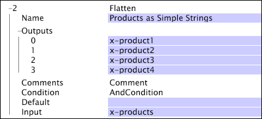

# 분리{#flatten}

[분리] 변환은 문자열 벡터를 가져와서 각 값을 해당 필드에 매핑합니다.

| 매개 변수 | 설명 | 기본값 |
|---|---|---|
|  이름  | 변환의 설명 이름입니다. 여기에 이름을 입력할 수 있습니다. |  |
| 설명 | 선택 사항입니다. 변환에 대한 참고 사항. |  |
| 조건 | 이 변환이 적용되는 조건입니다. |  |
| 기본값 | 조건이 충족되고 로그 항목에 대해 입력 값을 사용할 수 없는 경우 사용할 기본값입니다. |  |
| 입력 | 출력 필드 이름에 매핑할 문자열 값의 벡터. |  |
| 출력 | 출력 필드 이름 집합. |  |

고려 사항: [!DNL Flatten]

* 입력 벡터에 정의된 출력 필드보다 더 많은 값이 포함되어 있는 경우 추가 입력 값이 삭제됩니다.
* 입력 벡터에 정의된 출력 필드보다 값이 더 적은 경우, 기본값이 정의되지 않은 경우 추가 출력 필드에 기본값(정의된 경우) 또는 빈 문자열이 제공됩니다.

여기에서 변형은 제품(x-products)의 벡터를 가져와서 네 개의 필드(x-product1, ..., x-product4)로 구분하는 데 사용됩니다 [!DNL Flatten] .

입력 값에 B57481, C46355 및 Z97123 문자열이 포함되어 있으면 출력 필드에 다음과 같은 값이 표시됩니다.

* x-product1 = B57481
* x-product2 = C46355
* x-product3 = Z97123
* x-product4 = 비어 있음(출력 수보다 입력 수가 더 많고 기본값이 지정되지 않음)

