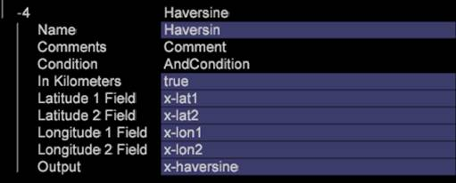

# Haversine{#haversine}

수학에서, 해버신 공식은 긴 강도와 위도에서 식별된 구에서 두 점 사이의 원을 주는 방정식입니다.

수식과 마찬가지로 [!DNL Haversine] 변환에는 두 개의 [!DNL Latitude] 및 [!DNL Longitude] 설정 세트가 필요하며 이 4개의 입력을 사용하여 두 위치 사이의 지구 사이의 실제 거리를 계산합니다.

이 거리는 &quot;In Km&quot; 플래그를 false에서 true로 변경하여 마일 또는 km로 나타낼 수 있습니다.

| 매개 변수 | 설명 | 기본값 |
|---|---|---|
| 이름 | 변환의 설명형 이름입니다. 여기에 이름을 입력할 수 있습니다. |  |
| 댓글 | 선택 사항입니다. 변형에 대한 참고 사항 |  |
| 조건 | 이 변환이 적용되는 조건입니다. |  |
| Latitude 1 필드 | 점 1의 위도입니다. |  |
| Latitude 2 필드 | 점 2의 위도입니다. |  |
| 경도 1 필드 | 1점의 경도입니다. |  |
| 경도 2 필드 | 점 2의 경도입니다. |  |
| 출력 | 계산하면 [!DNL Output] 필드에 Dimension의 요소로 지정된 점 사이의 거리가 포함됩니다. |  |

예를 들어 스토어의 위도 및 경도에 Lat1, Lon1로 코드를 작성하고 해당 고객에게 IP 조회의 위도 및 길이로 사용하는 경우 대부분의 고객이 구매하거나 가져온 스토어에서 찾을 수 있습니다.

>[!NOTE]
>
>다른 위치의 거리를 식별하려면 각 개별 위치에 위도 및 경도 필드 세트가 있어야 합니다.
