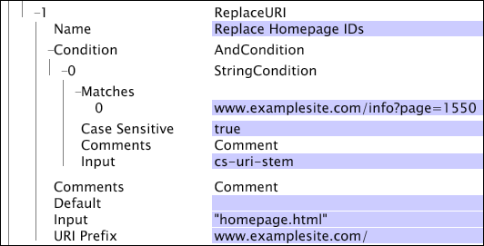

# ReplaceURI{#replaceuri}

ReplaceURI 변환은 내부 URI 차원의 값을 새 값으로 변경합니다.

[!DNL URI Prefix]을 지정하면 결과 값은 제공된 입력 값과 연결된 URI 접두사일 뿐입니다.

| 매개 변수 | 설명 | 기본값 |
|---|---|---|
| 이름 | 변환의 설명 이름입니다. 여기에 이름을 입력할 수 있습니다. |  |
| 댓글 | 선택 사항입니다. 변환에 대한 참고 사항. |  |
| 조건 | 이 변환이 적용되는 조건입니다. |  |
| 기본값 | 조건이 충족되고 입력 값을 사용할 수 없는 경우 사용할 기본값입니다. |  |
| 입력 | URI를 바꿀 값입니다. |  |
| URI 접두사 | [!DNL Input] 필드의 값 앞에 추가할 값(문자열)입니다. |  |

>[!NOTE]
>
>[!DNL ReplaceURI] 변형을 적용하기 전에 cs-uri-stem 또는 cs-uri 복사본에서 [!DNL Page View]의 상위로 새 단순 차원을 만들어야 합니다. 도움이 필요하면 Adobe에 문의하십시오.

이 예제에서는 *pageid*&#x200B;가 웹 사이트의 홈 페이지를 보았다는 것을 나타낼 때마다 [!DNL ReplaceURI]을 사용하여 &quot;page=*pageid*&quot; 쿼리 문자열을 &quot; [!DNL homepage.html]&quot;로 바꾸는 방법을 보여줍니다. 최종 결과는 사용자에게 친숙한 URI 보기입니다.

표시된 변환의 경우 페이지가 표시됩니다

* [!DNL www.examplesite.com/info.html?page=1550]

이

* [!DNL www.examplesite.com/homepage.html]
