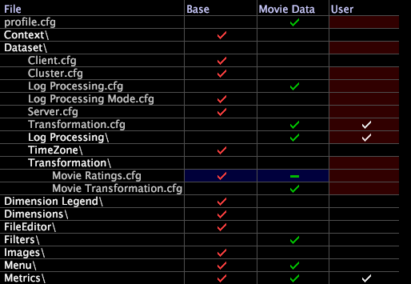

# 데이터 세트 구성 파일 숨기기{#hiding-dataset-configuration-files}

내부 또는 다른 상속된 프로필에서 구성 파일을 상속하지 않으려는 경우(즉, 데이터 집합을 구성하는 동안 파일의 지침을 무시하려는 경우) 파일을 수정하지 않고 같은 이름의 빈(0바이트) 파일을 만들어 다른 프로필에 저장할 수 있습니다.

**데이터 집합 구성 파일을 0바이트로 만들려면**

1. [!DNL Profile Manager]에서 필요한 폴더와 하위 폴더를 열어 0바이트로 지정할 파일을 찾습니다.
1. 파일 이름 옆에 있는 확인 표시를 마우스 오른쪽 단추로 클릭하고 **[!UICONTROL Make Local]** 를 클릭합니다.
1. 메모장과 같은 텍스트 편집기에서 로컬 파일을 열고 해당 내용을 삭제합니다.
1. 파일을 저장하고 닫습니다.
1. [!DNL Profile Manager]에서 0바이트 파일을 원래 파일이 있는 프로필 오른쪽에 있는 프로필에 저장합니다. 0바이트 파일이 원래 파일보다 우선해야 합니다.

   [!DNL Profile Manager]에서 검사 표시 대신 하이픈(-)은 아래 예와 같이 열에 있는 0바이트 파일을 식별합니다.

   

데이터 세트를 다시 처리할 때 데이터 세트에는 원래 파일에서 정의하는 데이터 세트 구성 요소가 포함되어 있지 않습니다.

>[!NOTE]
>
>시각화 또는 지표 정의에 사용되는 확장 차원을 정의하는 구성 파일을 0바이트하면 Data Workbench에서 해당 시각화 또는 지표에 대한 오류를 생성합니다.

0바이트 파일을 사용하여 지표, 차원 또는 필터를 프로필의 다른 위치로 이동하거나 메뉴 항목을 숨길 수도 있습니다. 자세한 내용은 *Data Workbench 사용 안내서*&#x200B;를 참조하십시오.
