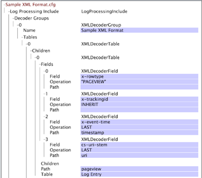

# XML 디코더 그룹{#xml-decoder-groups}

XML 파일을 로그 소스로 처리하여 XML 파일에서 데이터를 추출하기 위한 디코더를 정의합니다.

>[!NOTE]
>
>XML 로그 소스에 대한 XML 디코더 그룹을 정의하려면 XML 파일의 구조 및 내용, 추출할 데이터 및 해당 데이터가 저장되는 필드에 대한 지식이 필요합니다. 이 섹션에서는 디코더에 대해 지정할 수 있는 매개 변수에 대한 기본 설명을 제공합니다. 디코더를 사용하는 방식은 소스 데이터가 포함된 XML 파일에 따라 다릅니다.

XML 로그 소스의 형식 요구 사항에 대한 자세한 내용은 [로그 소스](../../../../../home/c-dataset-const-proc/c-log-proc-config-file/c-log-sources.md#concept-6714c720fac044cbb9af003bf401b2ea)를 참조하십시오. XML 디코더 정의에 대한 도움이 필요하면 Adobe에 문의하십시오.

XML 디코더의 최상위 레벨은 특정 형식의 XML 파일에서 데이터를 추출하는 데 사용하는 디코더 테이블 세트인 디코더 그룹(XMLDecoderGroup)입니다. 형식이 다른 XML 파일이 있는 경우 각 형식에 대해 디코더 그룹을 정의해야 합니다. 각 디코더 그룹은 하나 이상의 디코더 표로 구성됩니다.

다음 표에서는 Tables 매개 변수와 XML 디코더 그룹을 정의하기 위해 지정해야 하는 모든 하위 매개 변수에 대해 설명합니다.

<table id="table_06C40C5149E94548A1B0C2ED4397624B"> 
 <thead> 
  <tr> 
   <th colname="col1" class="entry"> 매개 변수 </th> 
   <th colname="col2" class="entry"> 설명 </th> 
  </tr> 
 </thead>
 <tbody> 
  <tr> 
   <td colname="col1"> 표 </td> 
   <td colname="col2"> <p>디코더 그룹의 각 테이블은 XML 파일에서 추출할 데이터 수준을 나타냅니다. 예를 들어 방문자에 대한 데이터를 추출하려면 각 방문자에 대해 추출할 정보로 구성된 디코더 테이블을 만듭니다. 디코더 테이블 내에서 디코더 테이블을 만들 수도 있습니다(하위 참조). </p> <p> <b>디코더 그룹에 테이블 추가</b> 
     <ul id="ul_C73CAD77440B4465B9FCE08BF4FA0749"> 
      <li id="li_C4B8CC5A85D942898F1EB76778105818"> <span class="uicontrol"> 표 </span>를 마우스 오른쪽 단추로 클릭하고 <span class="uicontrol"> 새 </span> 추가 &gt; <span class="uicontrol"> XMLDecoderTable </span>을 클릭합니다. </li> 
     </ul> </p> </td> 
  </tr> 
  <tr> 
   <td colname="col1"> 필드 </td> 
   <td colname="col2"> <p>데이터가 저장되는 확장 필드(예: x-trackingid, x-email)입니다. 필드에 저장할 데이터는 경로 및/또는 작업 하위 필드에 의해 결정됩니다. </p> <p> Path 는 구조화된 XML 파일 내의 필드 수준입니다. 필드의 경로는 필드가 정의된 테이블의 경로를 기준으로 합니다. 예로는 <span class="filepath"> tag.tag.tag </span> 또는 <span class="filepath"> tag.tag.tag.tag가 있습니다.@attribute </span> 경로는 대/소문자를 구분합니다. </p> <p> 지정된 경로의 각 라인에 작업이 적용되어 출력이 생성됩니다. 다음 작업을 사용할 수 있습니다. 
     <ul id="ul_B264A411D7E3446288E7E69D62150B8B"> 
      <li id="li_5936E81C0EEF46AFB780E451A04A88E4"><b>마지막: </b> 이 필드는 XML 파일에서 경로의 마지막 항목 값을 가져옵니다. </li> 
      <li id="li_7BC4F24F2CA84C2EB64B06FE09B4CAF6"><b>RANDOM:</b>  필드에 임의 값을 할당합니다. 이 작업은 x-trackingid 필드와 같은 고유한 ID를 생성해야 하는 경우에 유용합니다. </li> 
      <li id="li_C1D34EA11BFB4859A25A275A9B63FB56"><b>INHERIT:</b> 정의된 필드는 상위 테이블의 해당 필드에서 해당 값을 상속합니다. </li> 
      <li id="li_F62FB8CD962E4E1495D9A2D5B7A78E2A"><b>"<i>상수  </i>":</b>  상수는 따옴표로 묶어야 합니다. 상수 작업을 사용하여 특정 경로가 있는지 확인할 수 있습니다.경로가 있으면 필드에 상수의 값이 할당됩니다. </li> 
     </ul> </p> <p> <b>디코더 테이블에 필드를 추가하려면</b> </p> <p> 
     <ul id="ul_91D104D927424DEA9E788E43B2F6FEA9"> 
      <li id="li_5448B01EE82349569BBFC99C9604D7B8"> <span class="uicontrol"> 필드 </span>를 마우스 오른쪽 단추로 클릭한 다음 <span class="uicontrol"> 새 </span> 추가 &gt; <span class="uicontrol"> XMLDecoderField </span>를 클릭합니다. 필드, 작업 및 경로를 적절하게 정의합니다. </li> 
     </ul> </p> </td> 
  </tr> 
  <tr> 
   <td colname="col1"> 경로 </td> 
   <td colname="col2"> <p>디코더 테이블이 정보를 포함하는 구조화된 XML 파일 내의 레벨입니다. 하위 XML 디코더 테이블의 경우 경로는 상위 테이블의 경로를 기준으로 합니다. 경로는 대/소문자를 구분합니다. </p> <p> 예를 들어 XML 파일에 다음과 같은 구조가 포함되어 있는 경우 </p> 

    &amp;lt;visitor&amp;gt;
    
    &amp;nbsp;
    
    ..
    
    &amp;nbsp;
    
    &amp;lt;/visitor&amp;gt; 
    
    &amp;lt;/logdata&amp;gt;&amp;nbsp;   &lt;p> 그러면 경로는 logdata&lt;span class=&quot;filepath&quot;>.visitor입니다&lt;/span>. &lt;/p> &lt;/td>
</tr> 
  <tr> 
   <td colname="col1"> 테이블 </td> 
   <td colname="col2"> <p>이 매개 변수의 값은 항상 "로그 항목"이어야 합니다. </p> <p> <p>참고: 컨설팅 Adobe 없이 이 값을 변경하지 마십시오. </p> </p> </td> 
  </tr> 
  <tr> 
   <td colname="col1"> 하위 </td> 
   <td colname="col2"> <p>선택 사항입니다. 하나 이상의 포함된 디코더 테이블. 각 하위 항목에는 위에 설명된 Fields, Path 및 Table 매개 변수가 포함되어 있습니다. </p> <p> <b>디코더 테이블에 하위 항목을 추가하려면</b> </p> <p> 
     <ul id="ul_902AC6CA5D66457D84CBA3194FF49BBE"> 
      <li id="li_07B4D60E7E2E4630B4878691E575936A"> <span class="uicontrol"> 하위 </span> 를 마우스 오른쪽 단추로 클릭하고 <span class="uicontrol"> 새 </span> 추가 &gt; <span class="uicontrol"> XMLDecoderTable </span> 을 클릭합니다. 필드, 작업 및 경로를 적절하게 정의합니다. </li> 
     </ul> </p> </td> 
  </tr> 
 </tbody> 
</table>

XML 파일을 데이터 집합에 대한 로그 소스로 사용하려면 데이터 집합에 처리할 정보를 추출하려면 XML 디코더 그룹 및 테이블을 정의해야 합니다. 이 예에서는 웹 데이터 세트에 대한 샘플 XML 로그 소스에 대한 디코더 그룹 및 테이블을 정의하는 방법을 볼 수 있습니다.

다음 XML 파일에는 Experience Cloud ID, 이메일 주소, 실제 주소 및 방문자의 페이지 보기에 대한 정보를 포함하여 웹 사이트 방문자에 대한 정보가 포함되어 있습니다.


하나의 XML 파일이 있으므로 &quot;샘플 XML 형식&quot;이라는 하나의 디코더 그룹만 필요합니다. 이 디코더 그룹은 이 파일과 같은 형식의 다른 XML 파일에 적용됩니다. 이 디코더 그룹 내에서 XML 디코더 테이블 구성을 시작하려면 먼저 추출할 정보와 데이터가 저장되는 필드를 결정해야 합니다.

이 예제에서는 방문자 및 해당 방문자와 연관된 페이지 보기에 대한 정보를 추출합니다. 이를 위해 방문자에 대한 정보와 해당 방문자의 페이지 보기에 대한 정보가 포함된 포함된(하위) XML 디코더 테이블이 있는 최상위(상위) XML 디코더 테이블을 만듭니다.

**상위(방문자) 테이블에 대한 정보는 다음과 같습니다**

* XML 파일의 각 데이터 행에 대한 데이터 형식 식별자입니다. 방문자를 식별자로 사용하므로 페이지 보기가 아닌 방문자와 관련된 데이터 행을 빠르게 식별할 수 있습니다. 이 값은 x-rowtype 필드에 저장할 수 있습니다.
* x-trackingid 필드에 저장하는 방문자의 ID입니다.
* x-이메일 필드에 저장하는 방문자의 이메일 주소(contact.email)입니다.
* 방문자의 등록 상태입니다. 방문자가 등록된 사용자라면 x-is 등록 필드에 &quot;1&quot; 값을 저장할 수 있습니다.
* 경로 값은 [!DNL logdata.visitor]이고 테이블 값은 [!DNL Log Entry]입니다. 이러한 매개 변수에 대한 자세한 내용은 위의 XMLDecoderGroup 표를 참조하십시오.

**하위(페이지 보기 수) 테이블에 대한 정보는 다음과 같습니다.**

* XML 파일의 각 데이터 행에 대한 데이터 형식 식별자입니다. 방문자에게만 해당하는 데이터가 아니라 방문자의 페이지 보기에 관련된 데이터 행을 빠르게 식별할 수 있도록 &quot;PAGEVIEW&quot;를 식별자로 사용합니다. 이 값은 x-rowtype 필드에 저장합니다.
* 방문자의 ID입니다. 이 값은 상위 테이블에서 상속되며 x-trackingid 필드에 저장됩니다.
* x-event-time 필드에 저장되는 각 페이지 보기의 타임스탬프입니다.
* cs-uri-stem 필드에 저장된 각 페이지 보기의 URI입니다.
* 경로 값은 페이지 보기이며 테이블 값은 &quot;로그 항목&quot;입니다. 이러한 매개 변수에 대한 자세한 내용은 위의 XMLDecoderGroup 표를 참조하십시오.

다음 화면 캡처에는 상위 및 하위 XML 디코더 테이블의 설명된 구조를 기반으로 샘플 XML 파일에 대한 결과 XML 디코더 그룹이 있는 [!DNL Log Processing Dataset Include] 파일의 일부가 표시됩니다.




샘플 XML 파일에 대한 이 디코더의 출력을 보여 주는 표는 다음과 같습니다.

| x-rowtype | cs—uri-stem | x-email | x-is-registered | x-event-time | x-tracking-id |
|---|---|---|---|---|---|
| 방문자 |  | foo@bar.com | 1 |  | 3 |
| 페이지 보기 | /index.html |  |  | 2006-01-01 08:00:00 | 3 |
| 페이지 보기 | / |  |  | 2006-01-01 08:00:30 | 3 |

필드 뷰어 인터페이스를 사용하여 Data Workbench에서 위와 같은 테이블을 만들 수 있습니다. 필드 뷰어 인터페이스에 대한 자세한 내용은 [데이터 집합 구성 도구](../../../../../home/c-dataset-const-proc/c-dataset-config-tools/c-dataset-config-tools.md#concept-6e058b7691834cf79dcfd1573f78d4f5)를 참조하십시오.

## XML 요소#value 사용하여 해당 속성 값 {#section-88758428afb94f0baa5a986604d53bc1} 읽기

이제 XML 경로에 **[!DNL #value]** 태그를 사용하여 XML 요소의 값을 가져올 수 있습니다.

예를 들어 이전에 **`<Hit><Page name="Home Page" index="20">home.html</Page></Hit>`** 경로를 지정하면 `<Page>` 태그의 값을 읽을 수 없습니다. `<Page>` 태그의 값과 해당 속성을 읽으려면 각각 [!DNL Hit.Page.@name] 및 [!DNL Hit.Page.@index]를 사용할 수 있습니다. **`Hit.Page.#value`** 표현식을 사용하여 태그의 값을 가져올 수도 있습니다.

예를 들어 디코더에서 다음 필드를 추가하여 태그 `<varValue>` 값을 읽을 수 있습니다.

```
7 = XMLDecoderField: 
Field = string: x-varvalue-name-added 
Operation = string: LAST 
Path = string:  
<b>#value</b> 
Path = string: varValue 
Table = string: Log Entry
```

마찬가지로 디코더에서 다음 필드를 추가하여 태그 `<Rep>` 값을 읽을 수 있습니다.

```
7 = XMLDecoderField: 
Field = string: x-rep-name-added 
Operation = string: LAST 
Path = string: Rep.# 
<b>value</b> 
Path = string: Reps 
Table = string: Log Entry
```

반면에, 속성이 없는 요소 태그의 값을 읽으려면 디코더를 빌드한 방법에 따라 경로에 &quot; [!DNL text]&quot;를 지정하거나 [!DNL line.text]을(를) 사용하여 `<text>` 태그와 해당 값을 직접 읽을 수 있습니다.`<line>`

```
2 = XMLDecoderField: 
Field = string: x-chat-text 
Operation = string: LAST 
Path = string:  
<b>text</b> 
Path = string:  
<b>line</b> 
Table = string: Log Entry
```
