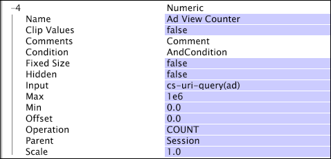

# 숫자 차원{#numeric-dimensions}

숫자 차원은 순차적인 숫자 요소로 구성되며 상위 가산 차원과 일대다 관계를 갖습니다.

숫자 차원을 상위 차원 요소의 숫자 등록 정보를 나타내는 것으로 생각할 수 있습니다. 예를 들어, 웹 데이터를 사용하여 작업하는 경우 세션 차원의 각 세션에 대한 수입(달러)을 정의하는 숫자 차원 세션 매출 을 정의할 수 있습니다. 각 세션에는 연결된 매출이 한 개 있지만, 여러 세션에서는 연결된 매출이 동일한 양을 가질 수 있습니다. 따라서 세션 수입 차원은 세션 차원과 일대다 관계를 갖습니다.

숫자 차원은 종종 값을 합하거나, 조건의 발생 수를 계산하거나, 최소 또는 최대 값을 찾는 지표를 정의하는 데 사용됩니다. 예를 들어 &quot;수입&quot;이라는 지표는 세션 매출 차원을 사용하여 정의할 수 있습니다.sum(Session_Revenue, Session). 이러한 방식으로 정의된 경우 수입 지표는 선택한 세션의 총 매출액 양을 제공합니다.

숫자 차원은 다른 차원의 상위 차원이 될 수 없습니다.

숫자 차원은 다음 매개 변수로 정의됩니다.

<table id="table_15B849DD0BFC4D57AD6CF28898901324"> 
 <thead> 
  <tr> 
   <th colname="col1" class="entry"> 매개 변수 </th> 
   <th colname="col2" class="entry"> 설명 </th> 
   <th colname="col3" class="entry"> 기본값 </th> 
  </tr> 
 </thead>
 <tbody> 
  <tr> 
   <td colname="col1"> 이름 </td> 
   <td colname="col2"> Data Workbench에 표시되는 차원의 수사적 이름입니다. 차원 이름에는 하이픈(-)을 포함할 수 없습니다. </td> 
   <td colname="col3"> </td> 
  </tr> 
  <tr> 
   <td colname="col1"> 클립 값 </td> 
   <td colname="col2"> True 또는 False. 입력 값( 작업 후)을 Min과 Max 값 간에 클리핑할지 여부를 지정합니다. [클립 값]이 true이면 값이 해당 범위로 잘립니다. 클립 값이 false이면 상위 차원의 요소에 대해 값이 반환되지 않습니다. </td> 
   <td colname="col3"> </td> 
  </tr> 
  <tr> 
   <td colname="col1"> 댓글 </td> 
   <td colname="col2"> 선택 사항입니다. 확장 차원에 대한 참고 사항 </td> 
   <td colname="col3"> </td> 
  </tr> 
  <tr> 
   <td colname="col1"> 조건 </td> 
   <td colname="col2"> 입력 필드가 숫자 차원 생성에 기여하는 조건입니다. </td> 
   <td colname="col3"> </td> 
  </tr> 
  <tr> 
   <td colname="col1"> 고정 크기 </td> 
   <td colname="col2"> True 또는 False. 차원의 요소 수(카디널리티)를 제어합니다. true인 경우 Min에서 최대 사이의 모든 요소가 차원에 포함됩니다. false인 경우 값이 추가되면 차원의 크기가 증가합니다. </td> 
   <td colname="col3"> false </td> 
  </tr> 
  <tr> 
   <td colname="col1"> 숨김 </td> 
   <td colname="col2"> 차원이 Data Workbench 인터페이스에 표시되는지 여부를 결정합니다. 기본적으로 이 매개 변수는 false로 설정됩니다. 예를 들어 차원이 지표의 기준으로만 사용되는 경우 이 매개 변수를 true로 설정하여 Data Workbench 표시에서 차원을 숨길 수 있습니다. </td> 
   <td colname="col3"> false </td> 
  </tr> 
  <tr> 
   <td colname="col1"> 입력 </td> 
   <td colname="col2"> 
지정된 작업 또는 발생 횟수를 카운트할 입력 값과 함께 사용할 값입니다. 
 
 이 필드가 문자열 벡터이면 벡터의 각 요소에 대해 평가가 수행됩니다. 따라서 길이가 3인 벡터와 COUNT의 작업이 카운트에 3을 추가합니다. 
 </td> 
   <td colname="col3"> </td> 
  </tr> 
  <tr> 
   <td colname="col1"> 최소 </td> 
   <td colname="col2"> 최종 차원 결과에 대한 하한. </td> 
   <td colname="col3"> 0 </td> 
  </tr> 
  <tr> 
   <td colname="col1"> 최대 </td> 
   <td colname="col2"> 최종 차원 결과의 상한. </td> 
   <td colname="col3"> 1e6 </td> 
  </tr> 
  <tr> 
   <td colname="col1"> 오프셋 </td> 
   <td colname="col2"> 이 표에서 비율 을 참조하십시오. </td> 
   <td colname="col3"> 0 </td> 
  </tr> 
  <tr> 
   <td colname="col1"> 작업 </td> 
   <td colname="col2"> 
사용 가능한 작업은 다음과 같습니다. 
 
 
     <ul id="ul_E04733E5E8824A2BAAB90D9356078D99"> 
      <li id="li_CAEE9167D45540BEAC538345F250B509"> 카운트:차원의 조건을 충족하는 모든 로그 항목에 대한  입력 필드의 비어 있지 않은 값의 총 수가 사용됩니다.  입력 필드가 벡터 필드인 경우 각 로그 항목의 총 비공백 값 수가 계산됩니다. </li> 
      <li id="li_64A4D671E78642BD9A9334F8098450B9"> 첫 번째 비어 있지 않음:첫 번째 로그 항목에서 오는지에 관계없이 첫 번째 비공백 입력 값이 사용됩니다.  입력이 벡터 필드인 경우 관련 로그 항목에 대한 벡터의 첫 번째 행이 사용됩니다. 값이 숫자가 아니면 값이 사용되지 않습니다. </li> 
      <li id="li_C967964729BD4A638FF78D8883CE513F"> 첫 번째 행:입력이 비어 있어도 상위 차원 요소와 관련된 첫 번째 로그 항목의 값이 사용됩니다.  입력이 벡터 필드인 경우 관련 로그 항목에 대한 벡터의 첫 번째 행이 사용됩니다. 이 값이 비어 있거나 숫자가 아니거나 관련 로그 항목이 차원의 조건을 충족하지 않는 경우 값이 사용되지 않습니다. </li> 
      <li id="li_74171B17F480478B8547E1A361B22DA4"> 마지막 비공백:마지막 로그 항목에서 오는지에 관계없이 마지막으로 비공백 입력 값이 사용됩니다.  입력이 벡터 필드인 경우 관련 로그 항목에 대한 벡터의 첫 번째 행이 사용됩니다. 값이 숫자가 아니면 값이 사용되지 않습니다. </li> 
      <li id="li_1253ECF507BD4BBF97CBB2FA12915045"> 마지막 행:입력이 비어 있어도 상위 차원 요소와 관련된 마지막 로그 항목의 값이 사용됩니다.  입력이 벡터 필드인 경우 관련 로그 항목에 대한 벡터의 첫 번째 행이 사용됩니다. 이 값이 비어 있거나 숫자가 아니거나 관련 로그 항목이 차원의 조건을 충족하지 않는 경우 값이 사용되지 않습니다. </li> 
      <li id="li_20819E3944544F98853D6A02814F47B2"> 합계:차원의 조건을 충족하는 모든 로그 항목에 대한  입력 필드의 모든 숫자 값의 합계가 사용됩니다. 로그 항목이 없거나 숫자 값이 없는 경우 숫자 값 0이 사용됩니다. </li> 
      <li id="li_086C2E57604B4645A9203A984C6F9A04">최소 또는 최대:차원의 조건을 충족하는 모든 로그 항목의  입력 필드에 있는 최소 또는 최대 숫자 값이 사용됩니다. 이러한 로그 항목이 없거나 숫자 값이 없는 경우 값이 사용되지 않습니다. </li> 
     </ul> 
 
 
참고: 차원이 의도한 대로 정의되도록 작업을 지정해야 합니다. 
 
 </td> 
   <td colname="col3"> </td> 
  </tr> 
  <tr> 
   <td colname="col1"> 상위 </td> 
   <td colname="col2"> 상위 차원의 이름입니다. 가산 차원은 상위 차원일 수 있습니다. </td> 
   <td colname="col3"> </td> 
  </tr> 
  <tr> 
   <td colname="col1"> 크기 조정 </td> 
   <td colname="col2"> 
치수의 서수 값을 산출하려면 다음과 같이 작업 결과가 변형됩니다. 
 
 (배율 * 입력) + 오프셋 
 </td> 
   <td colname="col3"> 1.0 </td> 
  </tr> 
 </tbody> 
</table>

>[!NOTE]
>
>[!DNL Operation] 값이 반환되지 않거나 [!DNL Clip Values] 가 false이고 값이 [!DNL Min] 및 [!DNL Max] 사이에 없으면 숫자 차원의 요소가 상위 차원의 요소와 관련이 없습니다.

이 예제는 웹 사이트 트래픽에서 수집된 이벤트 데이터를 사용하여 숫자 차원의 정의를 보여줍니다. 광고 보기 카운터라는 이 숫자 차원은 방문자가 지정된 세션 중에 광고를 보는 횟수를 계산합니다. 모든 광고 리소스는 cs-uri-query의 일부로 ad=를 사용하는 웹 서버에서 요청된다고 가정합니다. 이 예제에서 방문자에게 광고가 표시되는 횟수(COUNT)는 필드의 실제 값이 아니라 관심 값입니다.

