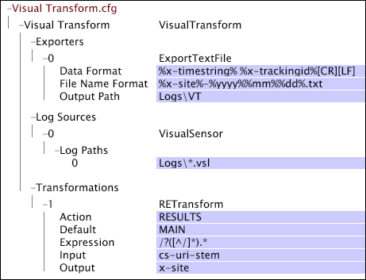

# 샘플 Data Workbench Transform.cfg 파일{#sample-data-workbench-transform-cfg-files}

{{eol}}

몇 가지 시나리오에 따라 Transform.cfg 파일에서 매개 변수를 지정하는 방법에 대한 정보입니다.

* [간단한 Insight Transform.cfg 파일](../../../../../home/c-dataset-const-proc/c-transf-func/c-config-files-transf/t-ins-transf-file/c-sample-transf-files.md#section-b7e83cafa3a947c597bd09d316930190)
* [쉼표로 구분된 값이 있는 출력](../../../../../home/c-dataset-const-proc/c-transf-func/c-config-files-transf/t-ins-transf-file/c-sample-transf-files.md#section-03916934ad574efc8695abbae54a1816)
* [샘플링된 로그 파일](../../../../../home/c-dataset-const-proc/c-transf-func/c-config-files-transf/t-ins-transf-file/c-sample-transf-files.md#section-113b3b0c0c7547ea9536bb2f465c0875)
* [웹 사이트별 로그 파일 분할 섹션](../../../../../home/c-dataset-const-proc/c-transf-func/c-config-files-transf/t-ins-transf-file/c-sample-transf-files.md#section-2cac205cd3934d31abb6c6ed8780196d)

각 샘플에서 파일은 [!DNL Transform.cfg] data workbench의 창.

## 단순 Data Workbench Transform.cfg 파일 {#section-b7e83cafa3a947c597bd09d316930190}

다음 [!DNL Transform.cfg] windows에서는 읽기 지침을 제공합니다. [!DNL .vsl] 파일의 [!DNL Logs] Logs\VT 디렉터리에 저장된 텍스트 파일로 x-timestring 및 x-trackingid 필드를 내보냅니다. 파일 순환 기간 또는 출력 파일 이름 형식을 지정하지 않았으므로 각 파일에는 1일 동안의 데이터가 포함되어 있으며 기본 형식의 이름이 있습니다 [!DNL %yyyy%%mm%%dd%-%x-mask%.txt].

## 쉼표로 구분된 값이 있는 출력 {#section-03916934ad574efc8695abbae54a1816}

다음 [!DNL Transform.cfg] windows에서는 읽기 지침을 제공합니다. [!DNL .vsl] 로그 디렉토리의 파일을 내보내고 필드 0~13을 쉼표로 구분된( )으로 내보냅니다. [!DNL .csv]) Logs\VT\CSV 디렉토리에 저장된 파일입니다. 파일 순환 기간을 지정하지 않았으므로 각 파일에는 1일 동안의 데이터가 포함됩니다. 출력 파일은 다음과 같습니다 [!DNL .csv] 형식으로 명명된 파일 [!DNL %yyyy%%mm%%dd%-%x-mask%.csv].

## 샘플 로그 파일 {#section-113b3b0c0c7547ea9536bb2f465c0875}

최신 콤팩트한 버전의 전체 로그 파일을 생성하고 유지 관리하도록 변환 기능을 구성할 수 있습니다. 이렇게 하면 전체 데이터 세트를 재처리하는 데 필요한 시간이 아닌 초 또는 분 단위의 재처리 시간을 사용하여 데이터 세트 구성을 빠르게 테스트할 수 있습니다. 다음 예에서는 이 작업을 수행하기 위해 변형 기능을 구성하는 방법에 대한 예를 제공합니다.

다음 [!DNL Transform.cfg] windows에서는 읽기 지침을 제공합니다. [!DNL .vsl] Logs 디렉터리에서 파일을 내보내고 x-timestring 및 x-trackingid 필드를 Logs\VT 디렉토리에 저장된 텍스트 파일로 내보냅니다. 지정된 해시 임계값은 데이터 집합에 있는 특정 추적 ID를 필터링하여 100의 비율로 샘플링되는 데이터 세트를 만듭니다. 파일 순환 기간을 지정하지 않았으므로 각 파일에는 1일 동안의 데이터가 포함됩니다. 출력 파일의 이름은 기본 형식입니다 [!DNL %yyyy%%mm%%dd%-%x-mask%.txt].

## 웹 사이트별 로그 파일 분할 섹션 {#section-2cac205cd3934d31abb6c6ed8780196d}

다음 [!DNL Transform.cfg] windows에서는 읽기 지침을 제공합니다. [!DNL .vsl]Logs 디렉터리에서 파일을 내보내고 x-timestring 및 x-trackingid 필드를 Logs\VT 디렉토리에 저장된 텍스트 파일로 내보냅니다. 정규 표현식 변형( [!DNL RETransform])은 cs-uri-stem 필드를 입력으로 사용하여 사이트의 섹션을 정의하는 새 필드(x-site)를 만듭니다. x-site 필드는 출력 텍스트 파일의 이름에 포함되어 있으며 각 파일에는 1일 동안의 데이터가 포함됩니다.

