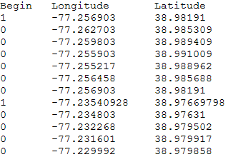

# 탭으로 구분된 값 파일을 참조하는 벡터 레이어{#vector-layers-referencing-tab-separated-values-files}

{{eol}}

탭으로 구분된 값(.tsv) 파일을 참조하는 벡터 레이어를 만들 때 .tsv 파일에서 경도 및 위도 데이터는 물론 드로잉 명령을 읽어들여 벡터 데이터를 가져옵니다.

를 참조하는 벡터 레이어를 정의하려면 [!DNL .tsv] 파일, 다음 항목이 있어야 합니다.

* **A [!DNL .tsv] 파일** 여기에는 경도 및 위도 데이터를 포함하여 세계에서 벡터를 그리는 데 사용되는 데이터가 포함되어 있습니다. 필요한 형식의 [!DNL .tsv] 파일, [벡터 TSV 파일 형식](../../../../home/c-geo-oview/c-wk-img-lyrs/c-wk-vctr-lyrs/c-tab-sep-val-files.md#section-a29012c9ff4444ac8a6d41c68482828e).

* **레이어 파일** 지정 [!DNL .tsv] 파일. 레이어 파일의 필수 형식에 대한 자세한 내용은 [벡터 레이어 파일 형식](../../../../home/c-geo-oview/c-wk-img-lyrs/c-wk-vctr-lyrs/c-tab-sep-val-files.md#section-c430923f341f4c93852e9f24b61e82bf).

## 벡터 TSV 파일 형식 {#section-a29012c9ff4444ac8a6d41c68482828e}

다음 [!DNL .tsv] 파일에는 탭으로 구분된 다음 세 개의 열이 포함되어야 합니다.

* **[!DNL Begin]:** 이 열은 새 행을 시작할지 여부를 나타냅니다. 이 열의 값은 0(새 행을 시작하지 않음) 또는 1(새 줄 시작)일 수 있습니다.
* **[!DNL Longitude]:** 이 열에는 경도 값이 포함되어야 합니다.
* **[!DNL Latitude]:** 이 열에는 위도 값이 포함되어야 합니다.

>[!NOTE]
>
>추가 열은 무시됩니다.

다음은 샘플입니다 [!DNL .tsv] 벡터 레이어의 데이터를 포함하는 파일:



## 벡터 레이어 파일 형식 {#section-c430923f341f4c93852e9f24b61e82bf}

참조하는 각 벡터 레이어 파일 [!DNL .tsv] 파일은 다음 템플릿을 사용하여 포맷해야 합니다.

```
Layer = VectorLayer:
  TSV Files = vector: n items
    0 = string: Maps\\File Name.tsv
    1 = string: Maps\\File Name.tsv
    . . .
    n-1 = string: Maps\\File Name.tsv
  Color = v3d: color vector
  Alpha = double: alpha
  Width = double: width
  Error Factor = double: error factor
```

<table id="table_152F73536AB9403AB43854B81D6A9A15"> 
 <thead> 
  <tr> 
   <th colname="col1" class="entry"> 매개 변수 </th> 
   <th colname="col2" class="entry"> 설명 </th> 
  </tr> 
 </thead>
 <tbody> 
  <tr> 
   <td colname="col1"> TSV 파일 </td> 
   <td colname="col2"> <p>경로 <span class="filepath"> .tsv</span> 벡터 데이터가 포함된 파일입니다. </p> <p>예: <span class="filepath"> 맵\\USVectorData.tsv</span> </p> </td> 
  </tr> 
  <tr> 
   <td colname="col1"> 색상 </td> 
   <td colname="col2"> (빨간색,녹색,파란색)으로 표시되는 RGB 색상 벡터입니다. 벡터의 각 색상에 대해 0.0부터 1.0까지의 값을 입력할 수 있습니다. 예를 들어, (1.0, 0.0, 0.0)은 밝은 빨간색이고 (0.5, 0.5, 0.5)은 회색으로 표시됩니다. </td> 
  </tr> 
  <tr> 
   <td colname="col1"> 알파 </td> 
   <td colname="col2"> 전경에 표시된 벡터의 투명도를 제어합니다. 범위는 0~1이며 0은 가장 투명합니다. </td> 
  </tr> 
  <tr> 
   <td colname="col1"> 너비 </td> 
   <td colname="col2"> 선택 사항. 데이터 너비를 픽셀 단위로 설정합니다. 권장 범위는 1~4입니다. </td> 
  </tr> 
  <tr> 
   <td colname="col1"> 오류 요소 </td> 
   <td colname="col2"> 벡터가 얼마나 정확하게 그려지는지를 제어합니다. 큰 값의 경우 벡터가 덜 정확하게 더 빨리 그려집니다. 기본값은 5입니다. </td> 
  </tr> 
 </tbody> 
</table>
