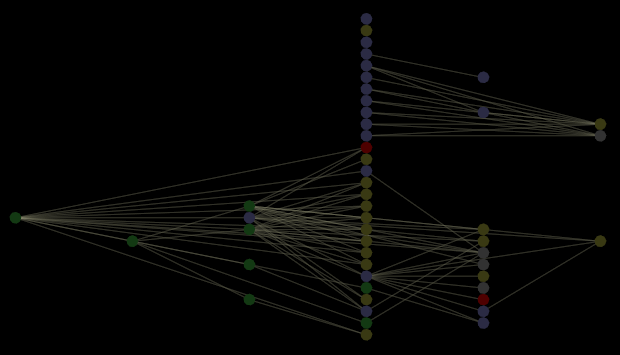

# 작업 영역 및 시각화{#workspaces-and-visualizations}

{{eol}}

작업 공간 및 시각화에 대한 개념 정보.

다음 그림은 노드에서 프로파일에 정의된 작업공간, 보고서, 메뉴 옵션 및 지구본 레이어를 나타내는 종속성 맵을 보여 줍니다. 이 옵션은 [!DNL Query Model] 표시 옵션이 활성화되어 있습니다.

>[!NOTE]
>
>만약 [!DNL Query Model] 표시 옵션은 [!DNL Workspaces and Visualizations] 표시 옵션을 선택하면 오류 메시지가 표시됩니다.

* 회색 노드는 작업 공간 또는 보고서를 나타냅니다.
* 노란색-녹색 노드는 메뉴 옵션을 나타냅니다.
* 빨간색 노드는 끊어지거나 원형 종속성 또는 기타 오류가 있는 작업 공간, 보고서, 메뉴 옵션 또는 지구본 레이어를 나타냅니다.

>[!NOTE]
>
>종속성 맵은 순환 종속성을 수용하도록 설계되었으므로 순환 종속성에 관련된 노드가 맵에 제대로 표시되지 않을 수 있습니다. 에 &quot;순환 종속성&quot;을 입력하여 순환 종속성을 검색할 수 있습니다 [!DNL Search] 텍스트 상자 에 대한 자세한 정보 [!DNL Search] 기능 [맵에서 검색](../../../../../home/c-get-started/c-admin-intrf/c-dataset-mgrs/c-dep-maps/t-srch-map.md#task-a1e7065a538d46c78a7d28676d880dfb).

맵의 다른 노드에 대한 설명은 다음을 참조하십시오 [쿼리 모델 구성 요소](../../../../../home/c-get-started/c-admin-intrf/c-dataset-mgrs/c-dep-maps/c-qry-mod-comp.md#concept-32c6dadd32f74179b026c7e96d47710f).
