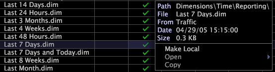

# 파생 차원을 사용한 작업{#work-with-derived-dimensions}

Data Workbench(파생 차원이라고 함)을 사용하여 만드는 새 차원은 클라이언트측 차원입니다.

Data Workbench 서버 컴퓨터의 데이터 집합 구성 및 업데이트 프로세스([!DNL Transformation.cfg] 파일)에서 이러한 차원을 정의하는 대신 파생된 차원은 프로필에 각각 [!DNL .dim] 파일로 만들어지고 저장됩니다. 따라서 데이터 세트를 재처리하지 않고도 기존 차원을 변경하고 새로운 파생 차원을 만들 수 있습니다.

>[!NOTE]
>
>이 섹션에 제공된 것보다 차원에 대한 자세한 내용은 해당 Data Workbench 응용 프로그램 안내서를 참조하십시오.

데이터 집합 구성 및 업데이트 프로세스에 대한 자세한 내용은 *데이터 집합 구성 안내서*&#x200B;를 참조하십시오.

## 파생된 차원 {#section-fd9b6ca13a8f4aa9bbc2fff3ef15cb76} 만들기

파생 차원을 생성하려면 기존 차원을 복사 및 수정하거나 시각화에서 차원을 저장할 수 있습니다.

## 기존 차원 {#section-f46c2d3ab0a5416c98d6e79d18d99fa1}에서 파생된 차원을 만듭니다.

사용자는 기존 차원으로부터 새 시간 차원을 만드는 경우가 많습니다. 예를 들어 기존 &quot;지난 7일&quot; 차원에서 새 &quot;지난 5일&quot; 차원을 만들 수 있습니다.

1. [!DNL Profile Manager]의 *프로필 이름* 열에서 만들려는 차원과 유사한 차원에 대한 확인 표시를 마우스 오른쪽 단추로 클릭하고 **[!UICONTROL Copy]**&#x200B;을 클릭합니다.

   예를 들어 [!DNL Traffic] 프로필의 보고 폴더에서 [!DNL Last 7 Days.dim]을 복사하려면 [!DNL Traffic] 열에서 파일 이름에 대한 확인 표시를 마우스 오른쪽 단추로 클릭하고 **[!UICONTROL Copy]**&#x200B;을 클릭합니다.

   

1. 복사된 차원을 저장할 폴더의 [!DNL User] 열을 마우스 오른쪽 단추로 클릭하고 **[!UICONTROL Paste]**&#x200B;을 클릭합니다.

   차원은 [!DNL User] 열에 확인 표시가 있는 선택한 Dimension 폴더에 나타납니다.

1. 새 차원의 이름을 바꾸려면 [!DNL User] 열에서 해당 확인 표시를 마우스 오른쪽 단추로 클릭하고 [!DNL File] 필드에 새 이름을 입력합니다.
1. 마우스 오른쪽 단추 클릭 메뉴에서 **[!UICONTROL Open]** > **[!UICONTROL from the workbench]**&#x200B;을 클릭합니다. 차원에 대한 정의 매개 변수가 나타납니다.
1. 필요에 따라 매개변수를 수정하여 새 차원을 정의합니다.

   시간 차원의 경우 카운트 및 범위 매개 변수만 수정해야 할 가능성이 높습니다.

1. 파일을 저장하려면 창 위쪽에 있는 **[!UICONTROL (modified)]**&#x200B;을 마우스 오른쪽 단추로 클릭하고 **[!UICONTROL Save]**&#x200B;을 클릭합니다.

   프로파일의 모든 사용자가 만든 차원을 사용하도록 하려면 [!DNL Profile Manager]을 사용하여 프로파일에 업로드해야 합니다. 자세한 내용은 [작업 중인 프로필에 파일 게시](../../../../home/c-get-started/c-admin-intrf/c-prof-mgr/t-pub-files-wkg-prof.md#task-a0106e010c834d16bd60eef4721b6af9)를 참조하십시오.

이제 기본 제공 차원과 같이 선택하여 현재 프로파일에서 새 차원을 사용할 수 있습니다.

## 시각화 {#section-84cfe5e9ccb640afa2ee4e2da2682757}에서 차원 저장

프로세스 맵 및 세그먼트에서 확장 차원을 저장할 수 있습니다. 프로세스 맵에서 차원을 저장하는 단계는 프로세스 맵에서 Dimension 저장](../../../../home/c-get-started/c-analysis-vis/c-proc-maps/t-dim-proc-maps.md#task-44d9e555d4a944e6aa81993eef703051)을 참조하십시오. [ 세그먼트 차원을 저장하는 단계는 82페이지의 [세그먼트 Dimension 만들기](../../../../home/c-get-started/c-analysis-vis/c-seg/c-create-seg-dim.md#concept-70b363edcad14185ba8051646ad3d44e)를 참조하십시오.

## 세그먼트를 {#section-7c443cf1ac5a44659623cabb9e0c1ab8} 차원으로 저장

정의된 세그먼트를 차원으로 저장할 수도 있습니다. 단계에 대해서는 [세그먼트 시각화 재사용](../../../../home/c-get-started/c-analysis-vis/c-seg/c-reuse-seg-vis.md#concept-a8a607bd415d404a83c32a26b804cbdc)을 참조하십시오.

## 기존 파생된 차원 {#section-3a82c604bf1c4d369770556d268808b2} 편집

1. I

   [!DNL Profile Manager]의 *프로필 이름* 열에서 편집할 차원 파일의 확인 표시를 마우스 오른쪽 단추로 클릭하고 **[!UICONTROL Make Local]**&#x200B;을 클릭합니다.
1. [!DNL User] 열에서 차원 파일의 확인 표시를 마우스 오른쪽 단추로 클릭하고 **[!UICONTROL Open]** > **[!UICONTROL from the workbench]**&#x200B;를 클릭합니다.
1. 필요에 따라 매개 변수를 완료합니다. 자세한 내용은 Adobe 컨설팅 서비스에 문의하십시오.
1. 파일을 저장하려면 창 위쪽에 있는 **[!UICONTROL (modified)]**&#x200B;을 마우스 오른쪽 단추로 클릭하고 **[!UICONTROL Save]**&#x200B;을 클릭합니다.

   프로필의 모든 사용자가 수정된 차원을 사용하도록 하려면 [!DNL Profile Manager]을 사용하여 프로필에 업로드해야 합니다. 자세한 내용은 [작업 중인 프로필에 파일 게시](../../../../home/c-get-started/c-admin-intrf/c-prof-mgr/t-pub-files-wkg-prof.md#task-a0106e010c834d16bd60eef4721b6af9)를 참조하십시오.
