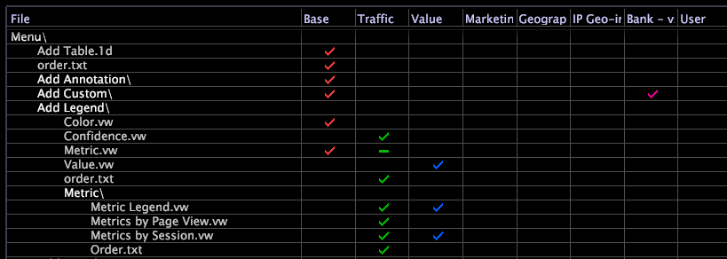

# 비우고 파일 숨기기(0바이트){#hide-a-file-by-emptying-it-zero-byte}

프로필에서 파일을 삭제할 권한이 없거나 파일을 영구적으로 삭제하지 않으려는 경우 빈(0바이트) 파일을 사용하여 파일을 숨길 수 있습니다.

[!DNL Profile Manager]에서 확인 표시 대신 하이픈(-)은 열에 0바이트 파일을 식별합니다.

파일을 숨기는 다른 방법(예: [!DNL order.txt], Show 매개 변수 및 Hidden 매개 변수)과 달리 Data Workbench은 0바이트 파일을 존재하지 않는 파일로 취급합니다. 예를 들어 시각화 또는 지표 정의에 사용된 차원 0바이트를 선택하면 Data Workbench에서 해당 시각화 또는 지표에 대한 오류를 각각 생성합니다.

이 기능은 다음을 수행하고자 하는 경우를 비롯하여 여러 가지 이유로 유용합니다.

* **파일을** 삭제하는 데 필요한 프로필 권한이 없어도 Data Workbench에서 파일을 사용할 수 없도록 만듭니다.
* **원본 위치에서 파일을 삭제하는 데 필요한 프로필** 권한이 없어도 지표, 차원 또는 필터를 다른 위치로 이동할 수 있습니다.
* **메뉴 항목을 숨깁니다.** 예를 들어  [!DNL Base] 파일에  [!DNL Metric Legend] 정의된 프로필이  [!DNL Metric.vw] 있습니다. 회사가 [범례 추가] > [지표] 하위 메뉴에 표시할 3가지 지표 범례를 만들었음을 가정해 보십시오. 새 하위 메뉴와 3개의 새 지표 범례가 나타나도록 [!DNL Base] 프로필 [!DNL Metric.vw] 파일을 0바이트를 수행할 수 있습니다.

**파일을 숨기려면**

1. [!DNL Profile Manager]에서 필요한 폴더 및 하위 폴더를 열어 0바이트를 사용할 파일을 찾습니다.
1. 파일 이름 옆에 있는 확인 표시를 마우스 오른쪽 단추로 클릭하고 **[!UICONTROL Make Local]**&#x200B;을 클릭합니다.
1. 로컬 파일을 열고 콘텐트를 삭제합니다.
1. 파일을 저장하고 닫습니다.
