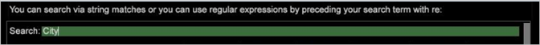

# 프로필 관리자{#profile-manager}

구현에 포함된 폴더 및 파일 이름은 프로필 관리자의 왼쪽에 표시됩니다.

응용 프로그램을 구성하는 프로필은 [!DNL Profile Manager]에 개별 열로 표시됩니다. 이러한 프로필에는 여러 개의 상속된 프로파일과 하나의 작업 프로파일이 포함됩니다.

>[!NOTE]
>
>작업 프로필(데이터 집합 프로필 또는 역할별 프로필)은 Data Workbench을 열 때 로드되는 프로필입니다.

확인 표시(및 해당 색상)는 각 파일이 있는 Data Workbench 서버 및 Data Workbench 컴퓨터의 프로필 폴더, 여러 파일 사본이 있는지 여부, 여러 사본에 동일한 수정된 날짜 및 시간이 있는지 여부를 나타냅니다. 이러한 파일은 프로파일 다운로드 중에 Data Workbench 서버와 Data Workbench 컴퓨터 간에 동기화됩니다.

다음은 HBX 구현을 위한 샘플 [!DNL Profile Manager]입니다.

[!DNL Profile Manager] 메뉴에서 다른 관리자(예: [!DNL Dimensions Manager] 또는 [!DNL Reports Manager])를 열 수 있습니다. 이 관리자는 [!DNL Profile Manager]의 특정 부분만 표시합니다. 새 프로필 관리자를 만들 수도 있습니다. [새 프로필 관리자 만들기](../../../../home/c-get-started/c-intf-anlys-ftrs/c-cstm-prof-files-mgrs/c-new-prof-mgrs.md#concept-0021e006523e4d538aaa16322731d9d3)를 참조하십시오.

특정 열의 파일 이름 옆에 있는 확인 표시는 해당 이름의 파일이 해당 열(프로필)에 있는 폴더에 있음을 나타냅니다. [!DNL Profile Manager]의 오른쪽으로 이동할 때 파일이 왼쪽에 있는 파일보다 우선합니다. 즉, 상속된 각 프로필은 [!DNL Profile Manager]의 왼쪽에 있는 프로파일을 기반으로 합니다. 예를 들어 이름이 같은 파일이 [!DNL Base] 프로필(열)과 [!DNL User] 프로필(열)의 동일한 위치에 있고 [!DNL User] 프로필의 파일이 [!DNL Base] 프로필의 파일 대신 사용됩니다.

## 프로파일 검색 {#section-91f873f1d7ed4fd6a5f3c3ac08cfa623}

Data Workbench 5.5의 경우 [!DNL Profile Manager]에서 필수 프로파일을 찾기 위해 검색 필드가 추가되었습니다.

다음 유형의 열이 [!DNL Profile Manager]에 나타납니다.

* *상속된 프로필 이름* 열에는 각 프로필 폴더에 있는 파일에 대한 확인 표시가 포함되어 있습니다. 상속된 프로필에는 Adobe에서 제공한 내부 프로필뿐만 아니라 만들고 유지 관리하는 회사별 또는 역할별 프로파일이 포함됩니다. 위의 예에서 내부 프로필에는 기본, 트래픽, 값, 마케팅 등이 포함됩니다. Adobe 응용 프로그램을 실행하는 데 필요한 기본 구성 블록과 구성 정보가 포함된 내부 [!DNL Base] 프로필은 모든 구현과 함께 제공됩니다. 다른 내부 프로필에는 웹 트래픽이나 마케팅과 같은 특정 유형의 정보와 관련된 요소(작업 영역, 지표, 파생된 차원 등)가 포함되어 있습니다. Adobe은 분석 중인 데이터 유형과 업계에 적합한 프로파일만을 제공합니다.

   >[!NOTE]
   >
   >기본적으로 내부 프로필(Adobe에서 제공한 프로파일)은 변경할 수 없습니다. 모든 사용자 지정은 데이터 세트 또는 역할별 프로필 또는 사용자가 만드는 기타 프로필에서 수행해야 합니다. 새 응용 프로그램을 빌드하고 내부 프로필을 변경해야 하는 경우 [!DNL Insight.cfg] 파일에서 내부 프로필 수정 매개 변수를 변경해야 합니다. 자세한 내용은 [인사이트 구성 매개 변수](../../../../home/c-get-started/c-insght-config-param.md#concept-14da97d0756348e885c08ca9e866074b)를 참조하십시오. 그 전에 Adobe 컨설팅 서비스에 문의하십시오.

* 항상 다음으로 다음 열인 *작업 프로필 이름* 열에는 현재 작업 프로필의 폴더에 있는 파일에 대한 확인 표시가 포함되어 있습니다. 위의 예에서 작업 프로필은 데이터 집합입니다. 작업 프로필은 데이터 집합 프로필 또는 역할별 프로필입니다. 이 폴더의 파일은 상속된 프로필 폴더에 있는 이름이 같은 파일보다 우선합니다.
* 항상 마지막 열인 [!DNL User] 열에는 User\*profile name* 폴더에 로컬 파일로 있는 파일과 폴더에 대한 확인 표시가 포함되어 있습니다. 사용자 폴더의 디렉토리 구조는 작업 프로필의 디렉토리 구조와 유사하며 각 User\*profile name* 폴더에는 특정 프로파일에 대한 작업 영역, 지표, 차원 및 구성 파일의 로컬 복사본이 포함됩니다. 이러한 로컬 사본은 상속되거나 작업 중인 프로필 폴더에 있는 이름이 동일한 파일보다 우선합니다. [!DNL User] 열의 파일은 User\*profile name* 폴더에만 만들어지고 저장되거나 내부 또는 작업 프로필뿐만 아니라 User\*profile name* 폴더에 있습니다. 각 폴더의 파일은 동일하거나 다를 수 있으며 동일한 수정된 날짜와 시간을 가질 수 있거나 가지지 못할 수 있습니다.

   >[!NOTE]
   >
   >
   >    
   >    
   >    * 데이터 세트를 로컬에만 변경하지 않도록 Data Workbench 서버는 [!DNL profile.cfg] 파일의 로컬 복사본과 User\*profile name* 폴더에 있는 데이터 세트 또는 내보내기 폴더에 있는 파일을 무시합니다. 무시된 파일은 [!DNL User] 열에서 빨간색 배경에 의해 식별되고 컨텍스트 메뉴의 &quot;사용자 디렉토리에서 무시됨&quot; 경고가 표시됩니다. 이러한 파일의 로컬 복사본에서 변경한 내용을 구현하려면 Data Workbench 서버와 동기화할 수 있도록 작업 프로파일에 저장해야 합니다. 작업 프로필에 파일을 저장하는 단계는 [작업 프로필에 파일 게시](../../../../home/c-get-started/c-admin-intrf/c-prof-mgr/t-pub-files-wkg-prof.md#task-a0106e010c834d16bd60eef4721b6af9)를 참조하십시오.
      >    
      >    
   * 열의 확인 표시 대신 하이픈(-)은 빈(0바이트) 파일을 식별합니다. Data Workbench은 0바이트 파일을 존재하지 않는 파일로 취급하므로 해당 파일을 사용하여 프로필에 포함된 파일을 왼쪽으로 숨길 수 있습니다. [빈(0바이트) 파일을 사용하여 파일 숨기기](../../../../home/c-get-started/c-admin-intrf/c-prof-mgr/c-empty-files.md#concept-e776fac9e5904bed8c13b9d5eb17c491)를 참조하십시오.

## 파일 버전 확인 {#section-225d732246b94cbe87acdfa9c881d6af}

이전 섹션에 언급된 대로, [!DNL Profile Manager]의 확인 표시는 파일이 있는 위치와 여러 파일 사본이 다른 시간에 수정되었는지 여부를 쉽게 식별할 수 있도록 색상으로 구분되어 있습니다.

파일이나 축소된 디렉토리가 왼쪽에 있는 파일 또는 디렉토리와 정확히 같으면 해당 열(프로파일)의 파일 또는 디렉토리와 동일한 색상 확인 표시가 나타납니다. 파일 또는 디렉토리와 왼쪽이나 다른 경우 또는 파일 또는 디렉토리가 [!DNL User] 열에만 있는 경우 확인 표시는 흰색입니다.

위의 예제에 표시된 [!DNL Profile Manager]은 다음을 나타냅니다.

* [!DNL A New Metric.metric] 파일에 대한 흰색 확인 표시는 [!DNL User] 열에만 나타나며, 이것은 해당 파일의 로컬 복사본만 가지고 있다는 것을 나타냅니다. 다른 Data Workbench 사용자가 액세스할 수 있도록 Data Workbench 서버에 게시되었거나 업로드되지 않았습니다.

* 동영상 및 [!DNL User] 열에 [!DNL Average Score.metric] 파일 이름에 대한 확인 표시가 나타납니다. [!DNL User] 열의 확인 표시는 [동영상] 열의 확인 표시와 동일한 색상이며, 이는 파일의 로컬 복사본이 [동영상] 폴더의 파일과 동일한 [수정됨] 날짜 및 시간을 갖는다는 것을 나타냅니다.

* 동영상 및 [!DNL User] 열에 [!DNL Average Score Error.metric] 파일 이름에 대한 확인 표시가 나타납니다. [!DNL User] 열의 확인 표시는 흰색이며, 이는 파일의 로컬 사본에 동영상 폴더의 파일과 다른 수정된 날짜 또는 시간이 있음을 나타냅니다.

