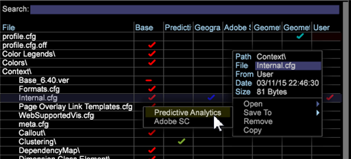

# 워크스테이션에서 프로필 잠금{#locking-profiles-in-the-workstation}

{{eol}}

프로필 관리자에 적용된 Internal.cfg 파일은 사용자가 프로필, Dimension, 보고서, 작업 공간, 지표 및 필터 관리자에 의해 사용자 지정 프로필에 대한 변경 사항을 방지합니다.

관리자를 사용할 때 **[!DNL Internal.cfg]** 파일을 프로필 관리자에서 사용자 지정 프로필에 보낼 수도 있습니다. 이 구성 파일은 관리자가 관리자(에서 액세스)에서 작업할 때 사용자가 여러 파일을 덮어쓰지 못하도록 합니다 **관리** > **프로필** 메뉴 아래의 제품에서 사용할 수 있습니다.

**프로필 관리자에서 프로필 잠금**

1. 작업 공간에서 마우스 오른쪽 단추 클릭 **관리** > **프로필 관리자**.

1. 에서 **프로필 관리자**, 마우스 오른쪽 단추 클릭 **[!DNL Context > Internal.cfg]** 및 **로컬 만들기**.

1. 체크 인을 마우스 오른쪽 단추로 클릭합니다. **사용자** 열 및 저장 `<custom profile>`.

**참고**: 파일을 저장할 때 관리자가 프로필 파일을 변경할 수만 없습니다 **[!DNL Internal.cfg]** 프로필 관리자에서 사용자 지정 프로필로 이동합니다. 작업 공간을 작업 공간에서 작업공간으로 저장할 때 **서버에 저장** 명령.
