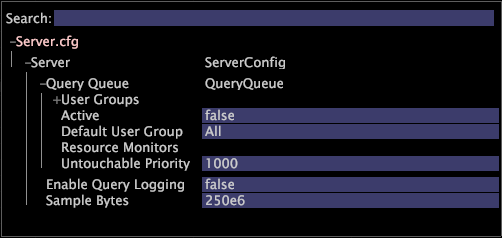

# 쿼리 큐{#query-queue}

일반적으로 데이터 워크벤치 서버는 수신되는 사용자 쿼리에 응답하며 사용자가 더 이상 요청하지 않을 때까지 결과 및 실시간 업데이트를 계속 제공합니다.

경우에 따라, 특히 많은 Data Workbench 사용자가 있는 시스템의 경우, 활성 쿼리 수는 서버에서 사용할 수 있는 것보다 더 많은 시스템 리소스를 필요로 합니다. [!DNL Query Queue] 서버에서 답변을 제공하는 데 필요한 리소스를 사용할 수 있을 때까지 일부 쿼리를 일시적으로 보류할 수 있습니다. 또한 [!DNL Query Queue] 리소스 경합 시 우선 순위가 높은 쿼리가 먼저 응답하도록 다양한 매개 변수를 기반으로 쿼리의 우선 순위를 지정하는 기능을 제공합니다.

단일 클라이언트 또는 보고서 서버의 쿼리는 묶음에 배치되고 단위로 예약됩니다. 쿼리에 사용되는 특정 시스템 리소스의 양을 제한하도록 리소스 모니터를 구성할 수 있습니다. 모니터링되는 리소스가 다른 쿼리 번들의 예약을 허용하는 경우 우선 순위가 가장 높은 번치가 예약됩니다. 리소스 제한으로 인해 아직 쿼리가 예약되지 않은 사용자는 오류를 받지 않지만 쿼리가 큐에 올라가 있음을 알림을 받고 사용자는 로컬 샘플에서 계속 작업할 수 있습니다.

기본 구성에는 에 대한 간단한 구성이 포함되지만 [!DNL Query Queue]비활성화된 상태로 유지됩니다. 관리자는 리소스 모니터를 활성화 또는 비활성화하고, [!DNL Query Queue]리소스 모니터를 구성하여 질의에 사용되는 다양한 리소스의 양을 결정하고, 다른 사용자에 대해 복잡한 우선 순위 지정 정책을 구성할 수 있습니다.

**Server.cfg 파일을 구성하려면[!DNL Query Queuing]**

1. [ [!DNL Server.cfg] 열기]를 **[!UICONTROL Admin]** > **[!UICONTROL Profile Manager]** > **[!UICONTROL Dataset]**&#x200B;클릭하여 엽니다.
1. 마우스 오른쪽 버튼을 **[!UICONTROL Server.cfg]** 클릭하여 로컬에서 편집할 수 있습니다.
1. 확장 [!DNL Query Queue].

   

1. 다음 매개 변수를 구성합니다.

   * **사용자 그룹:** 정책, 사용자 및 대기열 우선 순위를 구성할 수 있습니다. 정의는 [쿼리 큐 사용자](../../../../home/c-get-started/c-admin-intrf/c-query-que/c-query-que-user-grps.md#concept-5555f51402ed49419c067d61738474c1) 그룹을 참조하십시오.

   * **활성:** (벡터) 를 활성화하거나 비활성화합니다 [!DNL Query Queue]. 유효한 값은 true 또는 false입니다. 기본 설정은 false입니다.

   * **기본 사용자 그룹:** (문자열) 사용자가 추가된 사용자 그룹의 이름이 사용자 그룹에 나열되지 않은 경우 해당 사용자 그룹의 이름을 입력합니다.
   * **리소스 모니터:** (벡터) 마우스 오른쪽 단추를 클릭하여 리소스 모니터를 추가합니다. 메모리 또는 쿼리 수를 [!DNL Query Queue] 모니터할지 지정할 수 있습니다. 마우스 오른쪽 단추를 클릭하여 [메모리 예산 모니터] 또는 [쿼리 수 모니터]를 **[!UICONTROL Resource Monitor]** 선택합니다. 자세한 [내용은 쿼리](../../../../home/c-get-started/c-admin-intrf/c-query-que/c-query-que-res-mon.md#concept-0840967b228c4d5ba3b59b4b2759f325) 큐 리소스 모니터를 참조하십시오.

   * **터치할 수 없는 우선 순위:** (Int) 우선 순위가 이 값보다 크거나 같은 부치가 우선순위가 높은 분치를 예약하기 위해 선점 되지 않도록 지정합니다. 사용자 그룹 매개변수 테이블에 [!DNL Memory Budget Monitor] 설명된 [내용과 함께 사용됩니다](../../../../home/c-get-started/c-admin-intrf/c-query-que/c-query-que-user-grps.md#concept-5555f51402ed49419c067d61738474c1).

