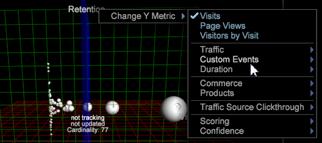

# 3D 산포도{#d-scatter-plots}

3D 산포도는 x, y 및 z 축이 다양한 지표를 나타내는 3차원 격자에 있는 데이터 차원(예: 일 또는 참조 사이트)의 요소를 그래프로 표시합니다.

[산포도 2D](https://docs.adobe.com/content/help/en/data-workbench/using/client/t-open-ins.html#Scatter_Plots)와 같이, 이 시각화는 서로 다른 지표를 사용하는 서로 다른 여러 항목의 관계를 이해하려고 할 때 유용합니다.

**3D 산포도 시각화를 사용하려면**

1. 새 작업 공간을 엽니다.

   새 작업 영역을 연 후에는 **추가** > **일시적으로 잠금 해제**&#x200B;를 클릭해야 할 수 있습니다.
1. 마우스 오른쪽 단추를 클릭하고 **시각화** > **3D 산포도**&#x200B;를 선택합니다.

   **[!UICONTROL Dimensions]** 메뉴를 엽니다.

1. 쿼리의 차원을 선택합니다.

   3D 산포도는 해당 차원에 대한 기본 지표를 엽니다.

   

   **[!UICONTROL Days]** 메뉴를 선택하면 다음 축에 이러한 기본 지표가 있는 다음 3D 산포도 표시됩니다.**[!UICONTROL x=Visits]**, **[!UICONTROL y=Retention]** 및 **[!UICONTROL z=Visits]**.

1. 지표 변경. x, y 또는 z축의 지표 레이블을 마우스 오른쪽 단추로 클릭하고 **[!UICONTROL Change Metric]** 을 선택합니다. 그런 다음 선택한 축에 대해 다른 지표를 선택합니다.

   

   >[!IMPORTANT]
   >
   >
   >    
   >    
   >    * 지표를 3축 레이블 중 하나로 끌어서 놓아 선택한 축을 삭제된 지표로 변경합니다.
   >    * 시각화의 다른 위치에 지표를 드래그하고 끌어 놓아 해당 축에 대한 반경 지표를 변경합니다.
   >    * 차원을 시각화의 아무 곳이나 끌어서 놓아 시각화에 대한 차원을 변경합니다.

1. 반경 지표를 변경합니다. 페이지 상단에 있는 제목(선택한 차원 뒤에 제목)을 마우스 오른쪽 단추로 클릭하고 **[!UICONTROL Change Radius Metric]**&#x200B;을 선택합니다.

   반경 지표는 지표 선택을 기반으로 표시되는 점의 크기를 정의합니다. 분산형 플롯에서는 점의 상대 위치가 변경되지 않지만 시각화 내에서 표시되는 포인트 크기는 지표 값을 기반으로 증가합니다.

   

1. **[!UICONTROL Orthographic Camera]** 을 사용합니다. 이 옵션을 사용하면 3차원 왜곡을 방지하기 위해 반경 지표를 기반으로 실제 원근과 관련하여 표시되는 점을 식별할 수 있습니다.

   3D 분산형 플롯이 처음 나타나면 3차원 회전 투영으로 표시되며 원근에 가까운 점 또는 가상 &quot;카메라&quot;에 일부 왜곡이 발생합니다. (카메라에서 더 멀리 회전하는 점보다 카메라 쪽에 더 가까운 줄거리가 훨씬 더 많이 나타납니다.)

   이러한 원근 왜곡을 방지하려면 제목을 마우스 오른쪽 단추로 클릭하고 메뉴에서 을 선택하여 **[!UICONTROL Orthographic Camera]** 옵션을 선택할 수 있습니다. 이렇게 하면 3차원 개체를 2차원으로 나타낼 수 있습니다. 이렇게 하면 표시된 점이 평면으로 렌더링되고 반지름 지표에 대해 점으로 표시되므로 3차원 오프셋이 줄어듭니다.

1. 산포도에서 점을 선택합니다.

   * **점 또는 점 그룹을 제거하려면 다음을 수행합니다**.점을 클릭합니다.
   * **선택 영역에 다른 점 또는 점 그룹을 추가하려면 다음을 수행합니다**. **Ctrl** +  **** 클릭 지점 또는  **Ctrl** +  **** 여러 점을 드래그합니다.

   * **선택 항목에서 점 또는 점 그룹을 제거하려면 다음을 수행합니다**. **Shift** +  **** 클릭 지점 또는  **Shift** **+** **** 여러 점을 드래그합니다.

<!--  -->
