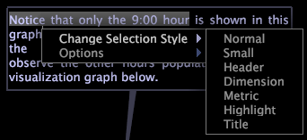
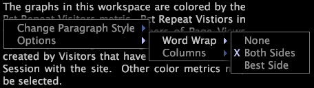

# 텍스트 주석{#text-annotations}

{{eol}}

텍스트 주석은 작업 공간에 설명적 정보나 설명을 추가하기 위해 임의의 텍스트를 입력할 수 있는 창입니다.

작업 공간 내에서 다른 유형의 시각화와 동일한 방식으로 텍스트 주석을 이동하거나 조작합니다. 텍스트 모양과 이름, 편집 또는 작업 공간에 추가하는 텍스트 주석 저장 등의 형식을 지정할 수도 있습니다. 텍스트 주석을 Microsoft Excel로 내보내고 다음 방법으로 생성 및 배포할 수도 있습니다. [!DNL Report].

에 대한 자세한 정보 [!DNL Reports]를 참조하고 *인사이트 보고서 안내서*.

## 텍스트 추가 또는 편집 {#section-8ecc44e0eeb24c5990050102013c0aed}

* 텍스트 본문을 클릭하여 편집 모드로 전환하고 입력을 시작합니다.

   >[!NOTE]
   >
   >텍스트 주석은 잘라내기(Ctrl+x), 복사(Ctrl+c), 붙여넣기(Ctrl+v), 실행 취소(Ctrl+Z), 다시 실행(Ctrl+Shift+z), 섹션 선택(클릭+드래그), 모두 선택(Ctrl+a)을 포함한 기본적인 편집 기능을 지원합니다. 자세한 내용은 [Windows에서 텍스트 작업](../../../../home/c-get-started/c-wk-win-wksp/c-work-text-win.md#concept-f1222434bf954767808e94b955945c8d).

## 단락에 서식 적용 {#section-27744c1589134aa3918aa8787429c0dc}

1. 텍스트 본문 내에서 서식을 지정할 단락을 마우스 오른쪽 단추로 클릭합니다.
1. 클릭 **[!UICONTROL Change Paragraph Style]** > *&lt;**[!UICONTROL text style]**>*.

## 선택 항목에 서식 적용 {#section-4032ecbcc0064e5c96504c15b6f481bf}

1. 텍스트 본문 내에서 &lt;드래그>를 클릭하여 서식을 지정할 텍스트를 선택합니다.
1. 선택 항목을 마우스 오른쪽 단추로 클릭하고 **[!UICONTROL Change Selection Style]** > *&lt;**[!UICONTROL text style]**>*.

## 자동 줄 바꿈 설정 변경 {#section-56948687d47349fc8ba21e108fd13cc1}

이 옵션은 작업 공간에서 주석 내의 텍스트가 시각화 주위에 래핑되는지 여부와 방법을 제어합니다.

* 텍스트 본문을 마우스 오른쪽 단추로 클릭하고 **[!UICONTROL Options]** > **[!UICONTROL Word Wrap]**&#x200B;를 클릭한 다음, 원하는 옵션을 클릭합니다.

   * **없음:** 이 옵션은 이 주석에서 줄바꿈 단어를 제거합니다.
   * **양쪽:** 이 옵션을 사용하면 주석 내의 텍스트가 작업 공간에서 시각화의 양측면을 둘러싸도록 할 수 있습니다.
   * **최상의 측면:** 이 옵션을 사용하면 주석 내의 텍스트가 작업 공간에서 시각화의 한 측면만 둘러싸도록 할 수 있습니다.

## 열 설정 변경 {#section-5cd3f3d63cf64119a2fcec371e33b734}

이 옵션은 주석에 텍스트를 표시할 열 수를 제어합니다.

* 텍스트 본문을 마우스 오른쪽 단추로 클릭하고 **[!UICONTROL Options]** > **[!UICONTROL Columns]**&#x200B;를 클릭한 다음, 원하는 옵션을 클릭합니다.

   * **자동:** 이 옵션은 텍스트의 너비와 길이에 가장 적합한 열 레이아웃을 선택합니다.
   * **1-4:** 이러한 옵션을 사용하면 하나, 2, 3 또는 4개의 열로 텍스트를 표시할 수 있습니다.

## Microsoft Excel로 내보내기 {#section-b239057b822348849fd17a83c3a03c22}

창 내보내기에 대한 자세한 내용은 [창 데이터 내보내기](../../../../home/c-get-started/c-wk-win-wksp/c-exp-win-data.md#concept-8df61d64ed434cc5a499023c44197349).
