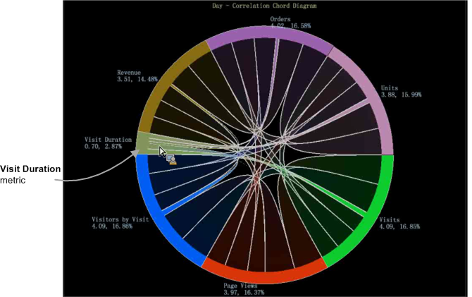

# Chord 시각화{#chord-visualization}

Chord 시각화를 사용하면 지표 간의 비율과 상관 관계를 모두 표시할 수 있으므로 더 큰 코드를 더 강한 상관관계를 나타내는 표시로 표시할 수 있습니다.

Chord 시각화를 사용하면 지표 간의 상관 관계를 식별할 수 있으므로 가능한 상관 관계를 추가하고 쉽게 평가할 수 있습니다. 또한 이전에 만든 [상관 관계 매트릭스](https://experienceleague.adobe.com/docs/data-workbench/using/client/analysis-visualizations/correlation-analysis/c-correlation-analysis.html)에도 다른 보기를 제공합니다. Chord 시각화를 사용하여 지표 간의 양수 또는 음수 상관관계를 식별할 수 없으며 상관 관계가 존재하는 경우에만 해당됩니다. 경우에 따라 카운터 지표를 적용하여 직접 또는 역 관계를 결정할 수 있습니다.

1. **시각화를&#x200B;**[!UICONTROL Chord]**엽니다**.

   작업 영역에서 [!DNL Visualization > Predictive Analytics > Chord] 을 마우스 오른쪽 단추로 클릭합니다.

1. **메뉴에서 Dimension을 선택합니다**.

   차원을 선택할 수 있는 빈 시각화가 열립니다. 차원 이름이 빈 코드 시각화의 맨 위에 나타납니다.

   >[!NOTE]
   >
   >작업 공간에 이미 상관 관계 매트릭스 가 열려 있는 경우 Chord 시각화로 렌더링할 수도 있습니다.

1. **상호 연관시킬 지표를 선택합니다**.

   **[!UICONTROL Finder]**&#x200B;에서 지표를 **[!UICONTROL Ctrl-Alt]**&#x200B;을 클릭하여 테이블에서 차트로 드래그합니다. 둘 이상의 지표를 선택하면 차트가 자동으로 새로 고침되고 상관 관계 데이터 표시를 시작합니다. 데이터 포인트를 상호 연결하려면 필요에 따라 지표를 계속 추가하십시오.

   

   Chord 시각화는 각 세그먼트의 영역으로 표시된 전체 비율의 비율을 표시합니다. 중요한 관계를 식별하고 조사하기 위해 필요에 따라 지표를 계속 추가합니다.

   

1. **Chord 시각화를 봅니다**.

   시각화에서 각 지표 위로 마우스를 가져가면 관계를 볼 수 있습니다. 이 예에서는 판매량과 대부분의 다른 지표(**방문 기간** 지표 제외) 간의 상관 관계를 볼 수 있습니다.

   

   Chord 시각화의 **방문 기간** 지표 위로 마우스를 가져가면 다른 모든 지표 간에 상관관계가 거의 없거나 가장 약한 것을 볼 수 있습니다.

   

1. **설정 변경.** Chord 시각화를 마우스 오른쪽 단추로 클릭하여 차원을 변경하고, 차원을 절대 숫자 또는 백분율로 표시하고, 선택한 지표나 모든 지표를 제거하고, 색상 및 세부 사항을 편집하고, 값을 상관 관계 매트릭스로 내보내십시오.

   
