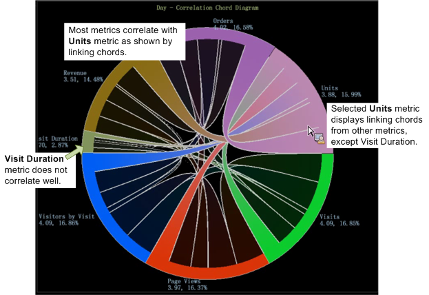

# Chord 시각화{#chord-visualization}

Chord 시각화를 사용하면 지표 간의 비율과 상관 관계를 모두 표시할 수 있으므로 더 큰 코드를 더 강한 상관관계를 나타내는 표시로 표시할 수 있습니다.

Chord 시각화를 사용하면 지표 간의 상관 관계를 식별할 수 있으므로 가능한 상관 관계를 추가하고 쉽게 평가할 수 있습니다. 또한 이전에 작성된 상관 관계 매트릭스에 다른 보기를 [제공합니다](https://docs.adobe.com/content/help/en/data-workbench/using/client/analysis-visualizations/correlation-analysis/c-correlation-analysis.html). Chord 시각화를 사용하면 지표 간 긍정적 또는 부정적 상관 관계를 식별할 수 없습니다. 상관 관계가 있는 경우에만 가능합니다. 경우에 따라, 직접 또는 역 관계를 결정하는 것은 카운터 지표를 적용하여 식별할 수 있습니다.

1. **시각화를&#x200B;**[!UICONTROL Chord]**엽니다**.

   작업 영역에서 마우스 오른쪽 버튼을 클릭합니다 [!DNL Visualization > Predictive Analytics > Chord].

1. **메뉴에서**&#x200B;차원을 선택합니다.

   차원을 선택할 수 있는 빈 시각화가 열립니다. 차원 이름이 빈 코드표 시각화의 맨 위에 나타납니다.

   >[!NOTE]
   >
   >작업 공간에 이미 상관 관계 매트릭스가 열려 있는 경우 코드표 시각화로 렌더링할 수도 있습니다.

1. **상호 연관시킬**&#x200B;지표를 선택합니다.

   지표를 클릭하여 표에서 **[!UICONTROL Finder]** 차트로 **[!UICONTROL Ctrl-Alt]** 끌어 지표를 드래그합니다. 둘 이상의 지표를 선택하면 차트가 자동으로 새로 고쳐지고 상관 관계 데이터를 표시하기 시작합니다. 필요에 따라 지표를 계속 추가하여 데이터 포인트를 상호 연관시킬 수 있습니다.

   

   Chord 시각화에는 각 세그먼트의 영역으로 표현되는 전체 비율이 표시됩니다. 중요한 관계를 식별하고 조사하기 위해 필요에 따라 지표를 계속 추가합니다.

   

1. **Chord 시각화를**&#x200B;봅니다.

   시각화의 각 지표 위로 마우스를 가져가면 관계를 볼 수 있습니다. 이 예에서는 단위와 대부분의 다른 지표 간의 상관 관계를 볼 수 있습니다(방문 기간 **지표 제외** ).

   

   Chord 시각화의 **방문 기간** 지표 위로 마우스를 가져가면 다른 모든 지표 간에 매우 적거나 가장 약한 상관 관계가 있음을 확인할 수 있습니다.

   

1. **설정 변경.** Chord 시각화를 마우스 오른쪽 단추로 클릭하여 차원을 변경하거나, 차원을 절대 숫자 또는 백분율로 표시하고, 선택한 지표나 모든 지표를 제거하고, 색상과 세부 사항을 편집하고, 값을 상관 관계 행렬로 내보냅니다.

   

