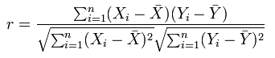

# Pearson 상관 계수 정보{#about-the-pearson-correlation-coefficient}

Pearson 상관 계수는 두 변수 간의 선형 의존의 강도를 표시하기 위해 상관 행렬에서 알고리즘으로 사용됩니다.

이러한 선형 상관 관계는 양수 또는 음수 의존을 나타내는 두 변수 간에 값을 렌더링할 선형 종속 또는 상관 관계에 대한 통계적 측정입니다.

다음은 Pearson 상관 계수 입니다

Pearson의 값은 정의된 두 지표 간의 상관 관계를 나타내는 상관 관계 매트릭스에서 시각화됩니다. 이러한 지표는 데이터 집합에 있는 가산 차원이나 가산 가능한 차원을 통해 서로 비교할 수 있습니다.

색상 선택기를 사용하거나 텍스트 맵과 열 맵의 값을 비교하거나 둘 다 사용하여 서로 다른 색상을 통해 이러한 비교를 강조 표시할 수 있습니다.
