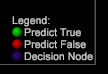

# 의사 결정 트리 옵션{#decision-tree-options}

의사 결정 트리 메뉴에는 긍정적인 사용 사례, 필터, 리프 배포 옵션, 혼동 매트릭스 및 기타 고급 옵션을 설정하는 기능이 포함되어 있습니다.

<table id="table_0CBCCB0856E2469EBE8846B413CAB114"> 
 <thead> 
  <tr> 
   <th colname="col1" class="entry"> 도구 모음 단추 </th> 
   <th colname="col2" class="entry"> 설명 </th> 
  </tr>
 </thead>
 <tbody> 
  <tr> 
   <td colname="col1"> 이동 </td> 
   <td colname="col2"> 을 클릭하여 의사 결정 트리 알고리즘을 실행하고 시각화를 표시합니다. 입력 내용이 있을 때까지 회색으로 표시됩니다. </td> 
  </tr> 
  <tr> 
   <td colname="col1"> 재설정 </td> 
   <td colname="col2"> 입력 및 의사 결정 트리 모델을 지우고 프로세스를 재설정합니다. </td> 
  </tr> 
  <tr> 
   <td colname="col1"> 저장 </td> 
   <td colname="col2"><b>의사 결정 트리를 저장합니다</b>. 의사 결정 트리를 다른 형식으로 저장할 수 있습니다. 
    <ul id="ul_F7C7836C06D64912893113E8EEA05704"> 
     <li id="li_D2D8451A679243F1BC67C3B80CA5F83F">PMML(<b>Predictive Markup Language</b>)은 애플리케이션에서 의사 결정 트리 모델을 설명하고 교환하는 데 사용되는 XML 기반의 파일 포맷입니다. </li> 
     <li id="li_88C4B3E050CA4EFC9B7FA8BD446A9C55"><b>참 또는 거짓, 백분율, 멤버 수 및 입력 값의 간단한 열과 행을 표시하는 텍스트입니다</b> . </li> 
     <li id="li_3F871B88F3FA41E9B95EFF5A181E3D57">예측된 <b>결과</b> 요소에 해당하는 분기가 있는 차원. </li> 
    </ul> </td> 
  </tr> 
  <tr> 
   <td colname="col1"> 옵션 </td> 
   <td colname="col2"> 옵션 메뉴는 아래 표를 참조하십시오. </td> 
  </tr> 
 </tbody> 
</table>

<table id="table_24D84440D0354C70928E8927624DB255"> 
 <thead> 
  <tr> 
   <th colname="col1" class="entry"> 옵션 메뉴 </th> 
   <th colname="col2" class="entry"> 설명 </th> 
  </tr>
 </thead>
 <tbody> 
  <tr> 
   <td colname="col1"> 긍정적인 대/소문자 설정 </td> 
   <td colname="col2"> 현재 작업 영역 선택을 모델의 긍정 대/소문자가 되도록 정의합니다. 선택 영역이 없는 경우 대/소문자를 지웁니다. </td> 
  </tr> 
  <tr> 
   <td colname="col1"> 모집단 필터 설정 </td> 
   <td colname="col2"> 현재 작업 영역 선택을 모델의 모집단 필터로 정의하며 이 조건을 만족하는 방문자로부터 그려집니다. 기본값은 "모든 사람"입니다. </td> 
  </tr> 
  <tr> 
   <td colname="col1"> 복잡한 필터 설명 표시 </td> 
   <td colname="col2"> 정의된 필터에 대한 설명을 표시합니다. 을 클릭하여 긍정 사례 및 모집단 필터의 필터링 스크립트를 봅니다. </td> 
  </tr> 
  <tr> 
   <td colname="col1"> 노드 숨기기 </td> 
   <td colname="col2"> 모집단 중 일부만 있는 노드를 숨깁니다. 이 메뉴 명령은 결정 트리가 표시되는 경우에만 표시됩니다. </td> 
  </tr> 
  <tr> 
   <td colname="col1"> 혼동 매트릭스 </td> 
   <td colname="col2"> 
옵션  &gt; 혼동  매트릭스를 클릭하여 정확도, 리콜, 정밀도 및 F-점수 값을 봅니다. 100%에 가까울수록 점수는 더 좋습니다. 
 
혼동 매트릭스는 값 조합을 사용하여 모델의 정확도를 네 가지 카운트를 제공합니다. 
     <ul id="ul_D9D512F5D74B44BDBD27B1912DF4CB02"> 
      <li id="li_28C541DF1CB543FEAF2D13C2F329DB52">실제 긍정(AP) </li> 
      <li id="li_56233006A1544D95A72CE096CA55C1E6">예측된 긍정적(PP) </li> 
      <li id="li_375FB2D6A0A3418A9AD377C9EBB65386">실제 네거티브(AN) </li> 
      <li id="li_07A5D23A36BA4D448C25C1414836EB8E">예측된 네거티브(PN) </li> 
     </ul> 
 
팁: 이러한 번호는 20% 테스트 데이터의 결과 점수 모델을 적용함으로써 얻으며 이미 정확한 대답으로 알려져 있습니다. 점수가 50%보다 큰 경우, 정의된 필터와 일치하는 긍정적인 대/소문자가 예측됩니다. 그런 다음 정확도 = (TP + TN 파섹)/(TP + FP + TN + FN), 소환은 TP / (TP + FN) 및 Precision = TP / (TP + FP). 
 </td> 
  </tr> 
  <tr> 
   <td colname="col1"> 표시 범례 </td> 
   <td colname="col2">의사 결정 트리에서 범례 키를 켜거나 끌 수 있습니다. 이 메뉴 명령은 결정 트리가 표시되는 경우에만 표시됩니다. </td> 
  </tr> 
  <tr> 
   <td colname="col1"> 고급 </td> 
   <td colname="col2"> 을 클릭하여 고급 메뉴를 열어 의사 결정 트리를 심층적으로 사용합니다. 메뉴 옵션은 아래 표를 참조하십시오. </td> 
  </tr> 
 </tbody> 
</table>

<table id="table_91E4A74BFB224ABD889147324AC2910F"> 
 <thead> 
  <tr> 
   <th colname="col1" class="entry"> 고급 메뉴 </th> 
   <th colname="col2" class="entry"> 설명 </th> 
  </tr>
 </thead>
 <tbody> 
  <tr> 
   <td colname="col1"> 교육 세트 크기 </td> 
   <td colname="col2"> 
모델 제작에 사용되는 교육 세트의 크기를 제어합니다. 더 큰 세트는 훈련하는 데 더 오래 걸리고 더 작은 세트는 더 적은 시간을 사용합니다. 
 </td> 
  </tr> 
  <tr> 
   <td colname="col1"> 입력 표준화 </td> 
   <td colname="col2"> 
 사용자가 Min-Max 또는 Z 스코어 기술을 사용하여 입력사항을 모델에 정규화할지 여부를 지정할 수 있습니다. 
 </td> 
  </tr> 
  <tr> 
   <td colname="col1"> SMOTE Over-Sampling Factor </td> 
   <td colname="col2"> 교육 샘플에서 긍정적인 사례가 자주(10% 미만)되지 않는 경우 SMOTE를 사용하여 추가 샘플을 제공합니다. 이 옵션을 사용하면 사용자가 SMOTE를 사용하여 만들 샘플 수를 표시할 수 있습니다. </td> 
  </tr> 
  <tr> 
   <td colname="col1"> 리프 클래스 배포 임계값 </td> 
   <td colname="col2"> 트리 작성 프로세스 동안 리프에 대해 가정된 임계값을 설정할 수 있습니다. 기본적으로 노드의 모든 멤버는 리프가 되도록(정리 단계 전에) 동일해야 합니다. </td> 
  </tr> 
 </tbody> 
</table>

