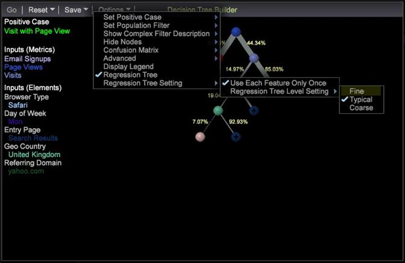

# 의사 결정 트리에 대한 회귀 트리 옵션{#regression-tree-option-for-decision-tree}

새 샘플링 및 시각화 기능과 함께 회귀 트리 옵션을 사용하여 의사 결정 트리를 평가합니다.

의사 결정 트리 시각화 내에서 마우스 오른쪽 단추를 클릭하고 옵션 > **회귀 트리**&#x200B;를 선택하여 회귀 트리 옵션을 사용하여 의사 결정 트리를 평가합니다.

**의사 결정 트리 빌더가 업데이트되었습니다**. 의사 결정 트리를 만들기 위해 새  [알고리즘이 도입되었습니다](https://experienceleague.adobe.com/docs/data-workbench/using/client/analysis-visualizations/decision-trees/c-decision-trees.html). 더 일반적인 데이터를 처리하고 예측의 정밀도를 개선하기 위해 더 유용한 시각화를 제공합니다.

**향상된 데이터 샘플링 모듈**: 업데이트된 적응형 샘플링 구성표는 결정 트리 및 성향 점수가 더 높은 정밀도 결과를 얻는 데 도움이 됩니다.

녹색과 빨간색은 true 또는 false를 나타냅니다. 색상 채도(예: 깊은 빨간색 및 밝은 빨간색)는 확률을 나타내는 데 사용됩니다. 예를 들어, 빨간색 깊이가 큰 노드는 false일 가능성이 매우 높지만, 빨간색이 밝은 노드는 false일 가능성이 낮습니다. 녹색이 깊은 노드는 사실일 가능성이 매우 높다.

모든 의사 결정 트리에는 분기 너비가 달라서 해당 트리의 분기에 대한 트래픽 수준을 나타냅니다.

의사 결정 트리 시각화에서 마우스 오른쪽 단추를 클릭하고 옵션 > **회귀 트리**&#x200B;를 선택합니다. 이 옵션을 선택하면 추가 설정이 제공됩니다.

<table id="table_39E025A3E0B549B4BEDCE0D30A499211"> 
 <thead> 
  <tr> 
   <th colname="col1" class="entry"> 회귀 설정 </th> 
   <th colname="col2" class="entry"> 설명 </th> 
  </tr>
 </thead>
 <tbody> 
  <tr> 
   <td colname="col1"> 
<b>각 기능을 한 번만 사용</b> 
 </td> 
   <td colname="col2"> 
이 옵션을 선택하면 원래 의사 결정 트리와 같은 기능이 두 번 이상 사용되지 않으므로 5개 이상의 입력이 있으면 트리가 5개 수준 이하이고 트리 구조가 의사 결정 트리와 유사하게 표시됩니다(하지만 약간 더 복잡함). 이 옵션을 사용하면 원래 의사 결정 트리와 같이 각 기능을 한 번만 사용하여 트리 빌드를 빠르게 수행할 수 있습니다. 이 기능을 사용하는 것은 기본 설정입니다. 
 </td> 
  </tr> 
  <tr> 
   <td colname="col1"> 
<b>회귀 트리 수준 설정  </b> 
 </td> 
   <td colname="col2"> 
이 옵션은 회귀 트리의 복잡성을 제어합니다. 데이터에 따라 보다 의미 있는 트리 분류를 얻기 위해 <i>Fine</i> 트리(노드가 더 많은 복잡한 구조)를 만들어야 할 수 있습니다. 많은 데이터가 있는 경우 상대적으로 <i>Coherd</i> 트리(더 적은 트리 노드로 인해 덜 복잡함)가 제대로 작동할 수 있습니다. 
 
 
참고: <i>일반</i>은 기본 설정입니다. <i>Typical</i> 설정도 제대로 작동하지 않고 <i>Coordinal</i> 또는 <i>Fine</i> 설정이 데이터를 더 잘 볼 수 있는 극단적인 사례가 있습니다. 
 
 </td> 
  </tr> 
  <tr> 
   <td colname="col1"> </td> 
   <td colname="col2"> 
<i>미세</i>: 가장 세부적인 보고 수준과 대부분의 분기가 있는 가장 복잡한 트리. 
 </td> 
  </tr> 
  <tr> 
   <td colname="col1"> </td> 
   <td colname="col2"> 
<i>일반</i>: 세부기간 및 분기의 평균 수준입니다. 
 </td> 
  </tr> 
  <tr> 
   <td colname="col1"> </td> 
   <td colname="col2"> 
<i>거친</i>: 가장 작은 카테고리와 가장 작은 분기가 있는 가장 덜 복잡한 트리. 
 </td> 
  </tr> 
 </tbody> 
</table>
