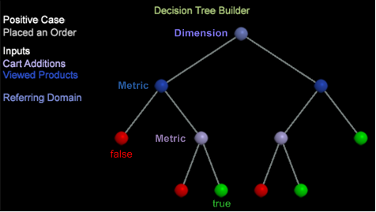

# 의사 결정 트리 작성{#building-a-decision-tree}

긍정적인 사례를 식별하고 지표 및 차원 입력을 추가하여 데이터를 평가하고 의사 결정 트리를 탐색하여 의사 결정 트리를 설정합니다.

다음 단계에 따라 의사 결정 트리를 만듭니다.

1. 새 작업 영역을 엽니다.

   새 작업 영역을 연 후 추가 > 임시 잠금 **해제를** 클릭해야 **할 수 있습니다**.

1. 의사 결정 트리 빌더를 열려면 **[!UICONTROL Visualization]** > 예측 분석 > **분류** > **의사 결정** 트리 **빌더를 마우스 오른쪽 단추로 클릭합니다**.

1. 긍정 **사례**&#x200B;설정

   Finder에서 차원 또는 테이블의 차원 요소를 선택하거나 디자인 필터에서 필터를 디자인하여 의사 결정 트리에 대해 긍정적인 대/소문자를 정의할 수 있습니다. 실제로 긍정적인 경우는 필터, 차원, 요소 및 모든 유형의 데이터 워크벤치 시각화 값을 포함하여 작업 영역에서 여러 선택 항목의 조합이 될 수 있습니다.

   * **필터 디자인 및 적용** (긍정적인 사례) 작업 영역을 마우스 오른쪽 단추로 클릭하고 **[!UICONTROL Tools]** > 을 선택하여 **[!UICONTROL Filter Editor]** 필터를 디자인하고 적용합니다.

   * 차원을 **긍정적인** 케이스로 추가합니다. 작업 영역에서 마우스 오른쪽 단추를 클릭하고 도구 > **파인더를** 선택합니다 **(** 또는 왼쪽 창에서 **[!UICONTROL Add]** > **[!UICONTROL Finders]** 선택). 검색 필드에 차원 이름을 **입력한** 다음 차원을 선택합니다.

   * 지표를 **긍정적인** 사례로 추가합니다. 마우스 오른쪽 단추를 클릭하고 도구 **>** **찾기를** 선택하거나 **[!UICONTROL Add]** 왼쪽 **[!UICONTROL Finders]** 창에서 > 을 선택하여지표 테이블을 엽니다. 지표를 긍정적인 사례로 선택합니다.

   * 차원 **요소를** 긍정적인 케이스로 추가합니다. 작업 공간을 마우스 오른쪽 단추로 클릭하고 차원 요소를 **[!UICONTROL Table]** 열도록 선택한 다음 차원 요소에서 선택하여 긍정적인 대/소문자를 설정합니다.

1. 클릭 **[!UICONTROL Options]** > **[!UICONTROL Set Positive Case]**.

   긍정적인 대/소문자를 설정하고 이름을 지정할 수 있습니다. 이름은 작업 영역의 **[!UICONTROL Positive Case]** 제목 아래에 표시됩니다.

   >[!NOTE]
   >
   >긍정적인 대/소문자를 설정할 때 의사 결정 트리는 현재 작업 영역 선택을 사용합니다. 이 선택 영역은 방문자(또는 최상위 수준 계산 가능한 것 중 정의되지만 대부분의 경우 방문자)로 정의될 수 있습니다. 이러한 결합은 하나의 긍정적인 대/소문자가 아닌 단일 필터로 결합됩니다.

   선택 **[!UICONTROL Set Positive Case]** 사항이 없을 때 클릭하면 긍정적인 대/소문자가 지워집니다.

1. (선택 사항) 분류할 방문자 인구를 **[!UICONTROL Set Population Filters]** 정의하려면 선택합니다.

   모집단 필터가 적용되지 않으면 교육 세트가 모든 방문자로부터 그려집니다(기본값은 &quot;모든 사람&quot;).

   >[!NOTE]
   >
   >긍정 사례 및 모집단 필터에 대한 필터링 스크립트를 **[!UICONTROL Show Complex Filter Description]** 보려면 을 클릭합니다.

1. 지표 **,**&#x200B;차원 **및**&#x200B;차원 요소를 **입력으로** 추가합니다.

   파인더 패널이나 개별 차원 요소의 표에서 드래그 앤 드롭하여 입력을 선택할 수 있습니다. 도구 모음의 **[!UICONTROL Metrics]** 메뉴에서 선택할 수도 있습니다.

   * 지표를 **입력으로** 추가합니다.

      도구 모음에서 지표를 선택합니다. Ctrl **+** Alt **를 눌러** 하나 이상의 지표를 의사 결정 트리 빌더로 드래그합니다.

      이 지표는 입력( **지표) 목록에** 고유한 색상 코딩이 있는 입력으로 나타납니다.

      

   * 차원을 **입력으로** 추가합니다.

      작업 공간에서 마우스 오른쪽 단추를 클릭하고 도구 > **파인더를** 선택한 **다음** 검색 **필드에 차원** 이름을입력합니다. Ctrl **+** **Alt를**&#x200B;누르고 차원을 선택한 다음 차원을 결정 트리 빌더로 드래그합니다.

      차원이 입력( **차원)** 목록에 나타나며 고유한 색상 코딩이 사용됩니다.

   * 차원 **요소를** 입력으로 추가합니다.

      작업 공간에서 마우스 오른쪽 단추를 누르고 차원 테이블을 선택합니다. 차원 요소를 선택하고 **Ctrl** + **Alt를**&#x200B;누른 다음 선택한 요소를 의사 결정 트리 빌더로 드래그합니다.

      차원 요소가 입력( **요소)** 목록에 고유한 색상 코딩과 함께 나타납니다.
   >[!IMPORTANT]
   >
   >평가할 최대 14개의 입력을 선택할 수 있습니다. 너무 많은 입력이 추가되면 오류 메시지가 나타납니다.

1. 도구 모음에서 **[!UICONTROL Go]** 선택합니다.

   의사 결정 트리는 선택한 차원 및 지표를 기반으로 만들어집니다. 장바구니 추가와 같은 단순 지표는 빠르게 작성되지만, 여러 데이터 포인트가 있는 방문 기간과 같은 복잡한 차원은 전환함에 따라 표시된 완료 비율로 더 느리게 생성됩니다. 그러면 트리 맵이 정리 및 열려 사용자 상호 작용이 수행됩니다. 차원 및 지표 입력은 노드 이름과 일관되게 색상으로 구분됩니다.

   

   트리가 정리되고 정리된 분기 다음에 True 또는 False가 **예측되는 경우 리프 노드는 녹색** (true) 또는 **빨간색** (false)으로 표시됩니다.

   >[!NOTE]
   >
   >교육 샘플은 트리 빌더가 사용할 데이터 세트에서 가져옵니다. 데이터 워크벤치에서는 샘플의 80%를 사용하여 트리를 만들고 나머지 20%를 사용하여 트리 모델의 정확도를 평가합니다.

1. 를 사용하여 정확성을 **[!UICONTROL Confusion Matrix]**&#x200B;확인합니다.

   > **[!UICONTROL Options]** 를 **[!UICONTROL Confusion Matrix]** 클릭하여 정확도, 리콜, 정밀도 및 F 스코어 값을 봅니다. 100%에 가까울수록 점수는 더 좋습니다.

   혼동 매트릭스는 값 조합을 사용하여 모델의 정확도를 네 가지 카운트를 제공합니다.

   * 실제 긍정(AP)
   * 예측된 긍정적(PP)
   * 실제 네거티브(AN)
   * 예측된 네거티브(PN)
   >[!TIP]
   >
   >이러한 번호는 20% 테스트 데이터의 결과 점수 모델을 적용함으로써 얻으며 이미 정확한 대답으로 알려져 있습니다. 점수가 50%보다 큰 경우, 정의된 필터와 일치하는 긍정적인 대/소문자가 예측됩니다. 그런 다음 정확도 = (TP + TN 파섹)/(TP + FP + TN + FN), 소환은 TP / (TP + FN) 및 Precision = TP / (TP + FP).

1. **의사 결정 트리를**&#x200B;살펴보십시오.

   의사 결정 트리를 생성한 후 예측 경로를 보고 정의된 기준을 충족하는 모든 방문자를 식별할 수 있습니다. 이 트리는 위치 및 색상 코딩에 따라 각 분기의 입력 분할을 식별합니다. 예를 들어 참조 도메인 노드를 선택하면 해당 분할로 연결되는 노드가 트리 왼쪽에 색상 코드로 나열됩니다.

   리프 노드를 선택하여 결정 트리의 분기(규칙 세트)를 선택할 수 있습니다.

   이 예제의 경우:방문 기간이 1보다 작은 경우, 캠페인이 존재하지 않고, 페이지 보기가 하나 이상 있고, 이메일 등록이 없으며, 방문이 하나 이상 있었습니다. 이 회의 기준에 대한 예상치와 주문 규모는 **94.73** %입니다.

   

   **의사 결정 트리 상호 작용**:표준 Ctrl 키를 누른 채 클릭하여 **트리에서 여러 노드를 선택하거나** Shift 키를 누른 상태에서 **클릭하여** 삭제할 수 있습니다.

   **색상으로 구분된 노드**:노드의 색상은 데이터 워크벤치에서 지정한 입력 차원 및 지표 색상과 일치합니다.

   정리된 분기의 리프 레벨에 있는 밝은 녹색 및 빨간색 노드는 노드를 True 또는 False로 예측합니다.

   |  밝은 녹색 | 노드가 true이고 모든 조건이 충족되었는지 확인합니다. |
   |---|---|
   |  밝은 빨강 | 노드가 false이고 일부 조건이 충족되지 않음을 나타냅니다. |

1. **의사 결정 트리를 저장합니다**.

   의사 결정 트리를 다른 형식으로 저장할 수 있습니다.

   

   * PMML(**Predictive Markup Language**)은 애플리케이션에서 의사 결정 트리 모델을 설명하고 교환하는 데 사용되는 XML 기반의 파일 포맷입니다.
   * **참 또는 거짓, 백분율, 멤버 수 및 입력 값의 간단한 열과 행을 표시하는 텍스트입니다** .
   * 예측된 **결과** 요소에 해당하는 분기가 있는 차원.

