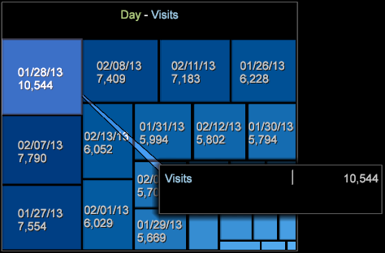

# 밀도 맵{#density-map}

밀도 맵 시각화는 요소를 정사각형 맵 내에서 음영처리된 사각형으로 표시합니다.

사각형의 크기는 요소 값에 따라 달라지며, 큰 값은 큰 영역의 사각형으로 표시됩니다. 파이 차트와 유사하게, 이 시각화 기능을 사용하면 선택한 차원의 가장 큰 백분율을 구성하는 요소를 신속하게 확인할 수 있습니다.

밀도 맵을 만들려면

1. 새 작업 영역을 엽니다.

   새 작업 영역을 연 후 추가 > 임시 잠금 **해제를** 클릭해야 **할 수 있습니다**.
1. 클릭 **[!UICONTROL Visualization]** > **[!UICONTROL Density Map]**.

1. Select a **[!UICONTROL Dimension]** from the menu.

   예를 들어 **[!UICONTROL Time]** > **[!UICONTROL Days]**&#x200B;을 선택합니다.

   반면 **[!UICONTROL Time]** **[!UICONTROL Hours]** >을 선택하면 더 작은 값이 있는 더 많은 요소가 더 작은 사각형으로 표시됩니다.

   >[!NOTE]
   >
   >필요에 따라 여러 요소가 있는 차원을 선택할 수 있습니다. 현재 제한은 각 차원에 대해 가장 큰 요소 중 200개입니다.

1. 맵에 표시할 테이블에서 요소 간에 **[!UICONTROL Visualization]** > **[!UICONTROL Table]** 를 열고 선택하여 차원 보기를 변경할 수 있습니다.

   

   맵은 표의 선택 사항에 응답합니다.

1. 마우스로 작은 요소를 가리키면 마우스 커서 근처에 나타나는 텍스트에 해당 이름과 값이 표시됩니다.
1. 마우스 오른쪽 단추를 클릭하고 선택하여 요소를 마스크한 **[!UICONTROL Mask]**&#x200B;다음 옵션을 선택합니다.

   

   마스크된 노드를 모두 표시하려면 을 **[!UICONTROL Unhide All]**&#x200B;선택합니다.

1. 마우스 오른쪽 단추를 클릭하고 선택한 **[!UICONTROL Spotlight]**&#x200B;다음 옵션을 선택하여 강조 요소를 표시합니다. 스포트라이트 기능을 사용하면 범위에서 요소를 강조 표시하고 어둡게 조정할 수 있습니다.
1. 작업 영역에 색상 범례를 추가합니다. 색상 범례를 사용하여 맵에서 값을 식별할 수 있습니다.

   작업 공간에 색상 범례를 추가할 수 있으며 노드는 추가 데이터 차원을 기반으로 색상을 변경합니다.
1. 맵 제목을 마우스 오른쪽 단추로 클릭하고 메뉴에서 선택하여 차원이나 지표를 변경합니다.

   

1. 셀을 마우스 오른쪽 단추로 클릭하고 선택하여 설명선을 **[!UICONTROL Add Callout]**&#x200B;추가합니다. 메뉴에서 다른 유형이나 시각화 중에서 선택할 수 있습니다.

   

1. 모든 시각화에서처럼 제목 표시줄 위를 마우스 오른쪽 버튼으로 클릭하여 기본 명령을 Microsoft Excel로 내보내기, 순서 지정, 복사, 최소화 및 테두리를 클릭하여 테두리 없이 시각화를 표시할 수 있습니다.

   

1. 밀도 맵을 사용하면 다른 시각화와 유사한 여러 요소를 선택하고 선택 취소할 수 있습니다.

* 요소를 선택하려면 마우스 왼쪽 버튼을 클릭합니다.
* 여러 요소를 선택하려면 Ctrl 키를 누른 채 클릭합니다.
* Shift 키를 누른 상태에서 클릭하여 요소를 선택 취소합니다.
* 선택한 요소 내에서 마우스 오른쪽 단추를 클릭하여 메뉴를 엽니다. 그런 다음 선택한 요소를 선택하거나 **[!UICONTROL Deselect]** **[!UICONTROL Deselect All]** 선택 취소합니다.

## 추가 옵션 {#section-d77defb012424de4a7ced8e5c93115bc}

밀도 맵을 마우스 오른쪽 단추로 클릭하여 다음과 같은 옵션이 있는 메뉴를 엽니다.

<table id="table_3ADA85031C834792BFD041E186962A41"> 
 <thead> 
  <tr> 
   <th colname="col1" class="entry"> 옵션 </th> 
   <th colname="col2" class="entry"> 설명 </th> 
  </tr>
 </thead>
 <tbody> 
  <tr> 
   <td colname="col1"> 이벤트가 복제되지 않도록 하면서 현재 이벤트 변수에  설명선 </td> 
   <td colname="col2">시각화에서 설명선으로 텍스트나 그래픽을 추가하여 요소를 추가로 식별하거나 설명합니다. 
밀도 맵에서 선택한 요소를 기준으로 빈 지표 범례, 표, 선 그래프 또는 산포도 선택할 수도 있습니다. 그런 다음 필요에 따라 지표 및 차원을 이러한 빈 시각화에 추가할 수 있습니다. 
 </td> 
  </tr> 
  <tr> 
   <td colname="col1"> 마스크 </td> 
   <td colname="col2">마스크 옵션을 사용하면 선택한 요소를 숨길 수 있습니다. 마우스 오른쪽 버튼을 클릭하여 마스크 옵션을 표시합니다. 
 이 요소 숨기기- 선택한 단일 요소를 마스크하려면 이 옵션을 선택합니다. 
 
 선택한 항목숨기기 - 선택한 여러 요소에 마스크를 적용하려면 이 옵션을 선택합니다. 
 
 위쪽 표시— 밀도 맵의 값을 기준으로 상위 100개, 50개, 25개 또는 10개의 최상위 요소만 표시하려면 이 옵션을 선택합니다. 
 
 하단표시 - 밀도 맵의 값을 기준으로 하위 100, 50, 25 또는 10개의 최상위 요소만 표시하려면 이 옵션을 선택합니다. 
 </td> 
  </tr> 
  <tr> 
   <td colname="col1"> 스포트라이트를 엽니다 </td> 
   <td colname="col2"> 스포트라이트 기능을 사용하면 범위에서 요소를 강조 표시하고 어둡게 조정할 수 있습니다. 마우스 오른쪽 버튼을 클릭하여 옵션 메뉴를 엽니다. 
 위쪽 표시— 밀도 맵에서 값을 기준으로 상위 100개, 50개, 25개 또는 10개의 최상위 요소만 강조 표시하려면 이 옵션을 선택합니다. 
 
 하단표시 - 밀도 맵의 값을 기준으로 하위 100, 50, 25 또는 10개의 최상위 요소만 강조 표시하려면 이 옵션을 선택합니다. 
 </td> 
  </tr> 
  <tr> 
   <td colname="col1"> 
선택 취소 
 
모두 선택 취소 
 </td> 
   <td colname="col2"> 
 이 명령을 선택하여 현재 요소를 선택 취소하거나 선택한 모든 요소를 선택 취소합니다. 
 </td> 
  </tr> 
 </tbody> 
</table>

