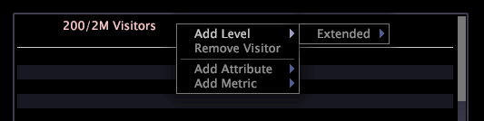

# 세부 사항 테이블{#detail-table}

세부 사항 테이블을 사용하면 다른 시각화에서 선택한 항목에 의해 정의된 데이터 하위 세트에 대한 추가 정보를 볼 수 있습니다.

표시되는 추가 정보는 사용 가능한 모든 데이터의 샘플링입니다.

다음 표에서는 세부 사항 테이블의 요소에 대해 설명합니다.

<table id="table_C88C7F7F5AEA4820B908923E45CC0A62"> 
 <thead> 
  <tr> 
   <th colname="col1" class="entry"> 요소 </th> 
   <th colname="col02" class="entry"> 색상 </th> 
   <th colname="col2" class="entry"> 설명 </th> 
  </tr> 
 </thead>
 <tbody> 
  <tr> 
   <td colname="col1"> 
레벨 
 </td> 
   <td colname="col02"> 
분홍색 
 </td> 
   <td colname="col2"> 
세부 속성 및 지표 정보를 보려는 계산 가능한 차원. 사용 가능한 요소 수 중에서 표시되는 요소 수가 레벨 앞에 표시됩니다. 예를 들어 6/444는 가능한 444에서 6개의 요소가 표시되고 있음을 나타냅니다. 위의 예에서 수준 방문자는 제공된 모든 세부 사항이 방문자를 기반으로 함을 나타냅니다. 페이지 보기 수준은 제공된 모든 세부 사항이 페이지 보기를 기반으로 함을 나타냅니다. 상위가 다른 데이터를 분석하려는 경우 여러 수준을 동시에 보는 것이 유용합니다. 
 </td> 
  </tr> 
  <tr> 
   <td colname="col1"> 
특성 
 </td> 
   <td colname="col02"> 
녹색 
 </td> 
   <td colname="col2"> 
도시 대 방문자 수와 같이 수준이 1대 다 또는 1대1인 모든 차원. 각 행은 선택한 수준의 각 요소와 관련된 요소를 표시합니다. 위의 예에서 도메인 및 도시 속성은 각 샘플 방문자에 대한 도메인과 시를 나열합니다. 
 </td> 
  </tr> 
  <tr> 
   <td colname="col1"> 
지표 
 </td> 
   <td colname="col02"> 
파란색 
 </td> 
   <td colname="col2"> 
선택한 수준에 대한 지표 세부 사항. 위의 예에서, 수준을 방문자로 설정하면, 페이지 보기 횟수 지표는 개별 방문자에 대한 페이지 보기 횟수를 표시하는 반면 페이지 보기 횟수 수준은 각 페이지 보기에 대한 세부 정보를 제공합니다. 
 </td> 
  </tr> 
 </tbody> 
</table>

웹 사이트 데이터를 사용하여 작업하고 있으며 특정 도시의 방문자와 특정 도메인의 방문자가 특정 기간 동안 방문한 페이지를 확인하려고 합니다.

먼저 관심 있는 기간을 표시하는 시각화를 만든 다음 해당 기간을 선택해야 합니다. 이제 세부 사항 테이블을 추가하여 데이터 세트에 있는 방문자 샘플 수에 대해 원하는 세부 사항을 볼 수 있습니다.

위에 설명된 세부 정보를 보려면 다음 단계를 완료해야 합니다.

1. 세부 사항 테이블 내부를 마우스 오른쪽 단추로 클릭하고 **[!UICONTROL Add Level]** > **[!UICONTROL Visitor]**&#x200B;를 클릭합니다.
1. 세부 사항 테이블 내부를 마우스 오른쪽 단추로 클릭하고 **[!UICONTROL Add Level]** > **[!UICONTROL Page View]**&#x200B;를 클릭합니다.
1. **[!UICONTROL Visitors]** 수준 머리글을 마우스 오른쪽 단추로 클릭하고 **[!UICONTROL Add Attribute]** > **[!UICONTROL Geography]** > **[!UICONTROL Domain]**&#x200B;를 클릭합니다.
1. 방문자 수준 머리글 내에서 마우스 오른쪽 단추를 클릭하고 **[!UICONTROL Add Attribute]** > **[!UICONTROL Geography]** > **[!UICONTROL City]**&#x200B;를 클릭합니다.
1. 방문자 수준 머리글 내에서 마우스 오른쪽 단추를 클릭하고 **[!UICONTROL Add Metric]** > **[!UICONTROL Page Views]**&#x200B;을 클릭합니다.
1. 페이지 보기 수준 머리글 내에서 마우스 오른쪽 단추를 클릭하고 **[!UICONTROL Add Attribute]** > **[!UICONTROL Page]** > **[!UICONTROL Page]**&#x200B;를 클릭합니다.

다음 샘플 작업 공간은 지정한 기간 동안 6명의 사이트 방문자 무작위 샘플링에 대한 관련 세부 사항을 보여줍니다.

## 수준 {#section-f948d3361fd84906ac4d9ebce520bfd0} 추가

* 세부 사항 테이블 내부를 마우스 오른쪽 단추로 클릭하고 **[!UICONTROL Add Level]** > *&lt;**[!UICONTROL dimension name]***&#x200B;을 클릭합니다.

## 수준 {#section-a8c820e0b656451e98e5ea75373edefc} 제거

* 기존 수준 머리글을 마우스 오른쪽 단추로 클릭하고 **[!UICONTROL Remove Level]** > *&lt;**[!UICONTROL dimension name]***&#x200B;을 클릭합니다.

## 특성 및 지표 추가 {#section-cdda2df3c9a448d5b9770686c8b8efb3}

* 속성 또는 지표 머리글을 마우스 오른쪽 단추로 클릭하고 **[!UICONTROL Add Attribute]** > *&lt;**[!UICONTROL attribute name]*** 또는 **[!UICONTROL Add Metric]** > *&lt;**[!UICONTROL metric name]***&#x200B;을 클릭합니다.

## 특성 및 지표 제거 {#section-4002ac957a2846678f9940270987d651}

* 제거할 열을 마우스 오른쪽 단추로 클릭하고 **[!UICONTROL Remove Attribute]** > *&lt;**[!UICONTROL attribute name]*** 또는 **[!UICONTROL Remove Metric]** > *&lt;**[!UICONTROL metric name]***&#x200B;을 클릭합니다.

## Microsoft Excel로 내보내기 {#section-a9eaba63c88a4598836a34669ba8cac1}

창 내보내기에 대한 자세한 내용은 [창 데이터 내보내기](../../../home/c-get-started/c-wk-win-wksp/c-exp-win-data.md#concept-8df61d64ed434cc5a499023c44197349)를 참조하십시오.
