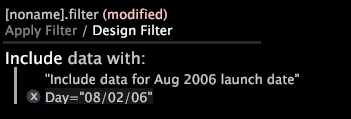

# 필터 조건 사용{#working-with-filter-conditions}

새 필터 만들기 및 새 필터에 조건 추가를 비롯하여 필터 조건 작업에 대한 정보입니다.

## 필터 만들기 {#section-70ba51ae625e493fa3ca70b93ffba406}

* **[!UICONTROL Add Visualization]** > **[!UICONTROL Filter Editor]**&#x200B;을 마우스 오른쪽 단추로 클릭하여 작업 영역에서 필터 편집기를 엽니다.

   -또는-

* 이미 필터 편집기를 열고 필터를 로드한 경우 현재 필터 이름을 마우스 오른쪽 단추로 클릭하고 **[!UICONTROL New Blank Filter]**&#x200B;을 클릭합니다.

## 새 필터 {#section-50986db80f1148c489630a8a63fe9f28}에 조건 추가

1. 새 필터를 만듭니다. [디자인 필터] 모드에서 작업 중임을 나타내는 [디자인 필터 적용]이 아닌 [디자인 필터]가 강조 표시되어 있는지 확인합니다.
1. **[!UICONTROL Right-click to build filter]**&#x200B;으로 표시된 영역 내에서 마우스 오른쪽 버튼을 클릭하고 다음 옵션 중 하나를 선택합니다.

   * 포함 필터를 만들려면 **[!UICONTROL Include group with]**&#x200B;을 클릭합니다.
   * 제외 필터를 만들려면 **[!UICONTROL Exclude group with]**&#x200B;을 클릭합니다.

1. 필터에 추가할 조건 유형을 선택합니다.

   다음 표에서는 사용 가능한 필터 조건 유형에 대한 설명을 제공합니다.

<table id="table_3B35B57FF32349F09E91E8256FF1672A"> 
 <thead> 
  <tr> 
   <th colname="col1" class="entry"> 조건 유형 </th> 
   <th colname="col2" class="entry"> 설명 </th> 
  </tr>
 </thead>
 <tbody> 
  <tr> 
   <td colname="col1"> 
작업 영역 선택 
 </td> 
   <td colname="col2"> 
작업 공간의 선택 사항을 기반으로 필터 조건을 정의합니다. 이 옵션은 작업 공간 내에 선택 영역이 하나 이상 있는 경우에만 사용할 수 있습니다. 
 
선택 내용에 대한 자세한 내용을 보려면 조건을 마우스 오른쪽 단추로 클릭하고  세부 사항 보기를 클릭합니다. 조건에 대한 설명선이 나타납니다. 
 
작업 영역에서 다른 선택 영역을 만들면 첫 번째 선택 영역의 하위 조건으로 선택 영역을 추가할 수 있습니다. 선택 항목은 논리 AND로 함께 그룹화됩니다. 따라서 조건에 포함되거나 제외된 데이터는 작업 공간 선택 사항을 모두 충족해야 합니다. 
 </td> 
  </tr> 
  <tr> 
   <td colname="col1"> 
하나 이상 
 </td> 
   <td colname="col2">선택한 차원의 요소가 하나 이상 있는지 여부를 기준으로 필터 조건을 정의합니다. 조건을 편집하려면 조건을 마우스 오른쪽 단추로 클릭하고  조건 변경 을 클릭합니다. 사용 가능한 차원 중 하나를 클릭합니다. </td> 
  </tr> 
  <tr> 
   <td colname="col1"> 
공식 
 </td> 
   <td colname="col2"> 
입력한 공식을 기준으로 필터 조건을 정의합니다. 필터를 사용하려면 적절한 구문을 사용해야 합니다. 
 
 
참고:필터 정의 구문에 대한 자세한 내용은 <a href="../../../../home/c-get-started/c-qry-lang-syntx/c-syntx-fltr-exp.md#concept-72f2563f809747a2a3cff7ec72462a15"> 필터 표현식 구문</a>을 참조하십시오. 
 
 </td> 
  </tr> 
  <tr> 
   <td colname="col1"> 
지표 값 
 </td> 
   <td colname="col2"> 
지정한 지표 값을 기반으로 필터 조건을 정의합니다. 
 
조건을 정의하려면 다음 단계를 수행합니다. 
     <ul id="ul_B69D31258A36460E94535709239CD165"> 
      <li id="li_51317A681E654DD7A9D997DF9F2F22BA">데이터 세트에 있는 차원 목록에서 수준 및 지표를 선택하려면  [수준 선택] &gt;  수준 변경을 마우스 오른쪽 단추로 클릭합니다. </li> 
      <li id="li_975E56C335824FDCB988344952DE2E9F">데이터 세트에 있는 지표 목록에서 지표를 선택하려면  [지표 선택] &gt;  지표 변경을 마우스 오른쪽 단추로 클릭합니다. </li> 
      <li id="li_D00B3AF3D8DE472C9D0E9EABBBCAAF61">보다 작음 클릭 및  비교 변경을 클릭하여 사용 가능한 비교 조건 중 하나(최소, 최소, 최소 또는 최대 미만)를 선택합니다. </li> 
      <li id="li_3334CE0A0950448590E5442AB243F46B">지표에 대해 원하는 값을 입력합니다. </li> 
     </ul> 
 </td> 
  </tr> 
  <tr> 
   <td colname="col1"> 
first/last 
 </td> 
   <td colname="col2"> 
지정된 차원이 있는 수준을 포함하거나 제외할 수 있는 필터를 정의합니다. 예를 들어 포함할 첫 번째/마지막 필터를 지정할 수 있습니다(또는 제외). 
 
마지막 페이지 보기에  /hme/rts/Our Rate의 페이지가 있는 세션. 
 
첫 번째/마지막 조건을 정의하려면 
     <ul id="ul_5AD916DA093844B8AC70127B1EB9BFC8"> 
      <li id="li_AB9FF22ADC8843A79856FED60B9478FA">필터 편집기에서  이 있는 그룹 포함 또는   &gt;  first/last이(가) 있는 그룹 포함 을 새 조건으로 선택합니다. </li> 
      <li id="li_92F536FCC2A74DDE97F66C6C45ACC3DC"> [컨테이너 선택] &gt;  컨테이너를 마우스 오른쪽 단추로 클릭하여 컨테이너를 선택합니다. </li> 
      <li id="li_1E5DBE04ABC74D84B7C0EF6886CDB5DC">수준을 지정하려면  first 또는  last을 마우스 오른쪽 단추로 클릭합니다. </li> 
      <li id="li_8B73EBF5D06E4513B5F0376EB2805D1C">마우스 오른쪽 단추를 클릭하여 차원을 지정한 다음 사용 가능한 필드에 값을 입력합니다. </li> 
      <li id="li_A9E02EF6C6004DDF9B00EB853B6E54EE">적용을 클릭합니다. </li> 
     </ul> 
 </td> 
  </tr> 
 </tbody> 
</table>

이 예제의 필터는 마지막 페이지 보기가 [!DNL /hme/rts/Our Rates]인 사용자에 대한 첫 번째/마지막 필터를 정의합니다.

1. (선택 사항) 필터에 조건을 더 추가하려면 필터를 작성할 창의 영역을 마우스 오른쪽 단추로 클릭하고 필터 유형(2단계 참조) 및 조건 규칙을 선택합니다(3단계 참조).

   >[!NOTE]
   >
   >여러 포함 조건은 논리 OR로 함께 그룹화됩니다. 따라서 필터에 포함된 데이터는 정의된 포함 조건 중 하나 이상을 충족해야 합니다. 여러 제외 조건도 논리 OR로 그룹화됩니다. 제외하려면 데이터가 제외 조건 중 하나 이상을 충족해야 합니다.

이 예제의 필터는 많은 동영상을 등급을 매겼지만 동영상 1개에 높은 점수(4 또는 5)를 주지 않은 동영상 뷰어(사용자)로 구성된 데이터 하위 집합을 정의합니다. 이 필터(Very Hard to Please라고 적절히 이름 지정됨)는 다음 두 가지 조건으로 구성됩니다.

* **지표 값 조건:** 조건에는 500개 이상의 동영상을 평가한 사용자가 포함됩니다.
* **작업 영역 선택 조건:** 이 조건에서는 한 동영상을 4 또는 5로 준 사용자를 제외합니다. 콜아웃은 점수 치수에서 선택한 요소가 4와 5임을 나타냅니다.

## 필터 조건 {#section-3092e0d7ac624885b8fe24616279de13} 삭제

>[!NOTE]
>
>디자인 필터 모드에서 작업하는 경우에만 조건을 삭제할 수 있습니다. 작업 영역에 필터를 적용한 경우 하나 이상의 필터 조건을 삭제하려면 먼저 디자인 필터를 클릭하여 디자인 필터 모드로 돌아가야 합니다.

* 조건 왼쪽에 있는 **x**&#x200B;을 클릭하여 삭제합니다.

## 조건 설명 {#section-5015fd2c88ed4b6a95be7f0d53be2db0} 편집

필터에 추가하는 각 조건에 설명을 추가할 수 있습니다. 원하는 대로 설명을 편집하거나 제거할 수 있습니다.

>[!NOTE]
>
>조건에 대한 설명은 디자인 필터 모드에서 작업하는 경우에만 나타납니다.

* 조건을 마우스 오른쪽 단추로 클릭하고 **[!UICONTROL Edit description]**&#x200B;을 클릭합니다.

   * 설명을 추가하거나 편집하려면 [!DNL Edit condition description] 필드에 설명을 입력합니다. 설명은 필터 편집기 창의 조건 위에 인용 부호로 나타납니다.

      

* 설명을 제거하려면 **[!UICONTROL Remove description]**&#x200B;을 클릭합니다. 조건이 필터 편집기 창에 남아 있습니다.
