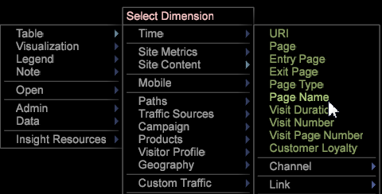
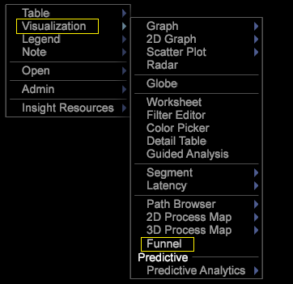
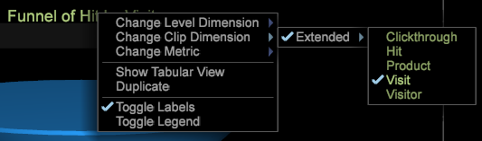

# 단계 만들기{#building-a-funnel}

{{eol}}

다음 단계에 따라 새 단계 시각화를 만듭니다

<!--  -->

1. 새 작업 공간에서 차원 테이블을 엽니다.

   

   예를 들어 작업 공간을 마우스 오른쪽 단추로 클릭하고 를 선택합니다 **[!UICONTROL Table > Site Content > Page Name]**

1. 단계 시각화를 엽니다.

   예를 들어 작업 공간을 마우스 오른쪽 단추로 클릭하고 를 선택합니다 **[!UICONTROL Visualization > Funnel]**.

   

1. 요소를 선택하여 차원을 추가한 다음 누른 채로 드래그합니다 **[!UICONTROL `<Ctrl>`]** + **[!UICONTROL `<Alt>`]**.

1. 요소를 대상 영역 위로 끌어서 놓습니다. **[!UICONTROL Drag Dimension Element Here]**.

   

1. 추가 차원을 추가합니다.

   단계에 최대 8개의 단계를 추가할 수 있습니다.
1. 총 대상을 기반으로 단계를 보기 위해 선택한 표를 해제합니다.

   단계 시각화 는 다른 모든 시각화의 패턴을 따르므로 선택한 요소가 시각화하는 데이터의 세그먼트를 제어할 수 있습니다.
1. 단계 클립 차원, 수준 차원 및 지표를 수정합니다.

   제목을 마우스 오른쪽 단추로 클릭하여 사용자 지정 프로필에 정의된 지표 및 차원을 기반으로 이러한 옵션을 조정합니다.

   

깔때기에서는 이탈률 및 이탈률, 판매와 다음 캠페인 또는 컨텐츠 경로를 전환하는 고객 비율을 식별할 수 있습니다. 자세한 내용은 [경로 브라우저](../../../../home/c-get-started/c-analysis-vis/c-funnel-visualization/c-path-browser-funnel.md#concept-b0cedf7a28ae422696ded1258c9a4119) 를 클릭하여 선택된 페이지에 도달하기 전에 가져온 페이지 및 페이지가 나간 후 이동하는 경로를 자세히 확인합니다.

추가 정보 [단계 기능](../../../../home/c-get-started/c-analysis-vis/c-funnel-visualization/c-funnel-visualization-features.md#concept-e65c81fe17794acd8d00d796b1780dc3).
