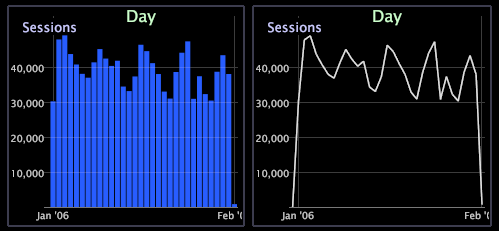

# 그래프 표시 변경{#change-a-graph-display}

{{eol}}

기본적으로 그래프 시각화는 막대를 표시하지만 막대를 선으로 쉽게 표시할 수 있고 그 반대의 경우도 가능합니다.

두 표시 유형은 모두 다음 예제에 표시됩니다.

**표시 유형을 선택하려면**

그래프 하단에 있는 차원 레이블을 마우스 오른쪽 단추로 클릭하고 를 클릭합니다. **[!UICONTROL Display]** > **[!UICONTROL Draw lines]** 또는 **[!UICONTROL Display]** > **[!UICONTROL Draw bars]**. 활성 디스플레이 모드의 왼쪽에 X가 나타납니다.

**그래프의 그라데이션 오버레이**

마우스 오른쪽 단추를 클릭하고 **그라데이션 오버레이** 메뉴에서 그래프 요소를 더 잘 볼 수 있습니다.

* **그라데이션 오버레이 없음**. 그라데이션 오버레이가 적용되지 않은 막대를 표시하려면 을(를) 선택합니다.
* **왼쪽에서 배경**. 왼쪽에서 오른쪽으로 모든 막대에 색상 분산을 표시하려면 을(를) 선택합니다.
* **오른쪽에서 배경**. 오른쪽에서 왼쪽으로 모든 막대에 색상 그라데이션 표시를 하려면 선택합니다.
* **원통**. 각 막대의 중심에서 각 막대의 가장자리까지 색상 분산을 표시하려면 선택합니다.
