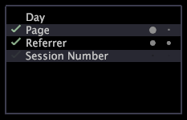

# 안내 분석{#guided-analysis}

안내 분석 시각화는 작업 공간에서 선택한 항목을 기반으로 추가 분석을 위한 큐를 제공합니다.

이 시각화는 선택 사항과 가장 강력하게 관련이 있는 차원을 식별할 수 있도록 도와줍니다. 다음 [!DNL Site] 안내 분석 시각화에서와 같이 Adobe 애플리케이션의 안내에 따라 분석 시각화는 데이터 세트와 관련된 차원을 표시합니다.

>[!NOTE]
>
>차원 이름이 빨간색으로 표시되면 데이터 세트에 정의되지 않은 것입니다.

작업 공간 내에서 선택할 때 안내에 따라 표시되는 분석 시각화에는 왼쪽에 확인 표시가 표시되고, 차원 오른쪽에 점이 표시되어 가장 관련성이 높은 정보를 제공합니다.

* **확인 표시는** 통계적으로 유의한 방법으로 값이 벤치마크와 다른 차원을 식별합니다(즉, 선택 내용과 벤치마크 간의 차이는 무작위 우연으로 인한 것이 아닙니다).
* **점은** 선택 사항이 벤치마크와 다른 정도를 나타냅니다. 첫 번째 점은 U 통계를 나타내고 두 번째 점은 V 통계를 나타냅니다. 통계 [측정 이해를 참조하십시오](../../../../home/c-get-started/c-analysis-vis/c-guided-analysis/c-stat-measures.md#concept-ba2c7f417f384dc0a3438fcb6e268708). 점이 더 밝아지고 커질수록 차이가 더 크고 선택 항목을 기반으로 한 차원에 대한 정보가 더 관련성이 높아집니다(즉, 밝은 점, 큰 점은 더 유용한 정보를 나타냅니다).

