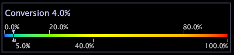

# 색상 범례{#color-legends}

전환 및 유지와 같은 지표별로 색상 범례 색상 코드 시각화를 사용하며 거의 모든 작업 영역에서 사용할 수 있습니다.

비즈니스 지표를 색상에 연결하면 예외 항목, 예외 사항 및 트렌드를 보다 손쉽게 파악할 수 있습니다. 작업 공간 내에서 색상 범례가 활성화되면 범례 내에서 마우스 오른쪽 단추를 클릭하여 색상 코드를 지정할 지표를 선택합니다. 그런 다음 해당 작업 영역 내의 시각화는 색상 범례에 표시된 지표를 기반으로 색상으로 구분됩니다. 현재 작업 영역의 모든 시각화에 대해 색상에 사용되는 지표 간에 전환할 수 있습니다.

>[!NOTE]
>
>색상 범례에서 지표를 선택하지 않으면 모든 시각화는 파란색으로 표시됩니다.

## 지표 {#section-694234fc79fd44c2a2ea2f677f74b3dc} 활성화 또는 변경

* 지표 이름을 마우스 오른쪽 단추로 클릭하고 원하는 지표를 클릭합니다.

   
