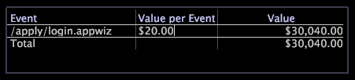

# 값 범례{#value-legends}

값 범례에는 정의된 값 이벤트가 표시됩니다.

값 범례는 HBX 및 [!DNL Site] 애플리케이션에서만 구성되지만 다른 응용 프로그램용으로 구성할 수 있습니다. 자세한 내용은 Adobe 컨설팅 서비스에 문의하십시오.

HBX 및 [!DNL Site]에서 값 이벤트는 비즈니스 값을 생성한 세션으로 정의됩니다. 예를 들어, 특정 페이지 보기와 연결된 이벤트 데이터 레코드(예: 주문 감사 페이지 또는 애플리케이션 완료 페이지)는 비즈니스 조직에 대한 값 이벤트를 나타낼 수 있습니다.

값 이벤트를 사용하면 웹 사이트에서 생성된 값의 양을 측정하고 추적할 수 있습니다. 각 이벤트에 대한 비즈니스 가치를 달러로 평가하고 다음과 같은 질문에 답변할 수 있습니다.

* 웹 사이트에서 가장 수익성 높은 방법은 무엇입니까?
* 어떤 레퍼러 또는 캠페인이 가장 많은 가치를 생성했습니까?

각 이벤트에 대해 범례는 이벤트의 단위 값(이벤트당 값)과 이벤트에 의해 생성된 총 값을 표시합니다. 범례를 사용하여 값 이벤트를 정의 및 변경하고 단위 값을 할당합니다.

다음 표에는 값 이벤트와 관련된 지표가 나열되어 있습니다.

| 지표 | 설명 |
|---|---|
| 변환 | 비즈니스 가치를 생성한 세션의 백분율 |
| 값 | 생성된 총 비즈니스 가치(달러) |
| 미디어 값 | 세션당 생성된 평균 비즈니스 가치(달러 단위) |

방문자가 웹 사이트에서 수행하는 모든 작업을 값 이벤트로 쉽게 정의할 수 있습니다.고객 서비스 요청 게시, 애플리케이션 완료, 컨텐츠 보기 또는 구매 완료 각 값 이벤트는 웹 사이트의 특정 페이지 또는 페이지 세트에 액세스하는 사용자에 해당하며, 달러 단위의 비즈니스 값과 연결됩니다. 예를 들어 &quot;Thank you for purchasing&quot; 페이지에 도달하는 모든 사용자가 평균 $20의 기여도 마진을 생성한다고 가정합니다. 값이 $20인 해당 페이지에 대한 값 이벤트를 정의합니다.

## 새 값 이벤트 정의 {#section-2ea4d168336e4d2e98b22b636ed43853}

**HBX에서 새 값 이벤트를 정의하려면[!DNL Site]**

값 이벤트를 만들 때 시각화의 값을 나타내는 웹 사이트 페이지를 값 범례로 드래그합니다.

1. 값 범례를 엽니다.

   

1. 프로세스 맵, URI 페이지 테이블 또는 페이지 계층 보기에서 범례에 값 이벤트를 추가합니다.

   * 프로세스 맵에서 노드를 프로세스 맵에서 범례로 드래그합니다.
   * URI 페이지 표에서 Ctrl+Alt를 누르고 표에서 범례로 페이지를 드래그합니다.
   * 페이지 계층 구조 보기에서 노드의 왼쪽(폴더, 페이지 또는 그룹)을 클릭하고 범례에 드래그합니다.
   

   마우스 포인터는 마우스가 범례에 도달할 때까지 &quot;아니요&quot;라는 단어를 표시합니다.

1. 값 범례에서 이벤트가 발생하는 각 세션에 비즈니스 값을 지정합니다.

   1. 열에서 값 이벤트로 추가한 페이지에 해당하는 셀을 [!DNL Value per Event] 클릭합니다.
   1. 해당 이벤트 값에 할당할 달러 금액을 입력하고 Enter 키를 누릅니다.
   

   기본적으로 값 이벤트로 정의된 페이지의 URL은 값 범례에 나타납니다. 원하는 경우 범례에서 이 URL을 두 번 클릭하여 편집 모드로 전환하고 이벤트 이름을 변경할 수 있습니다. 또한 언제든지 특정 이벤트의 값을 편집할 수 있습니다. 데이터 워크벤치 서버는 평균 값 및 전환과 같은 값 이벤트 기반 지표를 자동으로 다시 계산합니다.

하나 이상의 값 이벤트를 정의한 후에는 값 세그먼트 차원을 사용할 수 있습니다. 이 차원은 모든 세션에서 방문자가 생성한 총 값을 나타냅니다.

## 값 이벤트 제거 {#section-25cd90a859384ca183c0fc0998f888cf}

* 원하는 이벤트를 마우스 오른쪽 단추로 클릭하고 **[!UICONTROL Delete Event]**&#x200B;클릭합니다.

   

>[!NOTE]
>
>데이터 워크벤치 서버는 사용 중인 프로필에서 액세스할 수 있는 전체 데이터 세트에서 지표를 계산합니다. 기본적으로, Analytics 데이터 세트에 있는 데이터가 동일한 논리 소스의 데이터가 아닌 경우에도, Value, Value Events, Average Value 및 Conversion과 같은 지표를 [!DNL Data Workbench Server] 계산합니다.

## Microsoft Excel로 내보내기 {#section-feaa7a8eb8124fafbc74169bebaed6d8}

창 내보내기에 대한 자세한 내용은 창 [데이터 내보내기를 참조하십시오](../../../../home/c-get-started/c-wk-win-wksp/c-exp-win-data.md#concept-8df61d64ed434cc5a499023c44197349).
