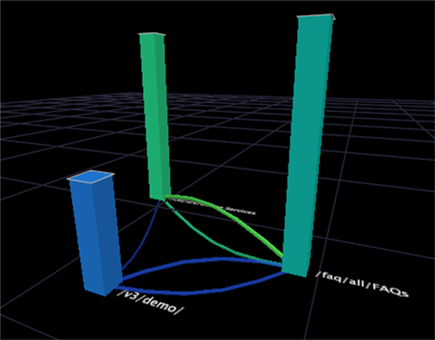

# 프로세스 맵{#process-map}

프로세스 맵을 사용하여 차원 요소 간의 활동 흐름을 분석할 수 있습니다.

차원의 요소를 빈 2D(2D) 또는 3차원(3D) 맵으로 드래그하여 놓아 프로세스 맵을 만듭니다. 요소는 맵에서 노드가 됩니다. 노드는 2D 프로세스 맵의 서클이고 3D 프로세스 맵의 막대는 연결되어 있습니다.

>[!NOTE]
>
>프로세스 맵은 프로세스의 단계 간 활동 흐름을 분석하는 데 사용할 때 해당 이름을 가져옵니다. 이러한 유형의 분석에서 맵의 각 요소는 프로세스의 단계를 나타냅니다.

경로 브라우저와 달리, 프로세스 맵은 분석에 필요한 만큼의 요소를 표시할 수 있습니다. 관심 요소를 선택하고 드래그하여 맵에 놓습니다. 또한 경로 브라우저와 달리 프로세스 맵은 한 요소와 하나 이상의 다른 요소 사이의 두 방향으로 활동 흐름을 나타냅니다.

>[!NOTE]
>
>이러한 맵이 가장 효과적으로 작동하려면 작업 영역에서 색상 범례를 열어야 합니다. 프로세스 맵에서 색상 범례 사용에 대한 자세한 내용은 [색상 링크 활성화](../../../../home/c-get-started/c-analysis-vis/c-proc-maps/c-act-color-lnks.md#concept-2c9b9f67f2bd4cd7a5431fa21c094edc)를 참조하십시오. 색상 범례에 대한 자세한 내용은 [색상 범례](../../../../home/c-get-started/c-analysis-vis/c-legends/c-color-leg.md#concept-f84d51dc0d6547f981d0642fc2d01358)를 참조하십시오.

모든 프로세스 맵에는 프로세스 맵에 표시된 데이터를 해석하는 키를 제공하는 연관된 기본 차원, 그룹 차원, 레벨 차원 및 지표가 있습니다.

프로세스 맵의 차원 및 지표에 대한 기본 설정은 사용 중인 Data Workbench 응용 프로그램에 따라 다릅니다. 프로세스 맵에 사용할 수 있는 차원 및 지표에 대한 자세한 내용은 Data Workbench 애플리케이션에 대한 애플리케이션 안내서를 참조하십시오.

* **기본 차원:** 요소를 프로세스 맵에 드래그하여 놓을 때 기본 차원의 요소를 드래그하여 놓습니다.
* **레벨 차원:** 데이터 세트에 있는 모든 차원은 상위 차원이라고도 하는 연관된 레벨 차원을 가집니다. 프로세스 맵의 레벨 차원은 프로세스 맵의 기본 차원에 대한 레벨 차원(또는 상위)과 같아야 합니다. 예를 들어 페이지(페이지 차원의 요소)를 맵으로 드래그하면 해당 수준 차원은 페이지 보기입니다.
* **그룹 차원:** 그룹 차원은 노드 간 연결을 형성하도록 레벨 차원의 요소를 그룹화하는 방법을 결정합니다. 프로세스 맵의 경우 그룹 차원은 다음 3가지 주요 이유로 중요합니다.

   * 두 노드 사이의 연결은 그룹 차원의 요소를 두 개 이상 확장할 수 없습니다. 이를 이해하려면 웹 데이터를 사용하는 예를 고려하십시오. 프로세스 맵의 기본, 레벨 및 그룹 차원이 각각 페이지, 페이지 보기 및 세션이라고 가정합니다. 페이지 A와 페이지 B의 연결은 단일 세션 동안 맵에 있는 다른 페이지(노드)의 중간 페이지 보기가 없는 페이지 B의 페이지 보기 전에 페이지 A의 페이지 보기가 발생했음을 알려줍니다. 동일한 세션 중에 A와 B 페이지에 대한 페이지 보기 사이에 사이트의 다른 페이지에 대한 페이지 보기 횟수가 있을 수 있지만 이러한 페이지는 이 맵에 표시되지 않습니다.
   * 두 노드 간의 연결은 그룹 차원의 여러 요소를 나타낼 수 있습니다. 예를 들어 페이지 B의 페이지 보기 전에 페이지 A의 페이지 보기가 발생한 여러 개의 세션이 있을 수 있습니다. 따라서 페이지 A와 페이지 B 사이의 연결은 페이지 B의 페이지 보기 전에 페이지 A의 페이지 보기가 발생한 모든 개별 세션을 나타냅니다. 이때 페이지 A의 페이지 보기가 맵에 다른 페이지(노드)의 중간 페이지 보기가 없는 경우입니다.
   * 프로세스 맵 내의 노드를 기반으로 선택할 경우 해당 노드가 포함된 그룹 차원의 모든 요소를 선택합니다. [시각화에 선택 만들기](../../../../home/c-get-started/c-vis/c-sel-vis/c-sel-vis.md#concept-012870ec22c7476e9afbf3b8b2515746)를 참조하십시오. 선택에 대한 자세한 내용은 [시각화에 선택 만들기](../../../../home/c-get-started/c-vis/c-sel-vis/c-sel-vis.md#concept-012870ec22c7476e9afbf3b8b2515746)를 참조하십시오.

* **지표:** 주어진 요소에 대한 노드의 크기는 해당 요소에 대한 지표 값에 비례합니다. 노드가 크면 작은 노드보다 큰 지표 값이 표시됩니다.

예를 들어 [!DNL Site] 또는 HBX 애플리케이션을 사용하는 경우 기본적으로 페이지 차원의 요소를 프로세스 맵으로 드래그할 수 있습니다. 각 노드의 크기는 해당 페이지를 본 세션 수(세션 지표에 의해 정의됨)와 관련되어 있습니다.

>[!NOTE]
>
>프로세스 맵에 대한 기본 차원이나 지표를 변경할 수 있습니다. 프로세스 맵을 구성하는 단계는 [프로세스 맵 구성](../../../../home/c-get-started/c-intf-anlys-ftrs/t-config-proc-maps.md#task-4a95730b18a14bc790a77c013832b2d6)을 참조하십시오.
