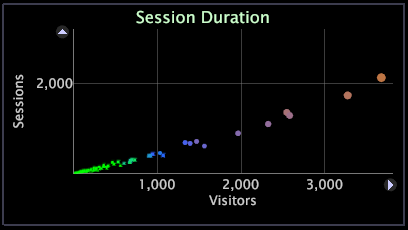

# 2D 산포도{#d-scatter-plots}

산포도는 x축과 y축이 다른 지표를 나타내는 그리드에 데이터 차원(예: 페이지 또는 도시)의 요소를 그래프로 표시합니다.

산포도는 서로 다른 두 지표에 의해 많은 수의 항목 간의 관계를 이해하려고 할 때 유용할 수 있습니다. 다음 예에서 산포도는 방문자 수와 각 유지 비율별로 각 도시를 보여줍니다.

산포도는 이상치를 빨리 볼 수 있도록 해줍니다. 예를 들어 Salt Lake 시는 방문자당 평균 유지 속도보다 높습니다.

산포도를 사용하여 데이터의 일관성을 표시할 수도 있습니다. 다음 예에서 산포도는 특정 길이의 세션이 있는 방문자의 수를 보여줍니다.

산포도의 각 지점의 크기는 반경 지표에 의해 결정됩니다. 기본 반경 지표는 각 Adobe 응용 프로그램에 대해 다릅니다. 예를 들어 [!DNL Site]에서 반경 지표는 기본적으로 세션을 기반으로 합니다. 반경 지표를 변경하여 산포도의 지점이 사용 가능한 지표를 나타내도록 할 수 있습니다. 이렇게 하는 단계는 [반경 지표 변경](../../../home/c-get-started/c-analysis-vis/c-scat-plots.md#section-fd80576d583c430cb469daf12e39aa2a) 을 참조하십시오. 점의 색상은 작업 공간 내에 열려 있는 색상 범례를 기반으로 합니다. 색상 범례에 대한 자세한 내용은 [색상 범례](../../../home/c-get-started/c-analysis-vis/c-legends/c-color-leg.md#concept-f84d51dc0d6547f981d0642fc2d01358)를 참조하십시오.

## 점 {#section-4b4d45f39b884d54bb7407b3b2f4ea50} 선택

**단일 점을 선택하려면**

* 점을 클릭합니다.

**선택 영역에 다른 점 또는 점 그룹을 추가하려면**

* Ctrl 키를 누른 채로 점을 클릭하거나 Ctrl 키를 누른 채 여러 점을 드래그합니다.

**선택 항목에서 점 또는 점 그룹을 제거하려면**

* Shift 키를 누른 상태에서 점을 클릭하거나 Shift 키를 누른 상태로 여러 점을 드래그합니다.

## 차원 변경 중 {#section-796cd962ef3f476caa89d99083782ed1}

* 그래프 맨 위에 있는 차원의 레이블을 마우스 오른쪽 단추로 클릭하고 **[!UICONTROL Change Dimension]** > *&lt;**[!UICONTROL dimension name]*** 를 클릭합니다.

## 지표 변경 {#section-44b8be9215cd4039b1eeb98ae1b31445}

**산포도의 x축 또는 y축에 표시된 지표를 변경하려면**

* 변경할 지표의 레이블을 마우스 오른쪽 단추로 클릭하고 **[!UICONTROL Change Metric]** > *&lt;**[!UICONTROL metric name]*** 를 클릭합니다.

## 반경 지표 변경 {#section-fd80576d583c430cb469daf12e39aa2a}

**산포도의 반경 지표를 변경하려면**

그래프 맨 위에 있는 차원의 레이블을 마우스 오른쪽 단추로 클릭하고 **[!UICONTROL Change Radius Metric]** > *&lt;**[!UICONTROL metric name]*** 를 클릭합니다.

