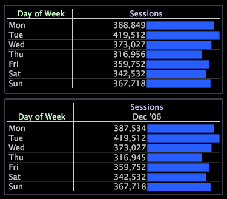

# 차원 추가, 변경 및 이동{#add-change-and-move-a-dimension}

테이블에 여러 차원을 추가하여 보다 자세한 데이터 교차 테이블 달성을 수행할 수 있습니다.

표의 어느 축에 차원을 추가할 수 있습니다.

**새 차원을 추가하려면**

* 요소 또는 차원의 레이블이나 지표의 레이블을 마우스 오른쪽 단추로 클릭하고 **[!UICONTROL Add Dimension]** > *&lt;**[!UICONTROL dimension name]**>를 클릭합니다.* 선택한 축의 시각화에 차원이 추가됩니다.

다음 예는 요일 차원(맨 위 테이블)에 그래프된 세션 지표 및 두 번째 차원인 이번 달이 맨 위 축(아래 테이블)에 추가된 동일한 테이블을 보여줍니다.

**차원을 변경하려면**

* 변경할 차원 레이블이나 요소를 마우스 오른쪽 단추로 클릭하고 **[!UICONTROL Change Dimension]** > *&lt;**[!UICONTROL dimension name]**>*&#x200B;을 클릭합니다.

**차원을 다른 위치로 이동하려면**

치수를 같은 축 또는 반대 축으로 다른 위치로 이동할 수 있습니다.

* 이동할 차원 레이블이나 요소를 마우스 오른쪽 단추로 클릭하고 **[!UICONTROL Move]***&lt; **[!UICONTROL dimension name]**>*을 클릭한 다음 적절한 단계를 완료합니다.

   * 치수를 반대 축으로 이동하려면 상단 축 또는 왼쪽 축을 클릭합니다.
   * 동일한 축에 있는 다른 치수와 위치를 교체하려면 을 **[!UICONTROL (move here)]**&#x200B;클릭합니다.

