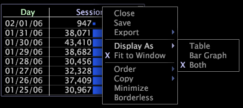

# 표 표시 변경{#change-the-table-display}

{{eol}}

표시 유형을 선택하는 정보입니다.

* 시각화의 위쪽 테두리를 마우스 오른쪽 단추로 클릭하고 다음 옵션 중 하나를 클릭합니다.

   * **[!UICONTROL Display As]** > **[!UICONTROL Table]**

   * **[!UICONTROL Display As]** > **[!UICONTROL Bar Graph]**

   * **[!UICONTROL Display As]** > **[!UICONTROL Both]** (기본값)

   

   활성 디스플레이 모드의 왼쪽에 X가 나타납니다.
