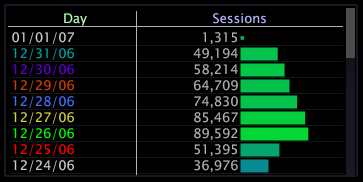

# 시리즈 범례 사용{#enable-a-series-legend}

차원 내의 요소는 일련의 색상으로 코딩될 수 있으므로 작업 공간 내의 다른 시각화에서 각 요소를 보다 쉽게 추적할 수 있습니다.

**시리즈 범례를 활성화 또는 비활성화하려면**

* 색상 코드할 요소 또는 차원의 레이블을 마우스 오른쪽 단추로 클릭하고 **[!UICONTROL Series Legend]**&#x200B;을 클릭합니다.

   시리즈 범례가 활성 상태인 경우 메뉴 옵션 옆에 X가 나타나고 차원 내의 요소가 대체 색상으로 표시됩니다.

   
