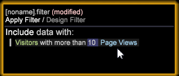

# 성향 점수 설정{#setting-up-propensity-scoring}

성향 점수 시각화를 사용하려면 다음 단계를 수행합니다.

1. 새 작업 영역을 열고 **[!UICONTROL Add]** > **[!UICONTROL Visualization]** > **[!UICONTROL Predictive Analytics]** > **[!UICONTROL Scoring]** > **[!UICONTROL Propensity Score]**&#x200B;를 클릭합니다.

   

1. **[!UICONTROL Target]**(종속 변수)을 설정합니다.

   다음을 선택하여 종속 변수를 설정합니다.

* **Dimension 요소**:작업 영역을 마우스 오른쪽 단추로 클릭하고 선택합니다 **[!UICONTROL Table]**. 그런 다음 Dimension 요소를 종속 변수로 선택합니다.

   또는

* **[!UICONTROL Filter Editor]** 구문을 사용하는 키-값 쌍으로 전달됩니다. **[!UICONTROL Add]** > **[!UICONTROL Visualization]** > **[!UICONTROL Filter Editor]**&#x200B;를 클릭하여 필터 편집기 시각화를 엽니다.

   

   Dimension 요소 또는 필터를 종속 변수로 선택한 후 **[!UICONTROL Set Target]**&#x200B;을 클릭하고 종속 변수를 설명하는 이름을 입력합니다. 그런 다음 **[!UICONTROL OK]**(필터 상자가 강조 표시되어 있는지 확인)을 클릭하여 Target을 설정합니다.

   

   타겟에 지정하는 이름은 왼쪽 창에 나타나는 종속적 변수입니다.
1. 독립 변수를 추가합니다.

   지표 또는 Dimension 요소를 사용하여 독립 변수를 추가합니다.

   

* **지표**. 성향 점수 도구 모음의 **[!UICONTROL Metrics]** 메뉴에서 지표를 선택합니다.

* **Dimension 요소**:작업 영역을 마우스 오른쪽 단추로 클릭하고 선택합니다 **[!UICONTROL Table]**. 하나 이상의 Dimension 요소를 선택하고 **[!UICONTROL Independent Variables]** 아래의 왼쪽 열 또는 `<Ctrl>` + `<Alt>` 키를 사용하여 **[!UICONTROL Element]** 상자로 드래그합니다.

1. 설정 **[!UICONTROL Training Filter]**. 성향 점수 지정 도구 모음에서 **[!UICONTROL Options]** > **[!UICONTROL Set Training Filter]**&#x200B;을 클릭하여 점수를 매길 방문자 집합을 정의할 수 있습니다. 점수를 매길 방문자만 사용하여 만든 데이터의 하위 세트가 제공됩니다. 예를 들어 지난 달에 방문한 사람, 호주에 거주하는 방문자 또는 특정 제품을 본 방문자.

   기본 필터는 **[!UICONTROL Train on Everyone]**&#x200B;이지만 테이블에서 **[!UICONTROL Dimension Elements]**&#x200B;을 활성화하거나 **[!UICONTROL Filter Editor]**&#x200B;를 사용하여 필터를 빌드하여 변경할 수 있습니다.

   Dimension 요소를 선택하거나 필터를 빌드하고 활성화한 후 **옵션** > **교육 필터 설정**&#x200B;을 클릭하고 필터를 설명하는 이름을 입력한 다음 **[!UICONTROL OK]**&#x200B;를 클릭합니다.
1. 입력을 모두 확인했으면 **[!UICONTROL Go]** 키를 누릅니다.

   

   점수 지정 프로세스는 데이터를 여러 번 전달함으로써 시작됩니다. 그러면 결과가 백분율 라인 위에 막대 차트로 표시됩니다.
1. 성향 점수 저장을 참조하십시오.

   6.1부터 이제 성향 점수 저장 옵션을 사용할 수 있습니다.

* 차원
* Dimension 및 지표

   2개의 저장된 파일(차원과 정의된 지표 모두)로 끝날 수 있습니다.

   >[!NOTE]
   >
   >처리를 위해 성향 점수를 제출하는 경우 차원만 표시됩니다.

   파생된 지표는 연관된 평균 점수 지표입니다.
1. 정확성을 확인하십시오.

   프로세스가 완료되면 시스템은 **[!UICONTROL Model Complete]**&#x200B;을 표시하고 점수 모델을 생성합니다.

   **[!UICONTROL Model Complete]**&#x200B;을 마우스 오른쪽 단추로 클릭하면 시스템이 정의한 점수 모델 정확도가 확인됩니다. 0%에서 100%까지의 값은 **[!UICONTROL Target]** 변수와 일치하는 방문자의 가능성을 식별합니다.

   혼동 매트릭스는 실제 긍정(AP), 실제 네거티브(AN), 예측된 긍정(PP) 및 예측된 네거티브(PN)를 조합하여 4개의 카운트를 제공합니다. 이러한 숫자는 우리가 정답을 알고 있는 20% 보류된 테스트 데이터에 결과 채점 모델을 적용하여 얻습니다. 점수가 50%보다 크면 긍정적인 대/소문자(정의된 이벤트와 일치)로 예측됩니다.

   

<table id="table_154BDD6D294C4ED1B8C15EC33B74B199"> 
 <tbody> 
  <tr> 
   <td colname="col1"><b> 정확도</b> </td> 
   <td colname="col2"> 모든 예측에서 올바른 예측을 식별하여 모델이 얼마나 정확한지 나타냅니다. 
(TP + TN)/(TP + FP + TN + FN) 
 </td> 
  </tr> 
  <tr> 
   <td colname="col1"><b> 리콜</b> </td> 
   <td colname="col2"> 점수 모델을 다시 식별할 수 있는 기능을 식별합니다. 
<b>TP / (TP + FN)</b> 
 </td> 
  </tr> 
  <tr> 
   <td colname="col1"><b> 정밀도</b> </td> 
   <td colname="col2">불일치 수준을 식별합니다. 
TP / (TP + FP) 
 </td> 
  </tr> 
 </tbody> 
</table>

1. [리프트 또는 게인 차트](../../../../home/c-get-started/c-analysis-vis/c-visitor-propensity/c-propensity-gain-lift-chart.md#concept-0d049f6baf534f7fb97f271843ba6c4a) 또는 [모델 뷰어](../../../../home/c-get-started/c-analysis-vis/c-visitor-propensity/c-propensity-model-viewer.md#concept-9f2593a8218140b7bd132a4c74e159f9)를 엽니다.

   **모델 완료** 시각화를 마우스 오른쪽 단추로 클릭하고 **[!UICONTROL Lift Chart]**, **[!UICONTROL Gain Chart]** 또는 **[!UICONTROL Model Viewer.]**&#x200B;를 선택합니다.
