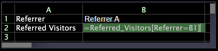

# 입력 셀 만들기{#create-an-input-cell}

입력 셀을 만드는 방법.

셀 B1이 입력 셀로 형식이 지정된 경우(셀을 마우스 오른쪽 단추로 클릭하고 **[!UICONTROL Format]** > **[!UICONTROL Input Cell]** 클릭), 시각화를 잠그고(셀의 위쪽 테두리를 마우스 오른쪽 단추로 클릭하고 **[!UICONTROL Locked]** 클릭) 입력 셀의 값을 변경하여 &quot;on-the-fly&quot; 결과를 볼 수 있습니다.

다음 예제에서는 입력 셀의 공식을 표시하는 워크시트를 보여 줍니다.

이 예에서는 입력 셀 수식의 결과를 표시하는 동일한 워크시트를 보여 줍니다.

두 예에서 행 1은 현재 고려되고 있는 레퍼러, 레퍼러 A를 보여주며 행 2는 레퍼러 A에서 참조한 방문자 수를 보여줍니다.

B1 서식을 지정하고 시각화를 잠그면 새 값을 입력하여 B1에 나열된 레퍼러의 값을 변경할 수 있습니다.

