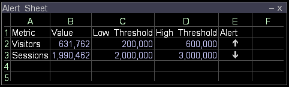

# 지표 표시기 만들기{#create-a-metric-indicator}

{{eol}}

워크시트를 사용하여 지표가 정의된 임계값에 도달했음을 나타낼 수 있습니다.

또한 [!DNL Report] 지표가 지정된 기간 내의 정의된 임계값에 도달할 때 보고서를 자동으로 생성하고 분배하기 위해.

에 대한 자세한 정보 [!DNL Report]를 참조하고 *Data Workbench 보고서 안내서*.

* [위쪽 또는 아래쪽 표시기](../../../../home/c-get-started/c-analysis-vis/c-wksts/c-metric-ind.md#section-40d7a2c3df0d40d4a7bb1a7e856abcba)
* [확인 표시기](../../../../home/c-get-started/c-analysis-vis/c-wksts/c-metric-ind.md#section-98c5298a74f34dcbaaf151549fcc7090)

**워크시트를 사용하여 지표 표시기를 만들려면**

1. 워크시트의 셀의 내용을 정의합니다.

   1. 열 A에서 원하는 지표의 이름을 입력합니다(예: [!DNL Visitors]).
   1. 열 B에서 원하는 지표의 값을 입력합니다(예: [!DNL =Visitors]).
   1. 열 C에서 지표의 낮은 임계값을 입력합니다.
   1. 열 D에서 지표의 높은 임계값을 입력합니다.
   1. 열 E에서 적절한 공식을 입력합니다. 예를 보려면 [위쪽 또는 아래쪽 표시기](../../../../home/c-get-started/c-analysis-vis/c-wksts/c-metric-ind.md#section-40d7a2c3df0d40d4a7bb1a7e856abcba) 또는 [확인 표시기](../../../../home/c-get-started/c-analysis-vis/c-wksts/c-metric-ind.md#section-98c5298a74f34dcbaaf151549fcc7090).
   1. 공식 셀(열 E)에서 마우스 오른쪽 단추를 클릭하고 **[!UICONTROL Format]** > **[!UICONTROL Indicator]**&#x200B;를 클릭한 다음, 다음 중 하나를 클릭합니다.

      * **[!UICONTROL None]**: 지표 대신 정확한 계산을 나열합니다.
      * **[!UICONTROL Check]**: 수식에 따라 값이 설정한 임계값보다 크거나 작음을 나타내는 확인 표시 또는 X를 사용합니다. 자세한 내용은 [확인 표시기](../../../../home/c-get-started/c-analysis-vis/c-wksts/c-metric-ind.md#section-98c5298a74f34dcbaaf151549fcc7090).
      * **[!UICONTROL Up or Down]**: 위쪽 또는 아래쪽 화살표를 사용하여 값이 낮은 임계값(아래쪽 화살표) 이하인지, 높은 임계값(위쪽 화살표) 이상인지 또는 낮은 임계값과 높은 임계값(빈) 사이인지를 나타냅니다. 자세한 내용은 [위쪽 또는 아래쪽 표시기](../../../../home/c-get-started/c-analysis-vis/c-wksts/c-metric-ind.md#section-40d7a2c3df0d40d4a7bb1a7e856abcba).

1. 지표를 만들 다른 지표에 대해 1단계를 반복합니다.

결과 워크시트는 다음 예제와 비슷합니다.

## 위쪽 또는 아래쪽 표시기 {#section-40d7a2c3df0d40d4a7bb1a7e856abcba}

대상 [!DNL Up] 또는 [!DNL Down indicator]를 채우기 위한 규칙은 다음 공식을 사용하십시오.

[!DNL (metric value - low threshold)/(high threshold - low threshold)*2 - 1]

예: [!DNL =(b2-c2)/(d2-c2)*2-1]

와 함께 이 공식을 사용할 때는 각 지표에 대해 세 가지 결과가 가능합니다 [!DNL Up] 또는 [!DNL Down indicator]:

* 측정 단위 값이 낮은 임계값과 높은 임계값 사이에 있으면 공식은 -1과 1 사이의 숫자(전용)로 평가됩니다. 워크시트에 위쪽 또는 아래쪽 화살표가 표시되지 않습니다.
* 지표 값이 낮은 임계값보다 작거나 같은 경우, 공식은 -1보다 작거나 같은 값으로 평가됩니다. 지표 표시기가 아래쪽 화살표로 변경됩니다.
* 지표 값이 높은 임계값보다 크거나 같은 경우, 공식은 1보다 크거나 같은 숫자로 평가됩니다. 지표 표시기가 위쪽 화살표로 바뀝니다.

다음 워크시트에서 예제 수식이 표시됩니다 [!DNL =(b2-c2)/(d2-c2)*2-1] 이 표시됩니다.

## 확인 표시기 {#section-98c5298a74f34dcbaaf151549fcc7090}

대상 [!DNL Check indicator], 지표 값이 지정된 임계값보다 크거나 작으면 알림을 받을 것인지 여부를 나타내는 공식을 사용합니다. 예:

* 값이 설정된 임계값 미만인 경우 알림을 받으려면 다음 형식을 사용할 수 있습니다.

   * [!DNL threshold - metric]

      예: [!DNL =(c2-b2)]

* 값이 설정된 임계값을 초과할 때 알림을 받으려면 다음 공식을 사용할 수 있습니다.

   * [!DNL metric - threshold]

      예: [!DNL =(b3-c3)]

확인 표시가 표시되면 수식은 양수로 평가됩니다. X가 표시될 때 수식은 음수로 평가됩니다.

를 사용할 때 각 지표에 대해 가능한 두 가지 결과가 있습니다 [!DNL Check indicator]:

* 수식이 지표 값을 임계값 이상으로 유지하는 것이 바람직함을 나타내는 경우 지표 값이 임계값보다 크거나 같은 경우 확인 표시가 표시되고 값이 임계값보다 작은 경우 X가 표시됩니다.
* 공식이 지표 값을 임계값 미만으로 유지하는 것이 바람직함을 나타내는 경우 지표 값이 임계값보다 작거나 같으면 확인 표시가 표시되고, 값이 임계값보다 클 때는 X가 표시됩니다.

다음 워크시트에서 공식의 예는 다음과 같습니다 [!DNL =(c2-b2)] 및 [!DNL =(b3-c3)] 이 표시됩니다.

