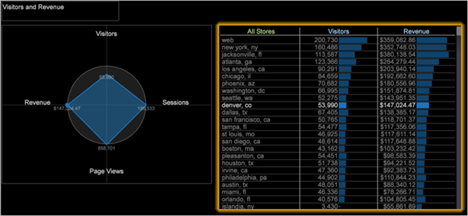

# 레이더 시각화{#radar-visualization}

레이더 차트는 지표 세트의 시각적 뷰와 이러한 지표 세트의 관계 또는 차이점을 제공하여 가장 주목해야 할 영역에 빠르게 초점을 맞출 수 있습니다.

작업 공간에서 선택한 관찰을 이해하고 평가하려면 둘 이상의 지표가 필요한 경우가 많습니다.

이 시각화는 테이블 선택 간 비교나 벤치마크에 유용합니다. 예를 들어 스토어를 나열하는 작업 영역 테이블을 추가한 다음 매출, 방문자 및 페이지 보기와 같은 지표와 함께 레이더 시각화를 추가할 수 있습니다. (다음 절차의 화면에 표시) 테이블에서 저장을 선택할 때 레이더 차트 풋프린트는 선택한 스토어에 대한 지표의 약점 또는 장점을 찾아 이동합니다.

레이더 차트의 각 방사형 차트는 지표이며 최소 3개의 지표가 필요합니다. 지표 데이터는 하나의 고정된 지표에 따라 그려집니다. 각 지표의 고정된 지표 및 앵커에 대한 비율 매개 변수는 벤치마크에 대한 지표 비율을 결정합니다.

**레이더 시각화를 만들려면**

1. 작업 영역에서 마우스 오른쪽 버튼을 클릭한 다음 **[!UICONTROL Visualization]** > **[!UICONTROL Radar]**&#x200B;를 클릭합니다.

   

1. 지표를 추가하려면 시각화를 마우스 오른쪽 단추로 클릭하고 **[!UICONTROL Add Metric]**&#x200B;선택합니다.
1. 지표를 차트에 연결하려면 지표를 마우스 오른쪽 단추로 클릭하고 다음 옵션을 선택합니다.

   **이 지표에 연결:** 이 지표를 다른 지표가 그려지는 벤치마크로 사용합니다. 한 번에 하나의 지표를 연결할 수 있습니다. 차트의 각 지표는 활성 작업 영역 선택 사항으로 필터링되거나 필터가 없습니다. 이 두 값 간의 벤치마크 비율은 그래프의 중심과 레이더의 지표 이름 사이의 축에 표시됩니다. 중앙에 0이 그려져 있다.

1. 고정된 지표로 지표의 크기를 조정하려면 지표를 마우스 오른쪽 단추로 클릭하고 다음 옵션을 선택합니다.

   **앵커로 크기 조절:** 활성화되면 이 지표의 축은 선택한 앵커 지표에 대한 벤치마크 비율이 원 중앙에 0으로 표시되도록 크기가 조절됩니다. 선택하지 않으면 원은 벤치마크 비율 1을 나타냅니다. 일반적으로 방문자 수 또는 페이지 보기 수와 같은 계산 가능한 지표에 대해 기준점을 사용하여 비율을 설정하고 전환, 평균 세션 기간 또는 세션당 페이지 보기 수와 같은 비율 지표에 대해서는 비율을 끕니다.

