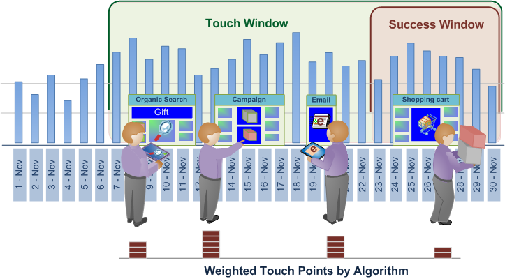

# 최적 속성{#best-fit-attribution}

최적 속성은 전환 이벤트의 여러 채널에 기여도 값을 지정하기 위한 기계 학습 방식입니다. 데이터 워크벤치는 채널당 시간 창에서 성공에 대한 기여도를 자동으로 평가한 다음 고객의 실제 상호 작용 패턴을 기반으로 기여도 모델을 작성합니다.

**[!UICONTROL Best Fit Attribution]** 성공적인 판매, 이메일 등록 또는 기타 성과 지표에 기여한 상호 작용 또는 접촉을 비교할 수 있습니다. 기여도 분석은 가장 중요한 접점에 가중치를 자동으로 할당하고 데이터를 기반으로 채널당 기여도 모델을 제공하며 시장 및 내부 프로토콜에 반응합니다.

예를 들어 고객이 유기적 검색을 통해 사이트를 방문한 다음 캠페인에 참여한 다음 이메일을 등록하는 경우 [규칙 기반 기여도는](/help/home/c-get-started/c-attribution-profiles/c-rules-attrib/c-rules-attrib.md) 첫 번째 터치 또는 마지막 터치를 식별하거나 사전 설정 기여도 모델을 사용하여 모든 터치포인트에서 성공 속성을 균등하게 배포합니다. 사용자가 규칙 기반 속성을 정의하는 경우 최적 속성은 전환 확률을 관찰된 터치 지점의 함수로 계산하여 알고리즘을 통해 값을 설정합니다.

>[!NOTE]
>
>데이터 **워크벤치에서 최적 속성을** 실행하려면 Adobe Analytics Premium을 지원하도록 서버 인증서( [!DNL .pem file])를 업데이트해야 합니다. 또한 클라이언트를 위한 사용자 **지정** 환경에 Premium을 추가하고 Adobe ClientCare for Server 및 Report Server [!DNL Profile.cfg] 에서 새 인증서를 받아야 합니다.

## 기본 설정 {#section-db597eaee462412ea7280d1426366c61}

단계별 [지침은 최적](../../../../home/c-get-started/c-attribution-profiles/c-attrib-algorithmic/c-attrib-building.md#concept-fede6fc4f592475fa8b351b1765a522d) 속성 만들기를 참조하십시오.

**성공 지표**&#x200B;설정성공 이벤트를 나타내는 지표를 정의합니다.

성공 지표는 종종 *주문이지만*, 데이터 워크벤치를 사용하여 성공 창과 함께 매우 복잡한 성공 지표를 정의할 수 있습니다.

**터치 지표** 설정(선택 사항)

성공적인 전환을 유도할 인터랙션을 식별한 다음, 속성을 계산할 터치 지표를 설정합니다.

>[!NOTE]
>
>터치 지표를 설정하는 것은 기존 채널 지표를 사용하는 대신 차원 요소를 드래그 앤 드롭하여 채널 지표를 파생시키는 데 사용하는 경우에만 필요합니다.

캠페인 또는 채널에 대해 정의된 지표가 없지만 채널을 나타내는 차원이 있는 경우, 가장 적합한 속성은 터치 지표를 기반으로 자동으로 만들 수 있습니다.

예를 들어, 터치 지표가 *히트로*&#x200B;설정되고, 이메일 *이메일* , *릴리스를*&#x200B;포함하는 요소가 있는 *미디어 유형이라는*&#x200B;차원이 *있고, Audition*, AuditionPrint 및 SocialSocial시각화를 포함하는 *Media Type이 있는 경우에는 시각화가*[!DNL Hits where Media Type = Email] 요소를 드래그하여 놓을 때 채널에 양식이 생성됩니다(S).

그런 다음 터치 지표는 성공 시 영향력이 있는 마케팅 상호 작용을 식별하기 위해 기여도 점수의 할당을 결정하므로 성공 창에서 식별된 모집단의 마케팅 접점을 평가할 수 있습니다. 페이지 보기 횟수 또는 *히트 수와 같은* 지표를 *설정하거나*&#x200B;필요에 따라 사용자 지정된 터치 지표를 사용할 수 있습니다.

많은 경우, 터치 창에 성공 창이 포함되어 판매 주기의 긴 리드 시간을 평가해야 합니다.

**매출 지표를 설정합니다.**

적절한 매출 지표를 설정하여 터치포인트 전체의 매출을 확인하도록 선택할 수 있습니다. 지정된 경우, 모델은 입력 채널에 대한 매출 분포를 표시합니다. 

통화 데이터 유형을 사용하여 매출 지표를 설정하여 정의된 모든 최상위 터치 지점에 성공을 할당할 수 있습니다. 이 지표는 최종 판매 매출을 분류하고 알고리즘에 의해 할당된 가중치를 기반으로 할당합니다.

**성공 및 터치 창을 설정합니다.**

성공 창은 성공적인 이벤트를 위한 모집단과 기간을 정의하므로 작업 공간 선택을 통해 분석을 고려할 수 있는 인구의 창과 기간을 표시할 수 있습니다. 성공 **창은** 성공 이벤트를 검사할 기간과 채우기를 정의합니다. 터치 **창은** 성공 이벤트로 연결되는 채널 상호 작용을 검사할 내역 기간을 지정합니다.

>[!NOTE]
>
>터치 지표 설정은 차원 요소를 시각화로 드래그하여 성공 지표를 자동으로 빌드하려는 경우에만 필요합니다.

하루, 월, 년 또는 사용 가능한 기간을 설정하여 판매 주기 전반에서 성공 및 터치 이벤트에 대한 평가를 제한하거나 특정 고객이 사이트에 들어올 수 있도록 제한할 수 있습니다. 속성을 제한하는 윈도우를 만들면 특정 요구 사항에 맞는 기간에 분석에 집중할 수 있습니다.

대부분의 경우, 판매 창을 기준으로 긴 리드 타임에 걸쳐 분석을 확장할 수 있도록 터치 창에 성공 창이 포함되도록 해야 합니다. 또는 성공 이벤트와 별도로 터치를 추적 및 분석할 수 있습니다.

**채널을 선택합니다.**

채널을 입력할 때 두 가지 옵션이 있습니다.

**터치 지표 추가 및 채널에 차원 요소 추가**

대부분의 경우 상위 터치 포인트를 차원 요소별로 분류하여 특정 채널을 정의하려고 합니다. 요소 값에 따라 최적 속성은 상위 수행자를 자동으로 선택하고 비율에 따라 등급을 지정하여 차트 시각화에 표시합니다.

기여도 모델은 성공 창 동안 상호 작용한 방문자를 바탕으로 작성되고, 성공적인 이벤트로 이어지거나 일어나지 않은 터치 창 동안 채널 터치를 조사함으로써 만들어집니다.

## 채널별 분류 {#section-a30592b84bc84f57bd2b988824e852d4}

채널을 입력할 때 두 가지 옵션이 있습니다.

* 터치 **지표를** 추가한 다음 채널에 **대한 차원** 요소를 추가합니다.

   **또는**

* 평가할 채널 요소에 대해 필터링하는 지표를 만듭니다.

**옵션 1:터치 지표를 추가하고 채널에 대한 차원 요소를 추가합니다**.

이것이 더 쉬운 방법입니다. 최적 속성은 자동으로 지표를 만들어 기여도를 평가합니다. 아래 예에서 터치 지표는 히트 ***및*** 채널입니다.캠페인 ***,***&#x200B;이메일 캠페인 ***및*** SEM 캠페인을 ***표시합니다***.

이 방법을 사용하면 최적 속성은 백그라운드에서 채널 간의 속성을 평가하기 위한 지표를 만듭니다(하지만 자동 생성된 지표는 표시되지 않으며 저장되지 않습니다). 아래 예에서는 세 개의 채널(예: 캠페인 표시, 이메일 캠페인 *및 SEM 캠페인*)에 대해 히트가 *필터링되는*&#x200B;세 개의 *지표가*&#x200B;만들어집니다. 이 방법은 최적 속성을 통해 자동으로 지표를 만들 수 있으므로 가장 쉽습니다.

**옵션 2:지표 만들기를 참조하십시오**.

두 번째 옵션에서 특정 채널을 필터링하여 평가할 채널에 대한 지표를 만들고 저장합니다. 이러한 지표의 예는 아래에 나와 있습니다.

그런 다음 채널에 대한 터치 지표와 차원 요소를 입력하는 대신 시각화에서 메뉴 모음을 클릭하고 입력 **> 채널** 추가를 **선택한** 다음 만든 지표를 선택합니다.

아래 두 번째 방법의 예를 참조하십시오. 두 옵션 모두 결과가 동일함을 확인할 수 있습니다.
