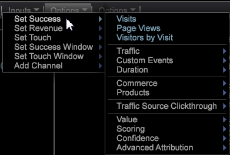

# 최적 속성 모델 구축{#build-a-best-fit-attribution-model}

Premium 메뉴에서 최적 속성 을 열고 다음 단계에 따라 최적 속성 모델을 구축합니다.

[최적 속성](../../../../home/c-get-started/c-attribution-profiles/c-attrib-algorithmic/c-attrib-algorithmic.md#concept-237feb6e9c4d49efaf75399297dcb9d1)의 개요를 참조하십시오.

1. **최적 속성**&#x200B;을 엽니다.

   작업 공간을 열고 **[!UICONTROL Premium]** > **[!UICONTROL Best Fit Attribution]** 를 클릭합니다.

   

   >[!NOTE]
   >
   >Best Fit Attribution은 프로필에서 Premium을 활성화해야 하는 Adobe Analytics Premium 기능입니다. 인증서를 업데이트하고 Premium 프로필을 profile.cfg 파일에 추가해야 합니다. [DWB 서버 업그레이드 를 참조하십시오. 6.2~6.3](/help/home/c-inst-svr/c-upgrd-uninst-sftwr/c-upgrd-sftwr/c-6-2-to-6-3-upgrade.md)(DWB 6.3의 경우)

1. **[!UICONTROL Success]** 지표를 설정합니다.

   >[!NOTE]
   >
   >**[!UICONTROL Finder]** 테이블에서 속성 시각화의 왼쪽 창으로 지표를 드래그하거나 **입력** 메뉴에서 선택할 수 있습니다.

   클릭 **[!UICONTROL Inputs]** > **[!UICONTROL Set Success]**. 지표 메뉴가 열립니다. 

   성공적인 전환을 식별하는 지표를 선택합니다.

1. (선택 사항) **수입** 지표를 설정합니다.

   전환 프로세스에서 매출을 평가하도록 지표를 설정합니다.

1. **Touch** 지표를 설정합니다.

   >[!NOTE]
   >
   >터치 지표 설정은 차원 요소를 시각화로 끌어 성공 지표를 자동으로 작성하려는 경우에만 필요합니다.

   **[!UICONTROL Inputs]** 메뉴를 클릭하고 **터치 설정**&#x200B;을 선택하거나, 파인더에서 지표를 드래그합니다. 

   차원 요소를 입력으로 사용할 때 채널 지표를 파생시키는 데 사용됩니다.

1. **성공** 창을 설정합니다.

   클릭 [!DNL Inputs > Success Window]. 테이블에서 날짜 범위를 선택한 다음 성공 창의 이름을 지정합니다. **[!UICONTROL Workspace Selection]** 을 클릭하면 선택한 날짜가 성공 지표의 시간 범위로 지정됩니다.

   

   >[!NOTE]
   >
   >성공 창은 워크스테이션 선택이므로 성공 창에 차원을 포함할 수 있습니다.

1. **[!UICONTROL Touch Window]** 을 설정합니다.

   클릭 [!DNL Inputs > Touch Window]. 테이블에서 날짜 범위를 선택한 다음 터치 창의 이름을 지정합니다. **[!UICONTROL Workspace Selection]** 을 클릭하면 선택한 날짜가 성공 지표의 시간 범위로 지정됩니다.

   

   기본적으로 **Touch** 창은 **[!UICONTROL Success]** 창과 동일한 기간으로 설정됩니다.

1. (선택 사항) 교육 필터를 설정합니다.

   작업 공간에서 **교육 필터**&#x200B;를 지정하여 방문자 데이터를 필터링할 수도 있습니다.

   >[!NOTE]
   >
   >성공 및 터치 창을 모두 설정할 때 교육 필터를 현재 작업 영역 선택 항목에 적용하여 데이터를 추가로 제한할 수 있습니다.

   

   >[!NOTE]
   >
   >교육 세트는 항상 성공 기간을 충족하는 방문자로부터 그려집니다. 필터 편집기를 사용하여 필터링하면 성공 창에서 보고된 방문자의 하위 집합을 만들 수 있습니다.

1. 터치를 나타내는 채널 지표를 지정합니다.

   지표를 시각화로 드래그하거나 [!DNL Inputs] > [!DNL Add Channel] 메뉴에서 선택합니다. 캠페인이나 채널에 대해 정의된 지표가 아직 없지만 채널을 나타내는 차원이 있는 경우 터치 지표의 사양에 따라 시각화가 자동으로 구성될 수 있습니다.

   예를 들어 터치 지표를 [!DNL Hits]로 설정하고 [!DNL Email], [!DNL Press Release], [!DNL Print Ad] 및 [!DNL Social Media]와 같은 요소를 포함하는 요소가 있는 [!DNL Media Type]라는 [!DNL dimension]을 지정하면 요소를 시각화에 끌어다 놓을 때 시각화는 [!DNL Hits where Media Type = Email] 형식의 채널 지표를 생성합니다.

1. **Go**&#x200B;을 누릅니다.

   Best Fit Analysis 프로세스가 실행되며 선택한 입력을 기반으로 채널별 기여도가 차트에 표시됩니다.

   >[!NOTE]
   >
   >완료된 분석에서 **모델 완료**&#x200B;를 마우스 오른쪽 단추로 클릭하여 속성 모델에 대한 통계를 확인합니다.

   

완료되면 그래프에는 채널별로 계산된 속성 모델이 표시되고 *수입* 지표(설정된 경우)의 배포가 표시됩니다. 모델을 내부적으로 저장하거나 다른 시스템으로 내보낼 수 있습니다.

>[!NOTE]
>
>**[!UICONTROL Streaming]**,  **[!UICONTROL Online]** 및  **[!UICONTROL Offline]** 모드는 평가되는 데이터의 지연 시간을 기반으로 속성 모델을 작성할 때 다른 효과를 생성합니다. 스트리밍 모드에서는 **[!UICONTROL Model Complete]** 세부 정보가 표시됩니다. 온라인 및 오프라인 모드에서 세부 사항 **[!UICONTROL Local Model Complete]**&#x200B;이 표시됩니다.

## 옵션 메뉴 {#section-22288867f6c8483a8a38410f4b948346}

**옵션** 메뉴는 최적 속성 분석을 설정 및 표시하는 고급 기능을 제공합니다.

<table id="table_8F6F517B7DBF4259814BEC6D07A72EAC">
 <thead>
  <tr>
   <th colname="col1" class="entry"> 옵션 메뉴 </th>
   <th colname="col2" class="entry"> 설명 </th>
  </tr>
 </thead>
 <tbody>
  <tr>
   <td colname="col1"> 교육 필터 설정   </td>
   <td colname="col2"> 교육 필터는 속성 모델을 작성할 때 모집단을 필터링하는 성공 창과 함께 사용됩니다. 이렇게 하면 분석하려는 방문자만 포함하는 데이터 하위 세트가 제공됩니다. 
참고: 숙련된 사용자는 또한 필터의 유연성을 활용하여 성공 및 터치 윈도우의 시간대를 넘어 집중할 수도 있습니다. 예를 들어, 시간 범위를 선택할 수 있을 뿐만 아니라, <i>참조 도메인</i> 세트를 선택하여 해당 도메인에서 사용자에 대한 속성만 검사할 수 있습니다. 
 </td>
  </tr>
  <tr>
   <td colname="col1"> 복잡한 필터 설명 표시   </td>
   <td colname="col2"> 교육 필터, 성공 창 및 터치 창의 필터 코드를 표시합니다. </td>
  </tr>
  <tr>
   <td colname="col1"> 모델 저장   </td>
   <td colname="col2"> 나중에 사용할 수 있도록 현재 속성 모델을 저장합니다. </td>
  </tr>
  <tr>
   <td colname="col1"> 모델 로드   </td>
   <td colname="col2"> 이전에 저장한 속성 모델을 엽니다. </td>
  </tr>
  <tr>
   <td colname="col1"> 프레젠테이션 보기   </td>
   <td colname="col2"> 프레젠테이션의 위쪽 메뉴 모음을 숨깁니다. </td>
  </tr>
  <tr>
   <td colname="col1"> 
<b>옵션 &gt; </b> 고급에는 교육 세트 크기를 설정하고 클래스 불균형의 경우 수행할 접근 방식을 지정하는 기능이 포함됩니다. 
 </td>
   <td colname="col2"> </td>
  </tr>
  <tr>
   <td colname="col1"> 고급 &gt; 교육 세트 크기   </td>
   <td colname="col2"> 
교육 집합 크기를 설정합니다. 
 
참고:  기본 교육 크기는 250,000명의 방문자에 대해 큽니다. 

    <ul id="ul_5F17C60227C34A85A2C476A32F2B5DCD">
     <li id="li_A076FC2AD0214ADDBFCFD82AEA5F0880">작은 = 50,000 </li>
     <li id="li_17E77E01D5374068BEBC80B3AD4CCD41">작게 = 75,000 </li>
     <li id="li_7F6B4834742A4BFCBC3DB214425B88C3">일반 = 100,000 </li>
     <li id="li_0BB7F791603745028CFC661EBC94D8B4">큰 = 250,00 </li>
     <li id="li_34B60233C84F48F1BCB8040C5195411A">거대 = 500,000 </li>
    </ul> </td>
  </tr>
  <tr>
   <td colname="col1"><b>고급 &gt; 분류 잔액  </b> </td>
   <td colname="col2"> 
데이터 세트 크기를 기반으로 하여 클래스 불균형 문제에 대해 생성할 입력 레코드 수를 식별하고 정의합니다. 
 </td>
  </tr>
 </tbody>
</table>

| 재설정 및 제거 옵션 | 설명 |
|---|---|
| **[!UICONTROL Reset Model]** | **[!UICONTROL Reset]** 메뉴에서 **[!UICONTROL Reset Model]** 을 선택하여 시각화를 지우고 입력 지표를 유지합니다. |
| **[!UICONTROL Reset All]** | **[!UICONTROL Reset]** 메뉴에서 **[!UICONTROL Reset All]** 을 선택하여 시각화 및 입력 지표를 지웁니다. |
| **[!UICONTROL Remove]** | 입력을 마우스 오른쪽 단추로 클릭하고 **[!UICONTROL Remove]** 을 선택하여 선택한 입력에서 지표를 지웁니다. |
| **[!UICONTROL Remove All]** | *채널*&#x200B;을 마우스 오른쪽 단추로 클릭하고 **[!UICONTROL Remove All]**&#x200B;를 선택하여 모든 입력 지표를 지웁니다. |
